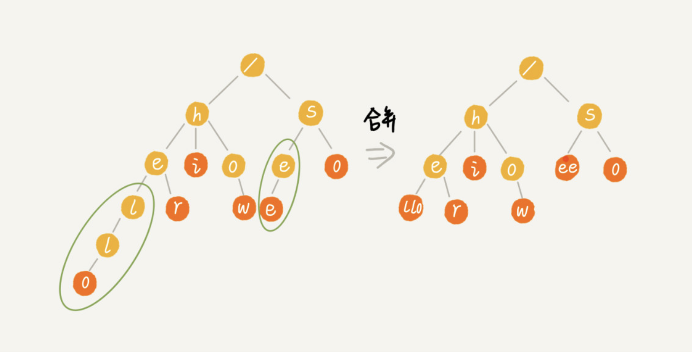

# Trie 树真的很耗内存吗？

前面我们讲了 Trie 树的实现，也分析了时间复杂度。现在你应该知道，Trie 树是一种非常独特的、高效的字符串匹配方法。但是，关于 Trie 树，你有没有听过这样一种说法：“Trie 树是非常耗内存的，用的是一种空间换时间的思路”。这是什么原因呢？

刚刚我们在讲 Trie 树的实现的时候，讲到用数组来存储一个节点的子节点的指针。如果字符串中包含从 a 到 z 这 26 个字符，那每个节点都要存储一个长度为 26 的数组，并且每个数组存储一个 8 字节指针（或者是 4 字节，这个大小跟 CPU、操作系统、编译器等有关）。而且，即便一个节点只有很少的子节点，远小于 26 个，比如 3、4 个，我们也要维护一个长度为 26 的数组。

我们前面讲过，Trie 树的本质是避免重复存储一组字符串的相同前缀子串，但是现在每个字符（对应一个节点）的存储远远大于 1 个字节。按照我们上面举的例子，数组长度为 26，每个元素是 8 字节，那每个节点就会额外需要 26*8=208 个字节。而且这还是只包含 26 个字符的情况。

如果字符串中不仅包含小写字母，还包含大写字母、数字、甚至是中文，那需要的存储空间就更多了。所以，也就是说，在某些情况下，Trie 树不一定会节省存储空间。在重复的前缀并不多的情况下，Trie 树不但不能节省内存，还有可能会浪费更多的内存。

当然，我们不可否认，Trie 树尽管有可能很浪费内存，但是确实非常高效。那为了解决这个内存问题，我们是否有其他办法呢？

我们可以稍微牺牲一点查询的效率，将每个节点中的数组换成其他数据结构，来存储一个节点的子节点指针。用哪种数据结构呢？我们的选择其实有很多，比如有序数组、跳表、散列表、红黑树等。

假设我们用有序数组，数组中的指针按照所指向的子节点中的字符的大小顺序排列。查询的时候，我们可以通过二分查找的方法，快速查找到某个字符应该匹配的子节点的指针。但是，在往 Trie 树中插入一个字符串的时候，我们为了维护数组中数据的有序性，就会稍微慢了点。

替换成其他数据结构的思路是类似的，这里我就不一一分析了，你可以结合前面学过的内容，自己分析一下。

实际上，Trie 树的变体有很多，都可以在一定程度上解决内存消耗的问题。比如，**缩点优化**，就是对只有一个子节点的节点，而且此节点不是一个串的结束节点，可以将此节点与子节点合并。这样可以节省空间，但却增加了编码难度。

