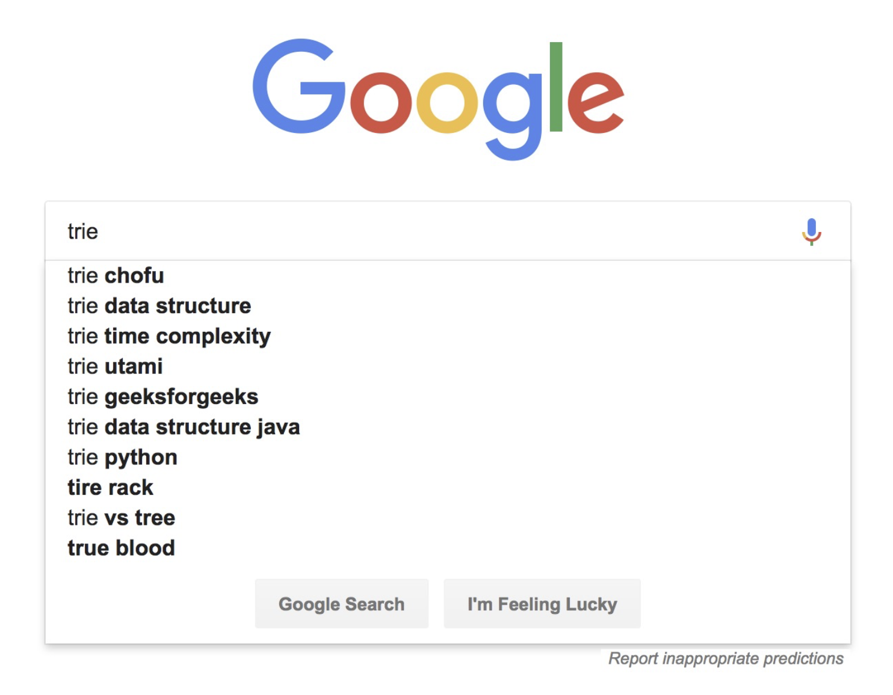

# 实现搜索关键词的提示功能？

我们假设关键词库由用户的热门搜索关键词组成。我们将这个词库构建成一个 Trie 树。当用户输入其中某个单词的时候，把这个词作为一个前缀子串在 Trie 树中匹配。为了讲解方便，我们假设词库里只有 hello、her、hi、how、so、see 这 6 个关键词。当用户输入了字母 h 的时候，我们就把以 h 为前缀的 hello、her、hi、how 展示在搜索提示框内。当用户继续键入字母 e 的时候，我们就把以 he 为前缀的 hello、her 展示在搜索提示框内。这就是搜索关键词提示的最基本的算法原理。

实际上，Trie 树的这个应用可以扩展到更加广泛的一个应用上，就是**自动输入补全**，比如输入法自动补全功能、IDE 代码编辑器自动补全功能、浏览器网址输入的自动补全功能等等。

