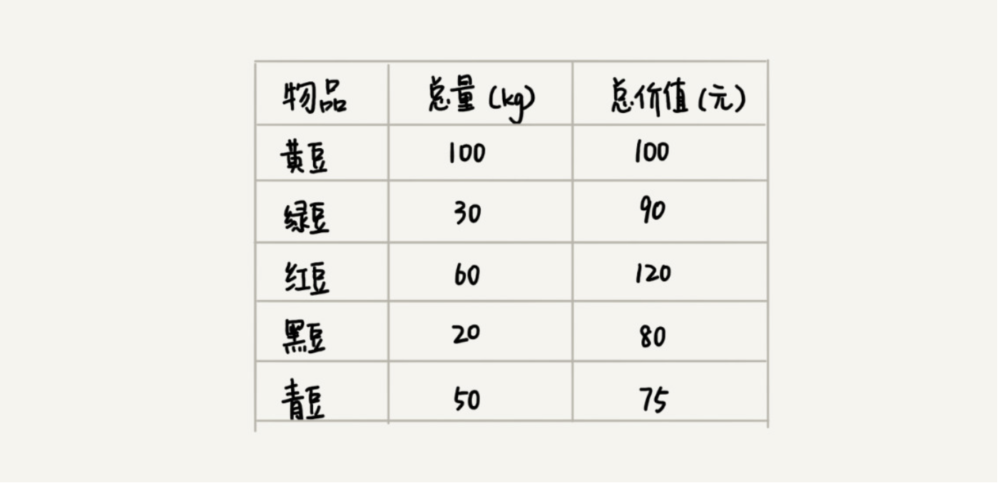
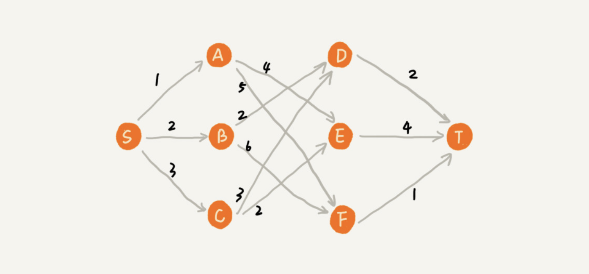

# 如何理解贪心算法

假设我们有一个可以容纳 100kg 物品的背包，可以装各种物品。我们有以下 5 种豆子，每种豆子的总量和总价值都各不相同。为了让背包中所装物品的总价值最大，我们如何选择在背包中装哪些豆子？每种豆子又该装多少呢？

实际上，这个问题很简单，我们只要先算一算每个物品的单价，按照单价由高到低依次来装就好了。单价从高到低排列，依次是：黑豆、绿豆、红豆、青豆、黄豆，所以，我们可以往背包里装 20kg 黑豆、30kg 绿豆、50kg 红豆。

这个问题的解决思路显而易见，它本质上借助的就是贪心算法。结合这个例子，我总结一下贪心算法解决问题的步骤，我们一起来看看。

**第一步，当我们看到这类问题的时候，首先要联想到贪心算法**：针对一组数据，我们定义了限制值和期望值，希望从中选出几个数据，在满足限制值的情况下，期望值最大。

类比到刚刚的例子，限制值就是重量不能超过 100kg，期望值就是物品的总价值。这组数据就是 5 种豆子。我们从中选出一部分，满足重量不超过 100kg，并且总价值最大。

**第二步，我们尝试看下这个问题是否可以用贪心算法解决**：每次选择当前情况下，在对限制值同等贡献量的情况下，对期望值贡献最大的数据。

类比到刚刚的例子，我们每次都从剩下的豆子里面，选择单价最高的，也就是重量相同的情况下，对价值贡献最大的豆子。

实际上，用贪心算法解决问题的思路，并不总能给出最优解。

我来举一个例子。在一个有权图中，我们从顶点 S 开始，找一条到顶点 T 的最短路径（路径中边的权值和最小）。贪心算法的解决思路是，每次都选择一条跟当前顶点相连的权最小的边，直到找到顶点 T。按照这种思路，我们求出的最短路径是 S->A->E->T，路径长度是 1+4+4=9。

但是，这种贪心的选择方式，最终求的路径并不是最短路径，因为路径 S->B->D->T 才是最短路径，因为这条路径的长度是 2+2+2=6。为什么贪心算法在这个问题上不工作了呢？

在这个问题上，贪心算法不工作的主要原因是，前面的选择，会影响后面的选择。如果我们第一步从顶点 S 走到顶点 A，那接下来面对的顶点和边，跟第一步从顶点 S 走到顶点 B，是完全不同的。所以，即便我们第一步选择最优的走法（边最短），但有可能因为这一步选择，导致后面每一步的选择都很糟糕，最终也就无缘全局最优解了。