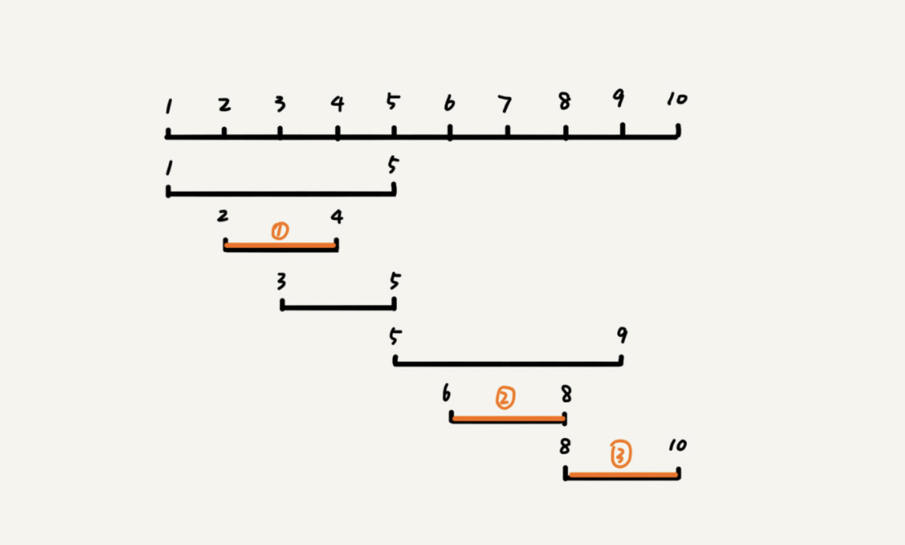

# 3. 区间覆盖

假设我们有 n 个区间，区间的起始端点和结束端点分别是 [l1, r1]，[l2, r2]，[l3, r3]，……，[ln, rn]。我们从这 n 个区间中选出一部分区间，这部分区间满足两两不相交（端点相交的情况不算相交），最多能选出多少个区间呢？

这个问题的处理思路稍微不是那么好懂，不过，我建议你最好能弄懂，因为这个处理思想在很多贪心算法问题中都有用到，比如任务调度、教师排课等等问题。

这个问题的解决思路是这样的：我们假设这 n 个区间中最左端点是 lmin，最右端点是 rmax。这个问题就相当于，我们选择几个不相交的区间，从左到右将 [lmin, rmax] 覆盖上。我们按照起始端点从小到大的顺序对这 n 个区间排序。

我们每次选择的时候，左端点跟前面的已经覆盖的区间不重合的，右端点又尽量小的，这样可以让剩下的未覆盖区间尽可能的大，就可以放置更多的区间。这实际上就是一种贪心的选择方法。

