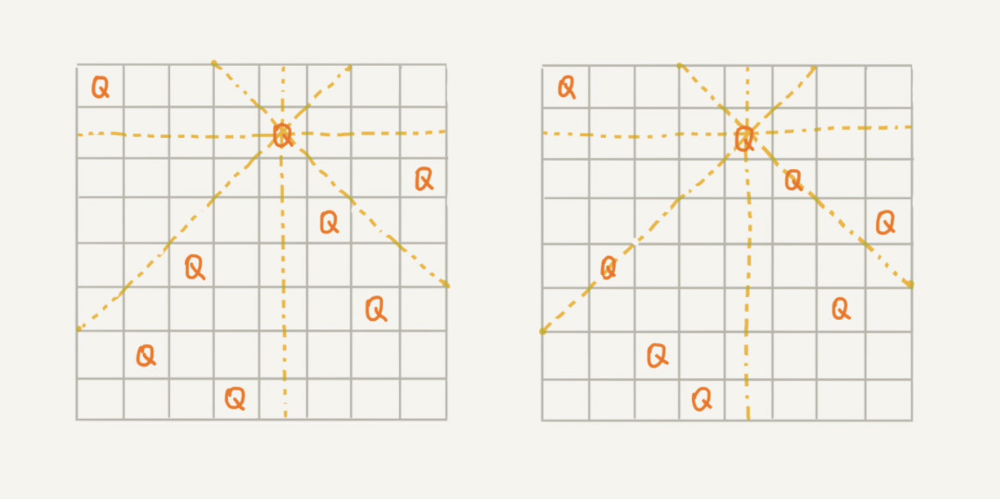

# 八皇后问题。

我们有一个 8x8 的棋盘，希望往里放 8 个棋子（皇后），每个棋子所在的行、列、对角线都不能有另一个棋子。你可以看我画的图，第一幅图是满足条件的一种方法，第二幅图是不满足条件的。八皇后问题就是期望找到所有满足这种要求的放棋子方式。



我们把这个问题划分成 8 个阶段，依次将 8 个棋子放到第一行、第二行、第三行……第八行。在放置的过程中，我们不停地检查当前的方法，是否满足要求。如果满足，则跳到下一行继续放置棋子；如果不满足，那就再换一种方法，继续尝试。

```java
int[] result = new int[8];// 全局或成员变量, 下标表示行, 值表示 queen 存储在哪一列
public void cal8queens(int row) { // 调用方式：cal8queens(0);
  if (row == 8) { // 8 个棋子都放置好了，打印结果
    printQueens(result);
    return; // 8 行棋子都放好了，已经没法再往下递归了，所以就 return
  }
  for (int column = 0; column < 8; ++column) { // 每一行都有 8 中放法
    if (isOk(row, column)) { // 有些放法不满足要求
      result[row] = column; // 第 row 行的棋子放到了 column 列
      cal8queens(row+1); // 考察下一行
    }
  }
}
 
private boolean isOk(int row, int column) {// 判断 row 行 column 列放置是否合适
  int leftup = column - 1, rightup = column + 1;
  for (int i = row-1; i >= 0; --i) { // 逐行往上考察每一行
    if (result[i] == column) return false; // 第 i 行的 column 列有棋子吗？
    if (leftup >= 0) { // 考察左上对角线：第 i 行 leftup 列有棋子吗？
      if (result[i] == leftup) return false;
    }
    if (rightup < 8) { // 考察右上对角线：第 i 行 rightup 列有棋子吗？
      if (result[i] == rightup) return false;
    }
    --leftup; ++rightup;
  }
  return true;
}
 
private void printQueens(int[] result) { // 打印出一个二维矩阵
  for (int row = 0; row < 8; ++row) {
    for (int column = 0; column < 8; ++column) {
      if (result[row] == column) System.out.print("Q ");
      else System.out.print("* ");
    }
    System.out.println();
  }
  System.out.println();
}
```

