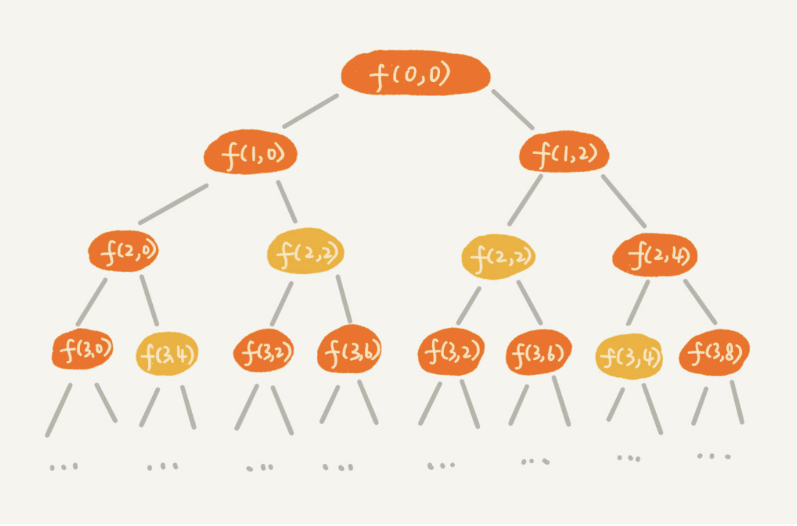
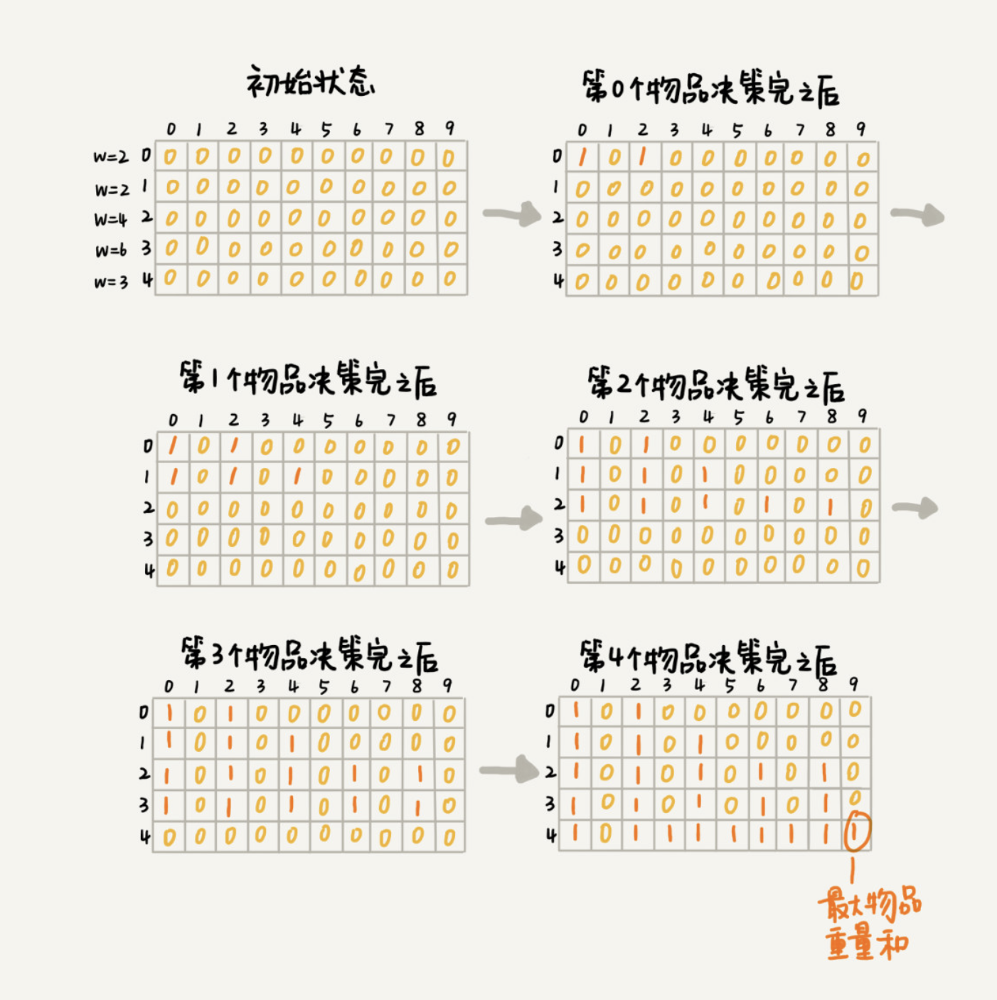

# 0-1背包问题

动态规划（Dynamic Programming）比较适合用来求解最优问题，比如求最大值、最小值等等。它可以非常显著地降低时间复杂度，提高代码的执行效率。

对于一组不同重量、不可分割的物品，我们需要选择一些装入背包，在满足背包最大重量限制的前提下，背包中物品总重量的最大值是多少呢？

关于这个问题，我们上一节讲了回溯的解决方法，也就是穷举搜索所有可能的装法，然后找出满足条件的最大值。不过，回溯算法的复杂度比较高，是指数级别的。

```java
// 回溯算法实现。注意：我把输入的变量都定义成了成员变量。
private int maxW = Integer.MIN_VALUE; // 结果放到 maxW 中
private int[] weight = {2，2，4，6，3};  // 物品重量
private int n = 5; // 物品个数
private int w = 9; // 背包承受的最大重量
public void f(int i, int cw) { // 调用 f(0, 0)
  if (cw == w || i == n) { // cw==w 表示装满了，i==n 表示物品都考察完了
    if (cw > maxW) maxW = cw;
    return;
  }
  f(i+1, cw); // 选择不装第 i 个物品
  if (cw + weight[i] <= w) {
    f(i+1,cw + weight[i]); // 选择装第 i 个物品
  }
}
```

规律是不是不好找？那我们就举个例子、画个图看看。我们假设背包的最大承载重量是 9。我们有 5 个不同的物品，每个物品的重量分别是 2，2，4，6，3。如果我们把这个例子的回溯求解过程，用递归树画出来，就是下面这个样子：



递归树中的每个节点表示一种状态，我们用（i, cw）来表示。其中，i 表示将要决策第几个物品是否装入背包，cw 表示当前背包中物品的总重量。比如，（2，2）表示我们将要决策第 2 个物品是否装入背包，在决策前，背包中物品的总重量是 2。

从递归树中，你应该能会发现，有些子问题的求解是重复的，比如图中 f(2, 2) 和 f(3,4) 都被重复计算了两次。我们可以借助递归那一节讲的“备忘录”的解决方式，记录已经计算好的 f(i, cw)，当再次计算到重复的 f(i, cw) 的时候，可以直接从备忘录中取出来用，就不用再递归计算了，这样就可以避免冗余计算。

```java
private int maxW = Integer.MIN_VALUE; // 结果放到 maxW 中
private int[] weight = {2，2，4，6，3};  // 物品重量
private int n = 5; // 物品个数
private int w = 9; // 背包承受的最大重量
private boolean[][] mem = new boolean[5][10]; // 备忘录，默认值 false
public void f(int i, int cw) { // 调用 f(0, 0)
  if (cw == w || i == n) { // cw==w 表示装满了，i==n 表示物品都考察完了
    if (cw > maxW) maxW = cw;
    return;
  }
  if (mem[i][cw]) return; // 重复状态
  mem[i][cw] = true; // 记录 (i, cw) 这个状态
  f(i+1, cw); // 选择不装第 i 个物品
  if (cw + weight[i] <= w) {
    f(i+1,cw + weight[i]); // 选择装第 i 个物品
  }
}
```

这种解决方法非常好。实际上，它已经跟动态规划的执行效率基本上没有差别。但是，多一种方法就多一种解决思路，我们现在来看看动态规划是怎么做的。

我们把整个求解过程分为 n 个阶段，每个阶段会决策一个物品是否放到背包中。每个物品决策（放入或者不放入背包）完之后，背包中的物品的重量会有多种情况，也就是说，会达到多种不同的状态，对应到递归树中，就是有很多不同的节点。

我们把每一层重复的状态（节点）合并，只记录不同的状态，然后基于上一层的状态集合，来推导下一层的状态集合。我们可以通过合并每一层重复的状态，这样就保证每一层不同状态的个数都不会超过 w 个（w 表示背包的承载重量），也就是例子中的 9。于是，我们就成功避免了每层状态个数的指数级增长。

我们用一个二维数组 states\[n][w+1]，来记录每层可以达到的不同状态。

第 0 个（下标从 0 开始编号）物品的重量是 2，要么装入背包，要么不装入背包，决策完之后，会对应背包的两种状态，背包中物品的总重量是 0 或者 2。我们用 states\[0][0]=true 和 states\[0][2]=true 来表示这两种状态。

第 1 个物品的重量也是 2，基于之前的背包状态，在这个物品决策完之后，不同的状态有 3 个，背包中物品总重量分别是 0(0+0)，2(0+2 or 2+0)，4(2+2)。我们用 states\[1][0]=true，states\[1][2]=true，states\[1][4]=true 来表示这三种状态。

以此类推，直到考察完所有的物品后，整个 states 状态数组就都计算好了。我把整个计算的过程画了出来，你可以看看。图中 0 表示 false，1 表示 true。我们只需要在最后一层，找一个值为 true 的最接近 w（这里是 9）的值，就是背包中物品总重量的最大值。



代码实现：

```java
// weight: 物品重量，n: 物品个数，w: 背包可承载重量
public int knapsack(int[] weight, int n, int w) {
  boolean[][] states = new boolean[n][w+1]; // 默认值 false
  states[0][0] = true;  // 第一行的数据要特殊处理，可以利用哨兵优化
  states[0][weight[0]] = true;
  for (int i = 1; i < n; ++i) { // 动态规划状态转移
    for (int j = 0; j <= w; ++j) {// 不把第 i 个物品放入背包
      if (states[i-1][j] == true) states[i][j] = states[i-1][j];
    }
    for (int j = 0; j <= w-weight[i]; ++j) {// 把第 i 个物品放入背包
      if (states[i-1][j]==true) states[i][j+weight[i]] = true;
    }
  }
  for (int i = w; i >= 0; --i) { // 输出结果
    if (states[n-1][i] == true) return i;
  }
  return 0;
}
```

实际上，这就是一种用动态规划解决问题的思路。我们把问题分解为多个阶段，每个阶段对应一个决策。我们记录每一个阶段可达的状态集合（去掉重复的），然后通过当前阶段的状态集合，来推导下一个阶段的状态集合，动态地往前推进。这也是动态规划这个名字的由来，你可以自己体会一下，是不是还挺形象的？

前面我们讲到，用回溯算法解决这个问题的时间复杂度 O(2^n)，是指数级的。动态规划解决方案的时间复杂度是 O(n*w)。n 表示物品个数，w 表示背包可以承载的总重量。


尽管动态规划的执行效率比较高，但是就刚刚的代码实现来说，我们需要额外申请一个 n 乘以 w+1 的二维数组，对空间的消耗比较多。有什么办法可以降低空间消耗吗？

实际上，我们只需要一个大小为 w+1 的一维数组就可以解决这个问题。动态规划状态转移的过程，都可以基于这个一维数组来操作。具体的代码实现我贴在这里，你可以仔细看下。

```java
public static int knapsack(int[] items, int n, int w) {
  boolean[] states = new boolean[w+1]; // 默认值 false
  states[0] = true;  // 第一行的数据要特殊处理，可以利用哨兵优化
  states[items[0]] = true;
  for (int i = 1; i < n; ++i) { // 动态规划
    for (int j = w-items[i]; j >= 0; --j) {// 把第 i 个物品放入背包
      if (states[j]==true) states[j+items[i]] = true;
    }
  }
  for (int i = w; i >= 0; --i) { // 输出结果
    if (states[i] == true) return i;
  }
  return 0;
}
```

这里我特别强调一下代码中的第 6 行，j 需要从大到小来处理。如果我们按照 j 从小到大处理的话，会出现 for 循环重复计算的问题。