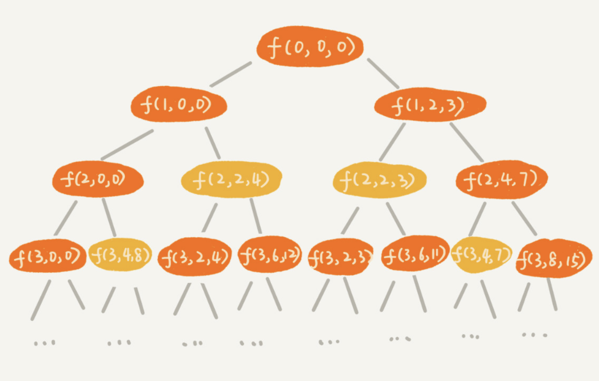

# 0-1背包问题升级版

我们刚刚讲的背包问题，只涉及背包重量和物品重量。我们现在引入物品价值这一变量。对于一组不同重量、不同价值、不可分割的物品，我们选择将某些物品装入背包，在满足背包最大重量限制的前提下，背包中可装入物品的总价值最大是多少呢？

这个问题依旧可以用回溯算法来解决。这个问题并不复杂，所以具体的实现思路，我就不用文字描述了，直接给你看代码。

```java
private int maxV = Integer.MIN_VALUE; // 结果放到 maxV 中
private int[] items = {2，2，4，6，3};  // 物品的重量
private int[] value = {3，4，8，9，6}; // 物品的价值
private int n = 5; // 物品个数
private int w = 9; // 背包承受的最大重量
public void f(int i, int cw, int cv) { // 调用 f(0, 0, 0)
  if (cw == w || i == n) { // cw==w 表示装满了，i==n 表示物品都考察完了
    if (cv > maxV) maxV = cv;
    return;
  }
  f(i+1, cw, cv); // 选择不装第 i 个物品
  if (cw + weight[i] <= w) {
    f(i+1,cw+weight[i], cv+value[i]); // 选择装第 i 个物品
  }
}
```

针对上面的代码，我们还是照例画出递归树。在递归树中，每个节点表示一个状态。现在我们需要 3 个变量（i, cw, cv）来表示一个状态。其中，i 表示即将要决策第 i 个物品是否装入背包，cw 表示当前背包中物品的总重量，cv 表示当前背包中物品的总价值。



我们发现，在递归树中，有几个节点的 i 和 cw 是完全相同的，比如 f(2,2,4) 和 f(2,2,3)。在背包中物品总重量一样的情况下，f(2,2,4) 这种状态对应的物品总价值更大，我们可以舍弃 f(2,2,3) 这种状态，只需要沿着 f(2,2,4) 这条决策路线继续往下决策就可以。

也就是说，对于 (i, cw) 相同的不同状态，那我们只需要保留 cv 值最大的那个，继续递归处理，其他状态不予考虑。

思路说完了，但是代码如何实现呢？如果用回溯算法，这个问题就没法再用“备忘录”解决了。所以，我们就需要换一种思路，看看动态规划是不是更容易解决这个问题？

我们还是把整个求解过程分为 n 个阶段，每个阶段会决策一个物品是否放到背包中。每个阶段决策完之后，背包中的物品的总重量以及总价值，会有多种情况，也就是会达到多种不同的状态。

我们用一个二维数组 states\[n][w+1]，来记录每层可以达到的不同状态。不过这里数组存储的值不再是 boolean 类型的了，而是当前状态对应的最大总价值。我们把每一层中 (i, cw) 重复的状态（节点）合并，只记录 cv 值最大的那个状态，然后基于这些状态来推导下一层的状态。

我们把这个动态规划的过程翻译成代码，就是下面这个样子：`

```java
public static int knapsack3(int[] weight, int[] value, int n, int w) {
  int[][] states = new int[n][w+1];
  for (int i = 0; i < n; ++i) { // 初始化 states
    for (int j = 0; j < w+1; ++j) {
      states[i][j] = -1;
    }
  }
  states[0][0] = 0;
  states[0][weight[0]] = value[0];
  for (int i = 1; i < n; ++i) { // 动态规划，状态转移
    for (int j = 0; j <= w; ++j) { // 不选择第 i 个物品
      if (states[i-1][j] >= 0) states[i][j] = states[i-1][j];
    }
    for (int j = 0; j <= w-weight[i]; ++j) { // 选择第 i 个物品
      if (states[i-1][j] >= 0) {
        int v = states[i-1][j] + value[i];
        if (v > states[i][j+weight[i]]) {
          states[i][j+weight[i]] = v;
        }
      }
    }
  }
  // 找出最大值
  int maxvalue = -1;
  for (int j = 0; j <= w; ++j) {
    if (states[n-1][j] > maxvalue) maxvalue = states[n-1][j];
  }
  return maxvalue;
}
```

时间复杂度是 O(n\*w)，空间复杂度也是 O(n\*w)。跟上一个例子类似，空间复杂度也是可以优化的，这里就不阐述了。

