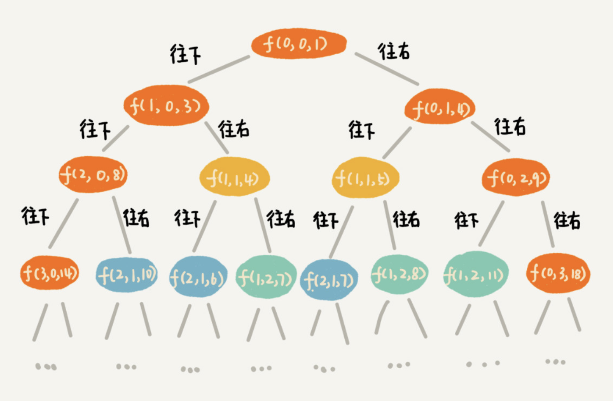
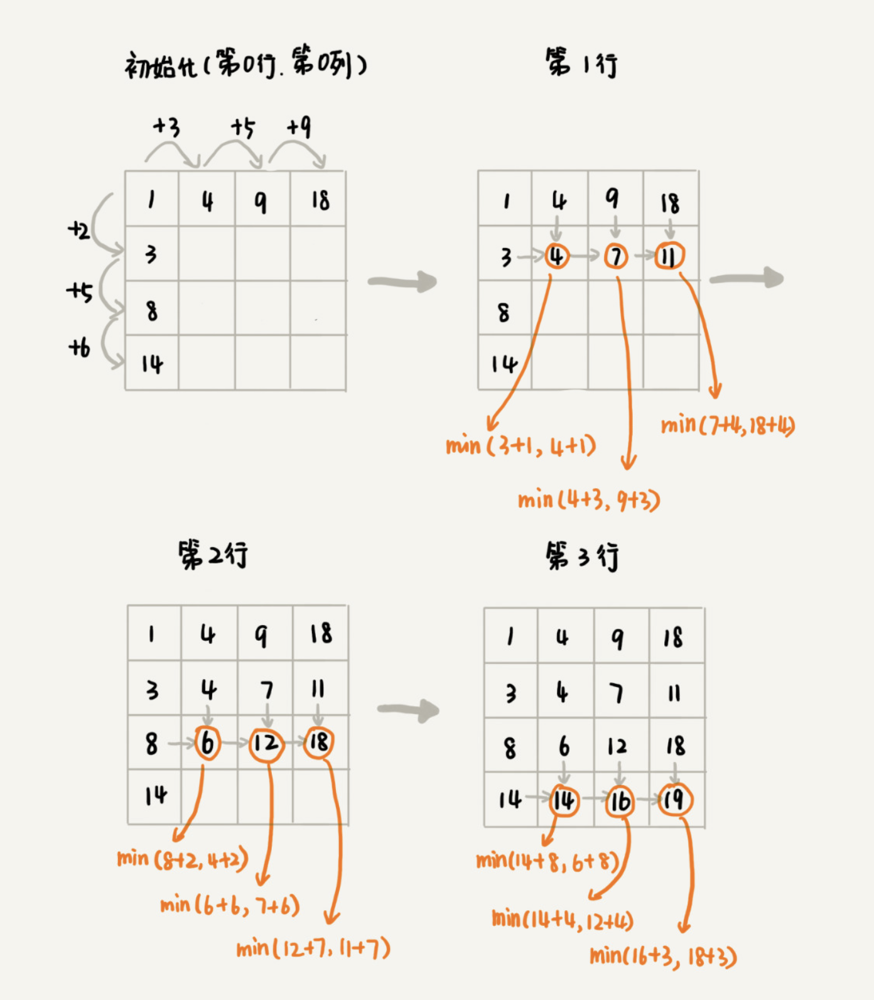

# 状态转移表法

一般能用动态规划解决的问题，都可以使用回溯算法的暴力搜索解决。所以，当我们拿到问题的时候，我们可以先用简单的回溯算法解决，然后定义状态，每个状态表示一个节点，然后对应画出递归树。从递归树中，我们很容易可以看出来，是否存在重复子问题，以及重复子问题是如何产生的。以此来寻找规律，看是否能用动态规划解决。

找到重复子问题之后，接下来，我们有两种处理思路，第一种是直接用**回溯加“备忘录”**的方法，来避免重复子问题。从执行效率上来讲，这跟动态规划的解决思路没有差别。第二种是使用动态规划的解决方法，**状态转移表法**。

回溯算法的代码实现如下所示:

```java
private int minDist = Integer.MAX_VALUE; // 全局变量或者成员变量
// 调用方式：minDistBacktracing(0, 0, 0, w, n);
public void minDistBT(int i, int j, int dist, int[][] w, int n) {
  // 到达了 n-1, n-1 这个位置了，这里看着有点奇怪哈，你自己举个例子看下
  if (i == n && j == n) {
    if (dist < minDist) minDist = dist;
    return;
  }
  if (i < n) { // 往下走，更新 i=i+1, j=j
    minDistBT(i + 1, j, dist+w[i][j], w, n);
  }
  if (j < n) { // 往右走，更新 i=i, j=j+1
    minDistBT(i, j+1, dist+w[i][j], w, n);
  }
}
```

有了回溯代码之后，接下来，我们要画出递归树，以此来寻找重复子问题。在递归树中，一个状态（也就是一个节点）包含三个变量 (i, j, dist)，其中 i，j 分别表示行和列，dist 表示从起点到达 (i, j) 的路径长度。从图中，我们看出，尽管 (i, j, dist) 不存在重复的，但是 (i, j) 重复的有很多。对于 (i, j) 重复的节点，我们只需要选择 dist 最小的节点，继续递归求解，其他节点就可以舍弃了。



既然存在重复子问题，我们就可以尝试看下，是否可以用动态规划来解决呢？


我们先画出一个状态表。状态表一般都是二维的，所以你可以把它想象成二维数组。其中，每个状态包含三个变量，行、列、数组值。我们根据决策的先后过程，从前往后，根据递推关系，分阶段填充状态表中的每个状态。最后，我们将这个递推填表的过程，翻译成代码，就是动态规划代码了。

我们画出一个二维状态表，表中的行、列表示棋子所在的位置，表中的数值表示从起点到这个位置的最短路径。我们按照决策过程，通过不断状态递推演进，将状态表填好。为了方便代码实现，我们按行来进行依次填充。



代码实现：

```java
public int minDistDP(int[][] matrix, int n) {
  int[][] states = new int[n][n];
  int sum = 0;
  for (int j = 0; j < n; ++j) { // 初始化 states 的第一行数据
    sum += matrix[0][j];
    states[0][j] = sum;
  }
  sum = 0;
  for (int i = 0; i < n; ++i) { // 初始化 states 的第一列数据
    sum += matrix[i][0];
    states[i][0] = sum;
  }
  for (int i = 1; i < n; ++i) {
    for (int j = 1; j < n; ++j) {
      states[i][j] = 
            matrix[i][j] + Math.min(states[i][j-1], states[i-1][j]);
    }
  }
  return states[n-1][n-1];
}
```

状态转移表法解题思路大致可以概括为，**回溯算法实现 - 定义状态 - 画递归树 - 找重复子问题 - 画状态转移表 - 根据递推关系填表 - 将填表过程翻译成代码**。