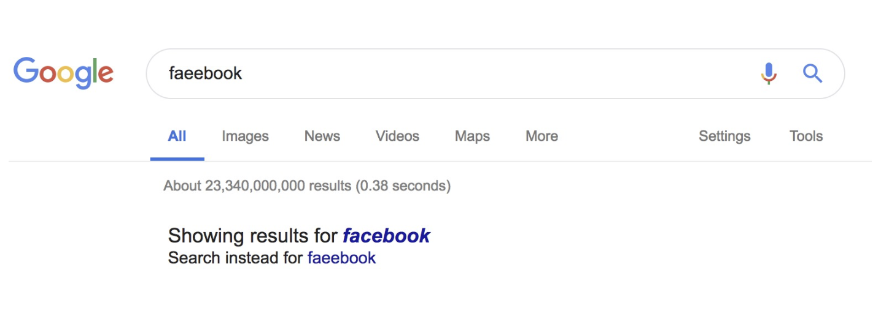

# 搜索引擎拼写纠错功能

当你在搜索框中，一不小心输错单词时，搜索引擎会非常智能地检测出你的拼写错误，并且用对应的正确单词来进行搜索。

当用户在搜索框内，输入一个拼写错误的单词时，我们就拿这个单词跟词库中的单词一一进行比较，计算编辑距离，将编辑距离最小的单词，作为纠正之后的单词，提示给用户。

这就是拼写纠错最基本的原理。不过，真正用于商用的搜索引擎，拼写纠错功能显然不会就这么简单。一方面，单纯利用编辑距离来纠错，效果并不一定好；另一方面，词库中的数据量可能很大，搜索引擎每天要支持海量的搜索，所以对纠错的性能要求很高。

针对纠错效果不好的问题，我们有很多种优化思路，我这里介绍几种。

- 我们并不仅仅取出编辑距离最小的那个单词，而是取出编辑距离最小的 TOP 10，然后根据其他参数，决策选择哪个单词作为拼写纠错单词。比如使用搜索热门程度来决定哪个单词作为拼写纠错单词。
- 我们还可以用多种编辑距离计算方法，比如今天讲到的两种，然后分别编辑距离最小的 TOP 10，然后求交集，用交集的结果，再继续优化处理。
- 我们还可以通过统计用户的搜索日志，得到最常被拼错的单词列表，以及对应的拼写正确的单词。搜索引擎在拼写纠错的时候，首先在这个最长被拼错单词列表中查找。如果一旦找到，直接返回对应的正确的单词。这样纠错的效果非常好。
- 我们还有更加高级一点的做法，引入个性化因素。针对每个用户，维护这个用户特有的搜索喜好，也就是常用的搜索关键词。当用户输入错误的单词的时候，我们首先在这个用户常用的搜索关键词中，计算编辑距离，查找编辑距离最小的单词。

针对纠错性能方面，我们也有相应的优化方式。我讲两种分治的优化思路。

- 如果纠错功能的 TPS 不高，我们可以部署多台机器，每台机器运行一个独立的纠错功能。当有一个纠错请求的时候，我们通过负载均衡，分配到其中一台机器，来计算编辑距离，得到纠错单词。
- 如果纠错系统的响应时间太长，也就是，每个纠错请求处理时间过长，我们可以将纠错的词库，分割到很多台机器。当有一个纠错请求的时候，我们就将这个拼写错误的单词，同时发送到这多台机器，让多台机器并行处理，分别得到编辑距离最小的单词，然后再比对合并，最终决定出一个最优的纠错单词。

