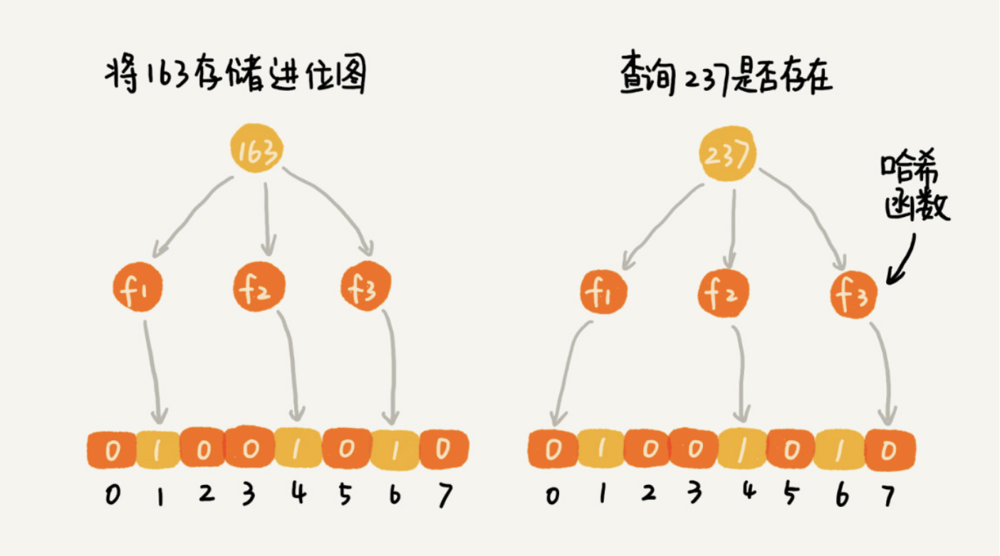
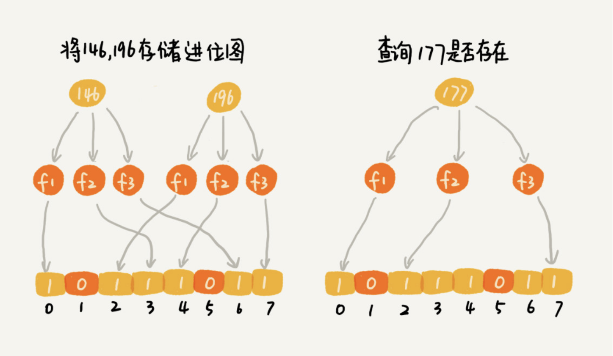

# 布隆过滤器

还是刚刚那个例子，数据个数是 1 千万，数据的范围是 1 到 10 亿。布隆过滤器的做法是，我们仍然使用一个 1 亿个二进制大小的位图，然后通过哈希函数，对数字进行处理，让它落在这 1 到 1 亿范围内。比如我们把哈希函数设计成 f(x)=x%n。其中，x 表示数字，n 表示位图的大小（1 亿），也就是，对数字跟位图的大小进行取模求余。

不过，你肯定会说，哈希函数会存在冲突的问题啊，一亿零一和 1 两个数字，经过你刚刚那个取模求余的哈希函数处理之后，最后的结果都是 1。这样我就无法区分，位图存储的是 1 还是一亿零一了。

为了降低这种冲突概率，当然我们可以设计一个复杂点、随机点的哈希函数。除此之外，还有其他方法吗？我们来看布隆过滤器的处理方法。既然一个哈希函数可能会存在冲突，那用多个哈希函数一块儿定位一个数据，是否能降低冲突的概率呢？我来具体解释一下，布隆过滤器是怎么做的。

我们使用 K 个哈希函数，对同一个数字进行求哈希值，那会得到 K 个不同的哈希值，我们分别记作 X1，X2，X3，…，XK。我们把这 K 个数字作为位图中的下标，将对应的 BitMap[X1]，BitMap[X2]，BitMap[X3]，…，BitMap[XK] 都设置成 true，也就是说，我们用 K 个二进制位，来表示一个数字的存在。

当我们要查询某个数字是否存在的时候，我们用同样的 K 个哈希函数，对这个数字求哈希值，分别得到 Y1，Y2，Y3，…，YK。我们看这 K 个哈希值，对应位图中的数值是否都为 true，如果都是 true，则说明，这个数字存在，如果有其中任意一个不为 true，那就说明这个数字不存在。

于两个不同的数字来说，经过一个哈希函数处理之后，可能会产生相同的哈希值。但是经过 K 个哈希函数处理之后，K 个哈希值都相同的概率就非常低了。尽管采用 K 个哈希函数之后，两个数字哈希冲突的概率降低了，但是，这种处理方式又带来了新的问题，那就是容易误判。我们看下面这个例子。

布隆过滤器的误判有一个特点，那就是，它只会对存在的情况有误判。如果某个数字经过布隆过滤器判断不存在，那说明这个数字真的不存在，不会发生误判；如果某个数字经过布隆过滤器判断存在，这个时候才会有可能误判，有可能并不存在。不过，只要我们调整哈希函数的个数、位图大小跟要存储数字的个数之间的比例，那就可以将这种误判的概率降到非常低。

尽管布隆过滤器会存在误判，但是，这并不影响它发挥大作用。很多场景对误判有一定的容忍度。比如我们今天要解决的爬虫判重这个问题，即便一个没有被爬取过的网页，被误判为已经被爬取，对于搜索引擎来说，也并不是什么大事情，是可以容忍的，毕竟网页太多了，搜索引擎也不可能 100% 都爬取到。

弄懂了布隆过滤器，我们今天的爬虫网页去重的问题，就很简单了。

我们用布隆过滤器来记录已经爬取过的网页链接，假设需要判重的网页有 10 亿，那我们可以用一个 10 倍大小的位图来存储，也就是 100 亿个二进制位，换算成字节，那就是大约 1.2GB。之前我们用散列表判重，需要至少 100GB 的空间。相比来讲，布隆过滤器在存储空间的消耗上，降低了非常多。

那我们再来看下，利用布隆过滤器，在执行效率方面，是否比散列表更加高效呢？

布隆过滤器用多个哈希函数对同一个网页链接进行处理，CPU 只需要将网页链接从内存中读取一次，进行多次哈希计算，理论上讲这组操作是 CPU 密集型的。而在散列表的处理方式中，需要读取散列冲突拉链的多个网页链接，分别跟待判重的网页链接，进行字符串匹配。这个操作涉及很多内存数据的读取，所以是内存密集型的。我们知道 CPU 计算可能是要比内存访问更快速的，所以，理论上讲，布隆过滤器的判重方式，更加快速。

除了爬虫网页去重这个例子，还有比如统计一个大型网站的每天的 UV 数，也就是每天有多少用户访问了网站，我们就可以使用布隆过滤器，对重复访问的用户，进行去重。

位图、布隆过滤器应用如此广泛，很多编程语言都已经实现了。比如 Java 中的 BitSet 类就是一个位图，Redis 也提供了 BitMap 位图类，Google 的 Guava 工具包提供了 BloomFilter 布隆过滤器的实现。