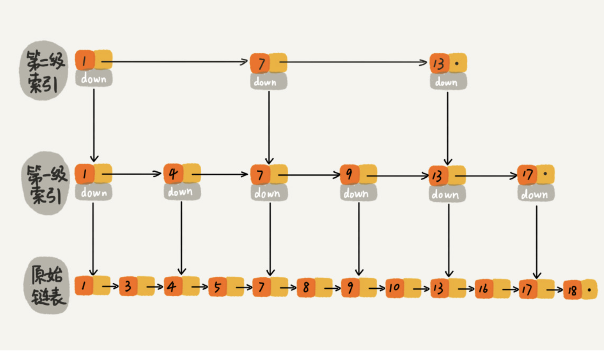

# 数据库索引设计

**数据库索引是如何实现的呢？底层使用的是什么数据结构和算法呢？**

如果你对数据库的操作非常了解，针对我们现在这个问题，你就能把索引的需求定义得非常清楚。但是，对于大部分软件工程师来说，我们可能只了解一小部分常用的 SQL 语句，所以，这里我们假设要解决的问题，只包含这样两个常用的需求：

- 根据某个值查找数据，比如 select * from user where id=1234；
- 根据区间值来查找某些数据，比如 select * from user where id > 1234 and id < 2345。

除了这些功能性需求之外，这种问题往往还会涉及一些非功能性需求，比如安全、性能、用户体验等等。限于专栏要讨论的主要是数据结构和算法，对于非功能性需求，我们着重考虑**性能方面**的需求。性能方面的需求，我们主要考察时间和空间两方面，也就是**执行效率和存储空间**。

在执行效率方面，我们希望通过索引，查询数据的效率尽可能的高；在存储空间方面，我们希望索引不要消耗太多的内存空间。

# 尝试用学过的数据结构解决这个问题

问题的需求大致定义清楚了，我们现在回想一下，能否利用已经学习过的数据结构解决这个问题呢？支持快速查询、插入等操作的动态数据结构，我们已经学习过散列表、平衡二叉查找树、跳表。

我们先来看**散列表**。散列表的查询性能很好，时间复杂度是 O(1)。但是，散列表不能支持按照区间快速查找数据。所以，散列表不能满足我们的需求。

我们再来看**平衡二叉查找树**。尽管平衡二叉查找树查询的性能也很高，时间复杂度是 O(logn)。而且，对树进行中序遍历，我们还可以得到一个从小到大有序的数据序列，但这仍然不足以支持按照区间快速查找数据。

我们再来看**跳表**。跳表是在链表之上加上多层索引构成的。它支持快速地插入、查找、删除数据，对应的时间复杂度是 O(logn)。并且，跳表也支持按照区间快速地查找数据。我们只需要定位到区间起点值对应在链表中的结点，然后从这个结点开始，顺序遍历链表，直到区间终点对应的结点为止，这期间遍历得到的数据就是满足区间值的数据。

这样看来，跳表是可以解决这个问题。实际上，数据库索引所用到的数据结构跟跳表非常相似，叫作 B+ 树。不过，它是通过二叉查找树演化过来的，而非跳表。