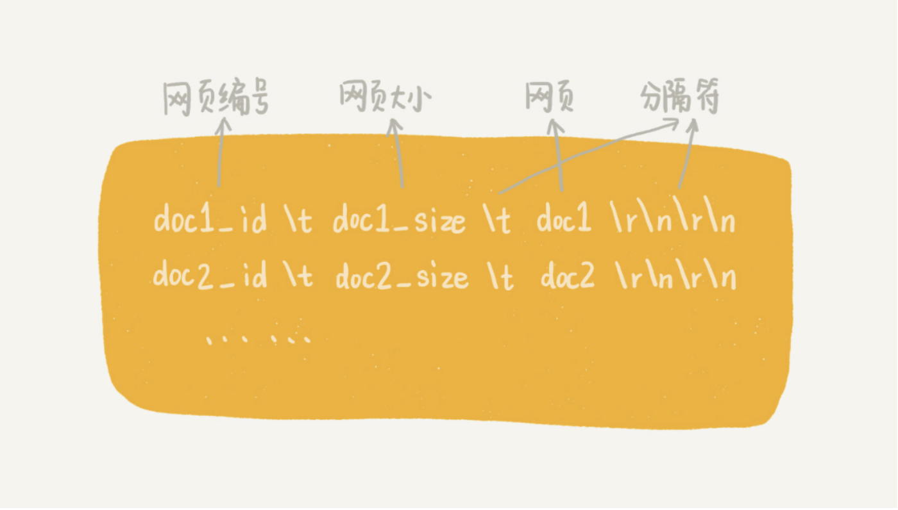

# 搜集

现在，互联网越来越发达，网站越来越多，对应的网页也就越来越多。对于搜索引擎来说，它事先并不知道网页都在哪里。打个比方来说就是，我们只知道海里面有很多鱼，但却并不知道鱼在哪里。那搜索引擎是如何爬取网页的呢？

搜索引擎把整个互联网看作数据结构中的有向图，把每个页面看作一个顶点。如果某个页面中包含另外一个页面的链接，那我们就在两个顶点之间连一条有向边。我们可以利用图的遍历搜索算法，来遍历整个互联网中的网页。

我们前面介绍过两种图的遍历方法，深度优先和广度优先。搜索引擎采用的是广度优先搜索策略。具体点讲的话，那就是，我们先找一些比较知名的网页（专业的叫法是权重比较高）的链接（比如新浪主页网址、腾讯主页网址等），作为种子网页链接，放入到队列中。爬虫按照广度优先的策略，不停地从队列中取出链接，然后取爬取对应的网页，解析出网页里包含的其他网页链接，再将解析出来的链接添加到队列中。

基本的原理就是这么简单。但落实到实现层面，还有很多技术细节。我下面借助搜集阶段涉及的几个重要文件，来给你解释一下搜集工程都有哪些关键技术细节。

# 1. 待爬取网页链接文件：links.bin

在广度优先搜索爬取页面的过程中，爬虫会不停地解析页面链接，将其放到队列中。于是，队列中的链接就会越来越多，可能会多到内存放不下。所以，我们用一个存储在磁盘中的文件（links.bin）来作为广度优先搜索中的队列。爬虫从 links.bin 文件中，取出链接去爬取对应的页面。等爬取到网页之后，将解析出来的链接，直接存储到 links.bin 文件中。

这样用文件来存储网页链接的方式，还有其他好处。比如，支持断点续爬。也就是说，当机器断电之后，网页链接不会丢失；当机器重启之后，还可以从之前爬取到的位置继续爬取。

关于如何解析页面获取链接，我额外多说几句。我们可以把整个页面看作一个大的字符串，我们可以利用字符串匹配算法，在这个大字符串中，搜索这样一个网页标签，然后顺序读取之间的字符串。这其实就是网页链接。

# 2. 网页判重文件：bloom_filter.bin

如何避免重复爬取相同的网页呢？这个问题我们在位图那一节已经讲过了。使用布隆过滤器，我们就可以快速并且非常节省内存地实现网页的判重。

不过，还是刚刚那个问题，如果我们把布隆过滤器存储在内存中，那机器宕机重启之后，布隆过滤器就被清空了。这样就可能导致大量已经爬取的网页会被重复爬取。

这个问题该怎么解决呢？我们可以定期地（比如每隔半小时）将布隆过滤器持久化到磁盘中，存储在 bloom_filter.bin 文件中。这样，即便出现机器宕机，也只会丢失布隆过滤器中的部分数据。当机器重启之后，我们就可以重新读取磁盘中的 bloom_filter.bin 文件，将其恢复到内存中。

# 3. 原始网页存储文件：doc_raw.bin

爬取到网页之后，我们需要将其存储下来，以备后面离线分析、索引之用。那如何存储海量的原始网页数据呢？

如果我们把每个网页都存储为一个独立的文件，那磁盘中的文件就会非常多，数量可能会有几千万，甚至上亿。常用的文件系统显然不适合存储如此多的文件。所以，我们可以把多个网页存储在一个文件中。每个网页之间，通过一定的标识进行分隔，方便后续读取。具体的存储格式，如下图所示。其中，doc_id 这个字段是网页的编号，我们待会儿再解释。

当然，这样的一个文件也不能太大，因为文件系统对文件的大小也有一定的限制。所以，我们可以设置每个文件的大小不能超过一定的值（比如 1GB）。随着越来越多的网页被添加到文件中，文件的大小就会越来越大，当超过 1GB 的时候，我们就创建一个新的文件，用来存储新爬取的网页。

假设一台机器的硬盘大小是 100GB 左右，一个网页的平均大小是 64KB。那在一台机器上，我们可以存储 100 万到 200 万左右的网页。假设我们的机器的带宽是 10MB，那下载 100GB 的网页，大约需要 10000 秒。也就是说，爬取 100 多万的网页，也就是只需要花费几小时的时间。

# 4. 网页链接及其编号的对应文件：doc_id.bin

刚刚我们提到了网页编号这个概念，我现在解释一下。网页编号实际上就是给每个网页分配一个唯一的 ID，方便我们后续对网页进行分析、索引。那如何给网页编号呢？

我们可以按照网页被爬取的先后顺序，从小到大依次编号。具体是这样做的：我们维护一个中心的计数器，每爬取到一个网页之后，就从计数器中拿一个号码，分配给这个网页，然后计数器加一。在存储网页的同时，我们将网页链接跟编号之间的对应关系，存储在另一个 doc_id.bin 文件中。

**爬虫在爬取网页的过程中，涉及的四个重要的文件，我就介绍完了。其中，links.bin 和 bloom_filter.bin 这两个文件是爬虫自身所用的。另外的两个（doc_raw.bin、doc_id.bin）是作为搜集阶段的成果，供后面的分析、索引、查询用的。**

