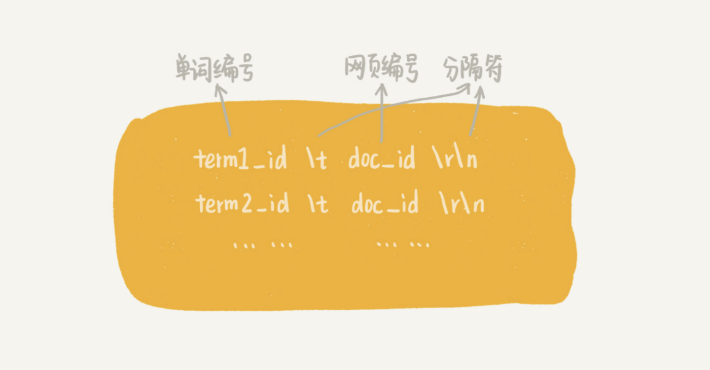

# 分析

网页爬取下来之后，我们需要对网页进行离线分析。分析阶段主要包括两个步骤，第一个是抽取网页文本信息，第二个是分词并创建临时索引。我们逐一来讲解。

# 1. 抽取网页文本信息

网页是半结构化数据，里面夹杂着各种标签、JavaScript 代码、CSS 样式。对于搜索引擎来说，它只关心网页中的文本信息，也就是，网页显示在浏览器中时，能被用户肉眼看到的那部分信息。我们如何从半结构化的网页中，抽取出搜索引擎关系的文本信息呢？

我们之所以把网页叫作半结构化数据，是因为它本身是按照一定的规则来书写的。这个规则就是**HTML 语法规范**。我们依靠 HTML 标签来抽取网页中的文本信息。这个抽取的过程，大体可以分为两步。

第一步是去掉 JavaScript 代码、CSS 格式以及下拉框中的内容（因为下拉框在用户不操作的情况下，也是看不到的）。也就是``，``，`<option></option>`这三组标签之间的内容。我们可以利用 AC 自动机这种多模式串匹配算法，在网页这个大字符串中，一次性查找``, `</script>`, `</option`）为止。而这期间遍历到的字符串连带着标签就应该从网页中删除。

第二步是去掉所有 HTML 标签。这一步也是通过字符串匹配算法来实现的。过程跟第一步类似，我就不重复讲了。

# 2. 分词并创建临时索引

经过上面的处理之后，我们就从网页中抽取出了我们关心的文本信息。接下来，我们要对文本信息进行分词，并且创建临时索引。

对于英文网页来说，分词非常简单。我们只需要通过空格、标点符号等分隔符，将每个单词分割开来就可以了。但是，对于中文来说，分词就复杂太多了。我这里介绍一种比较简单的思路，基于字典和规则的分词方法。

其中，字典也叫词库，里面包含大量常用的词语（我们可以直接从网上下载别人整理好的）。我们借助词库并采用最长匹配规则，来对文本进行分词。所谓最长匹配，也就是匹配尽可能长的词语。我举个例子解释一下。

比如要分词的文本是“中国人民解放了”，我们词库中有“中国”“中国人”“中国人民”“中国人民解放军”这几个词，那我们就取最长匹配，也就是“中国人民”划为一个词，而不是把“中国”、“中国人“划为一个词。具体到实现层面，我们可以将词库中的单词，构建成 Trie 树结构，然后拿网页文本在 Trie 树中匹配。

每个网页的文本信息在分词完成之后，我们都得到一组单词列表。我们把单词与网页之间的对应关系，写入到一个临时索引文件中（tmp_Index.bin），这个临时索引文件用来构建倒排索引文件。临时索引文件的格式如下：

在临时索引文件中，我们存储的是单词编号，也就是图中的 term_id，而非单词本身。这样做的目的主要是为了节省存储的空间。那这些单词的编号是怎么来的呢？

给单词编号的方式，跟给网页编号类似。我们维护一个计数器，每当从网页文本信息中分割出一个新的单词的时候，我们就从计数器中取一个编号，分配给它，然后计数器加一。

在这个过程中，我们还需要使用散列表，记录已经编过号的单词。在对网页文本信息分词的过程中，我们拿分割出来的单词，先到散列表中查找，如果找到，那就直接使用已有的编号；如果没有找到，我们再去计数器中拿号码，并且将这个新单词以及编号添加到散列表中。

当所有的网页处理（分词及写入临时索引）完成之后，我们再将这个单词跟编号之间的对应关系，写入到磁盘文件中，并命名为 term_id.bin。

**经过分析阶段，我们得到了两个重要的文件。它们分别是临时索引文件（tmp_index.bin）和单词编号文件（term_id.bin）。**

