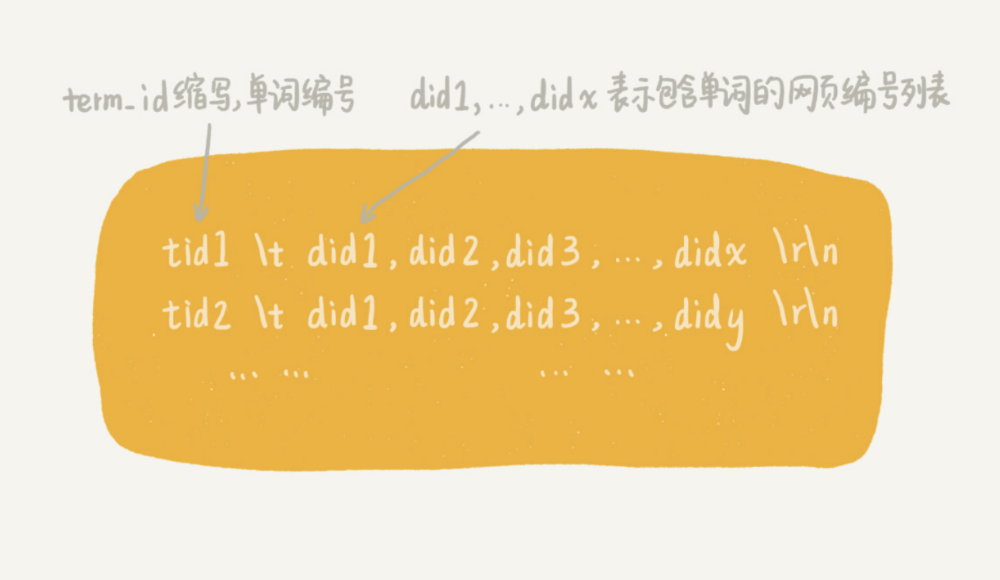
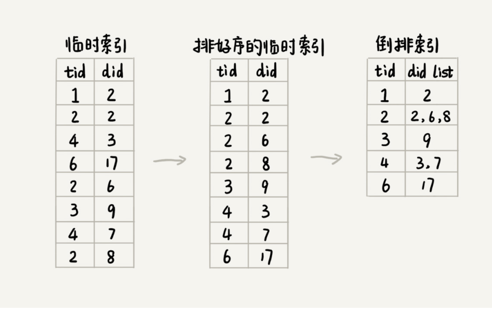

# 索引

索引阶段主要负责将分析阶段产生的临时索引，构建成倒排索引。倒排索引（ Inverted index）中记录了每个单词以及包含它的网页列表。文字描述比较难理解，我画了一张倒排索引的结构图，你一看就明白。

我们刚刚讲到，在临时索引文件中，记录的是单词跟每个包含它的文档之间的对应关系。那如何通过临时索引文件，构建出倒排索引文件呢？这是一个非常典型的算法问题，你可以先自己思考一下，再看我下面的讲解。

解决这个问题的方法有很多。考虑到临时索引文件很大，无法一次性加载到内存中，搜索引擎一般会选择使用**多路归并排序**的方法来实现。

我们先对临时索引文件，按照单词编号的大小进行排序。因为临时索引很大，所以一般基于内存的排序算法就没法处理这个问题了。我们可以用之前讲到的归并排序的处理思想，将其分割成多个小文件，先对每个小文件独立排序，最后再合并在一起。当然，实际的软件开发中，我们其实可以直接利用 MapReduce 来处理。

临时索引文件排序完成之后，相同的单词就被排列到了一起。我们只需要顺序地遍历排好序的临时索引文件，就能将每个单词对应的网页编号列表找出来，然后把它们存储在倒排索引文件中。具体的处理过程，我画成了一张图。通过图，你应该更容易理解。

除了倒排文件之外，我们还需要一个文件，来记录每个单词编号在倒排索引文件中的偏移位置。我们把这个文件命名为 term_offset.bin。这个文件的作用是，帮助我们快速地查找某个单词编号在倒排索引中存储的位置，进而快速地从倒排索引中读取单词编号对应的网页编号列表。

**经过索引阶段的处理，我们得到了两个有价值的文件，它们分别是倒排索引文件（index.bin）和记录单词编号在索引文件中的偏移位置的文件（term_offset.bin）。**