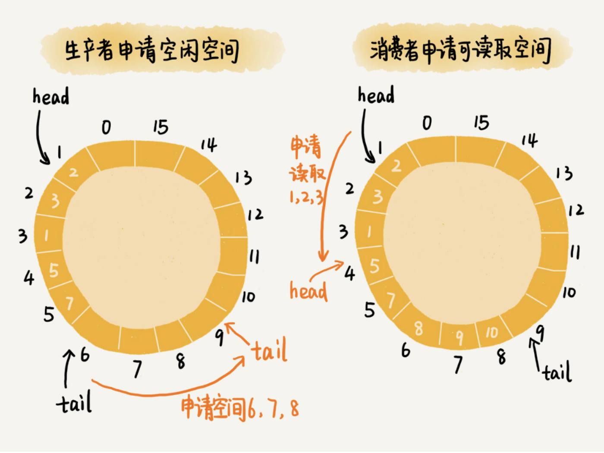

# 基于无锁的并发“生产者 - 消费者模型”

尽管 Disruptor 的源码读起来很复杂，但是基本思想其实非常简单。实际上，它是换了一种队列和“生产者 - 消费者模型”的实现思路。

之前的实现思路中，队列只支持两个操作，添加数据和读取并移除数据，分别对应代码中的 add() 函数和 poll() 函数，而 Disruptor 采用了另一种实现思路。

对于生产者来说，它往队列中添加数据之前，先申请可用空闲存储单元，并且是批量地申请连续的 n 个（n≥1）存储单元。当申请到这组连续的存储单元之后，后续往队列中添加元素，就可以不用加锁了，因为这组存储单元是这个线程独享的。不过，从刚刚的描述中，我们可以看出，申请存储单元的过程是需要加锁的。

对于消费者来说，处理的过程跟生产者是类似的。它先去申请一批连续可读的存储单元（这个申请的过程也是需要加锁的），当申请到这批存储单元之后，后续的读取操作就可以不用加锁了。

不过，还有一个需要特别注意的地方，那就是，如果生产者 A 申请到了一组连续的存储单元，假设是下标为 3 到 6 的存储单元，生产者 B 紧跟着申请到了下标是 7 到 9 的存储单元，那在 3 到 6 没有完全写入数据之前，7 到 9 的数据是无法读取的。这个也是 Disruptor 实现思路的一个弊端。

实际上，Disruptor 采用的是 RingBuffer 和 AvailableBuffer 这两个结构，来实现我刚刚讲的功能。不过，因为我们主要聚焦在数据结构和算法上，所以我对这两种结构做了简化，但是基本思想是一致的。如果你对 Disruptor 感兴趣，可以去阅读一下它的[源码](https://github.com/LMAX-Exchange/disruptor)。

