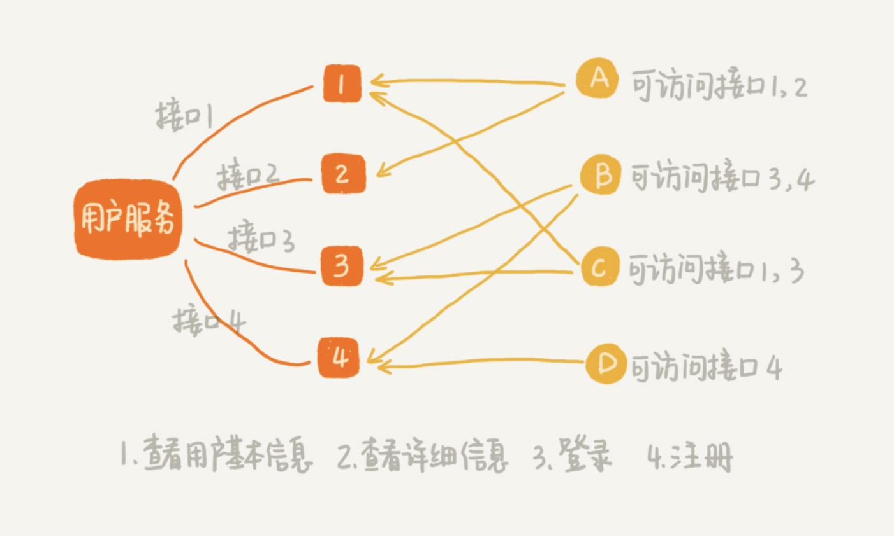
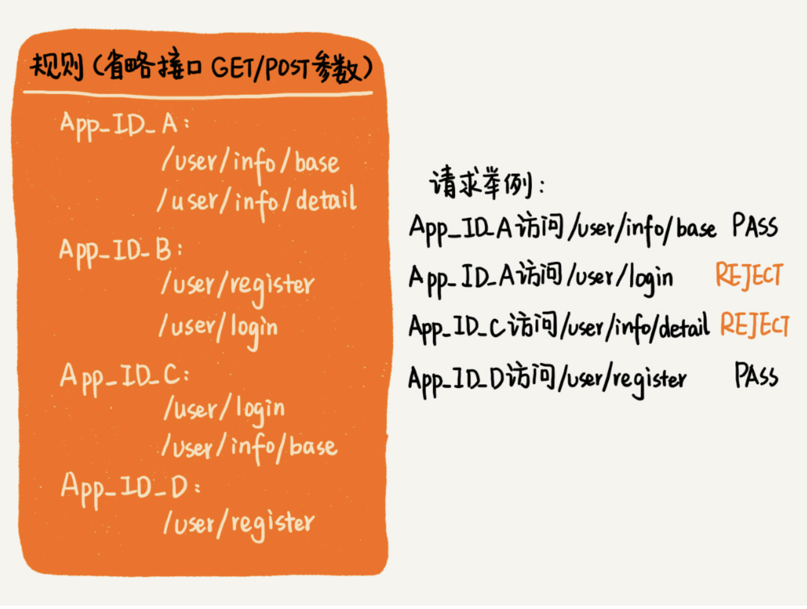
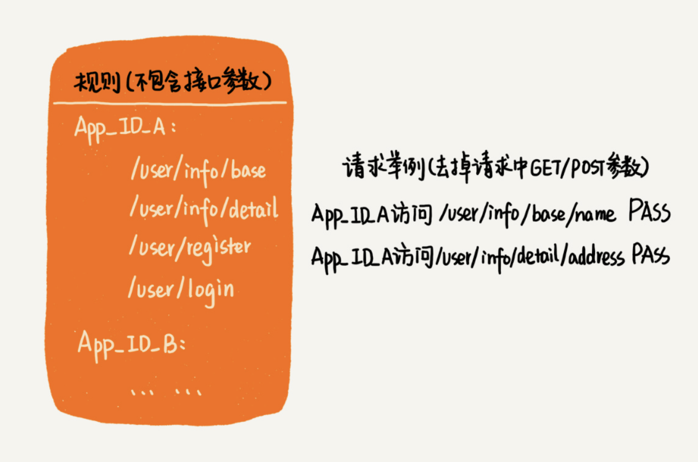
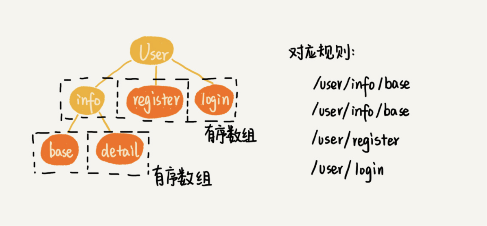
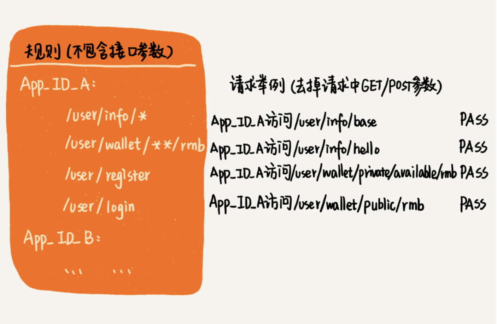

# 如何实现快速鉴权？

以防你之前可能对微服务没有太多了解，所以我对鉴权的背景做了简化。

假设我们有一个微服务叫用户服务（User Service）。它提供很多用户相关的接口，比如获取用户信息、注册、登录等，给公司内部的其他应用使用。但是，并不是公司内部所有应用，都可以访问这个用户服务，也并不是每个有访问权限的应用，都可以访问用户服务的所有接口。

我举了一个例子给你讲解一下，你可以看我画的这幅图。这里面，只有 A、B、C、D 四个应用可以访问用户服务，并且，每个应用只能访问用户服务的部分接口。

要实现接口鉴权功能，我们需要事先将应用对接口的访问权限规则设置好。当某个应用访问其中一个接口的时候，我们就可以拿应用的请求 URL，在规则中进行匹配。如果匹配成功，就说明允许访问；如果没有可以匹配的规则，那就说明这个应用没有这个接口的访问权限，我们就拒绝服务。

接口的格式有很多，有类似 Dubbo 这样的 RPC 接口，也有类似 Spring Cloud 这样的 HTTP 接口。不同接口的鉴权实现方式是类似的，我这里主要拿 HTTP 接口给你讲解。

鉴权的原理比较简单、好理解。那具体到实现层面，我们该用什么数据结构来存储规则呢？用户请求 URL 在规则中快速匹配，又该用什么样的算法呢？

实际上，不同的规则和匹配模式，对应的数据结构和匹配算法也是不一样的。所以，关于这个问题，我继续细化为三个更加详细的需求给你讲解。

# 1. 如何实现精确匹配规则？

我们先来看最简单的一种匹配模式。只有当请求 URL 跟规则中配置的某个接口精确匹配时，这个请求才会被接受、处理。为了方便你理解，我举了一个例子，你可以看一下。

不同的应用对应不同的规则集合。我们可以采用散列表来存储这种对应关系。我这里着重讲下，每个应用对应的规则集合，该如何存储和匹配。

针对这种匹配模式，我们可以将每个应用对应的权限规则，存储在一个字符串数组中。当用户请求到来时，我们拿用户的请求 URL，在这个字符串数组中逐一匹配，匹配的算法就是我们之前学过的字符串匹配算法（比如 KMP、BM、BF 等）。

规则不会经常变动，所以，为了加快匹配速度，我们可以按照字符串的大小给规则排序，把它组织成有序数组这种数据结构。当要查找某个 URL 能否匹配其中某条规则的时候，我们可以采用二分查找算法，在有序数组中进行匹配。

而二分查找算法的时间复杂度是 O(logn)（n 表示规则的个数），这比起时间复杂度是 O(n) 的顺序遍历快了很多。对于规则中接口长度比较长，并且鉴权功能调用量非常大的情况，这种优化方法带来的性能提升还是非常可观的 。

# 2. 如何实现前缀匹配规则？

我们再来看一种稍微复杂的匹配模式。只要某条规则可以匹配请求 URL 的前缀，我们就说这条规则能够跟这个请求 URL 匹配。同样，为了方便你理解这种匹配模式，我还是举一个例子说明一下。

不同的应用对应不同的规则集合。我们采用散列表来存储这种对应关系。我着重讲一下，每个应用的规则集合，最适合用什么样的数据结构来存储。

在Trie树那节，我们讲到，Trie 树非常适合用来做前缀匹配。所以，针对这个需求，我们可以将每个用户的规则集合，组织成 Trie 树这种数据结构。

不过，Trie 树中的每个节点不是存储单个字符，而是存储接口被“/”分割之后的子目录（比如“/user/name”被分割为“user”“name”两个子目录）。因为规则并不会经常变动，所以，在 Trie 树中，我们可以把每个节点的子节点们，组织成有序数组这种数据结构。当在匹配的过程中，我们可以利用二分查找算法，决定从一个节点应该跳到哪一个子节点。

# 3. 如何实现模糊匹配规则？

如果我们的规则更加复杂，规则中包含通配符，比如“**”表示匹配任意多个子目录，“*”表示匹配任意一个子目录。只要用户请求 URL 可以跟某条规则模糊匹配，我们就说这条规则适用于这个请求。为了方便你理解，我举一个例子来解释一下。

不同的应用对应不同的规则集合。我们还是采用散列表来存储这种对应关系。这点我们刚才讲过了，这里不再重复说了。我们着重看下，每个用户对应的规则集合，该用什么数据结构来存储？针对这种包含通配符的模糊匹配，我们又该使用什么算法来实现呢？

还记得我们在回溯算法那节讲的正则表达式的例子吗？我们可以借助正则表达式那个例子的解决思路，来解决这个问题。我们采用回溯算法，拿请求 URL 跟每条规则逐一进行模糊匹配。如何用回溯算法进行模糊匹配，这部分我就不重复讲了。你如果忘记了，可以回到相应章节复习一下。

不过，这个解决思路的时间复杂度是非常高的。我们需要拿每一个规则，跟请求 URL 匹配一遍。那有没有办法可以继续优化一下呢？

实际上，我们可以结合实际情况，挖掘出这样一个隐形的条件，那就是，并不是每条规则都包含通配符，包含通配符的只是少数。于是，我们可以把不包含通配符的规则和包含通配符的规则分开处理。

我们把不包含通配符的规则，组织成有序数组或者 Trie 树（具体组织成什么结构，视具体的需求而定，是精确匹配，就组织成有序数组，是前缀匹配，就组织成 Trie 树），而这一部分匹配就会非常高效。剩下的是少数包含通配符的规则，我们只要把它们简单存储在一个数组中就可以了。尽管匹配起来会比较慢，但是毕竟这种规则比较少，所以这种方法也是可以接受的。

当接收到一个请求 URL 之后，我们可以先在不包含通配符的有序数组或者 Trie 树中查找。如果能够匹配，就不需要继续在通配符规则中匹配了；如果不能匹配，就继续在通配符规则中查找匹配。

总结：

对于第一种精确匹配模式，我们利用有序数组来存储每个应用的规则集合，并且通过二分查找和字符串匹配算法，来匹配请求 URL 与规则。对于第二种前缀匹配模式，我们利用 Trie 树来存储每个应用的规则集合。对于第三种模糊匹配模式，我们采用普通的数组来存储包含通配符的规则，通过回溯算法，来进行请求 URL 与规则的匹配。

