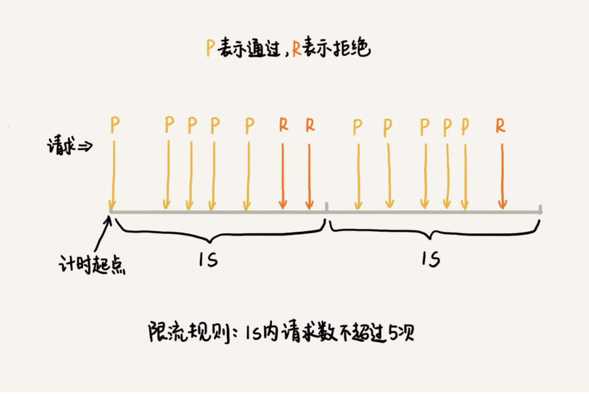
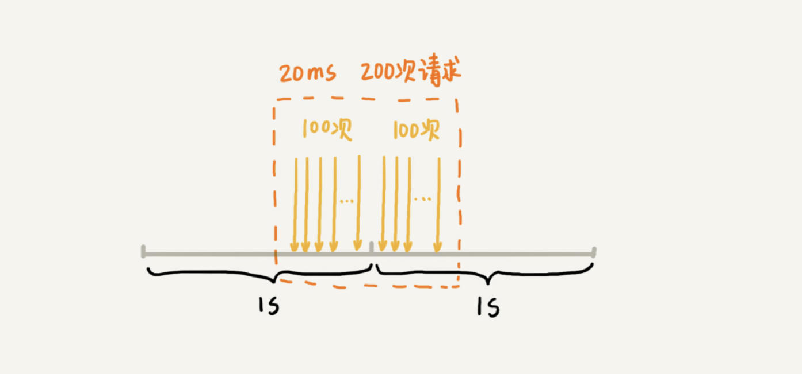
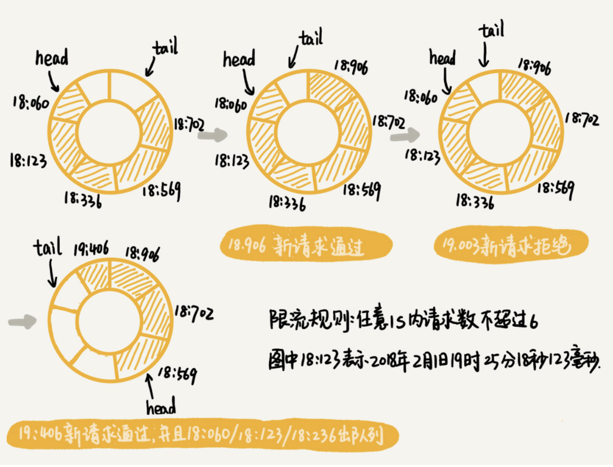

# 如何实现精准限流？

所谓限流，顾名思义，就是对接口调用的频率进行限制。比如每秒钟不能超过 100 次调用，超过之后，我们就拒绝服务。限流的原理听起来非常简单，但它在很多场景中，发挥着重要的作用。比如在秒杀、大促、双 11、618 等场景中，限流已经成为了保证系统平稳运行的一种标配的技术解决方案。

按照不同的限流粒度，限流可以分为很多种类型。比如给每个接口限制不同的访问频率，或者给所有接口限制总的访问频率，又或者更细粒度地限制某个应用对某个接口的访问频率等等。

不同粒度的限流功能的实现思路都差不多，所以，我今天主要针对限制所有接口总的访问频率这样一个限流需求来讲解。

# 固定时间窗口限流算法

最简单的限流算法叫**固定时间窗口限流算法**。这种算法是如何工作的呢？首先我们需要选定一个时间起点，之后每当有接口请求到来，我们就将计数器加一。如果在当前时间窗口内，根据限流规则（比如每秒钟最大允许 100 次访问请求），出现累加访问次数超过限流值的情况时，我们就拒绝后续的访问请求。当进入下一个时间窗口之后，计数器就清零重新计数。

这种基于固定时间窗口的限流算法的缺点是，限流策略过于粗略，无法应对两个时间窗口临界时间内的突发流量。这是怎么回事呢？我举一个例子给你解释一下。

假设我们的限流规则是，每秒钟不能超过 100 次接口请求。第一个 1s 时间窗口内，100 次接口请求都集中在最后 10ms 内。在第二个 1s 的时间窗口内，100 次接口请求都集中在最开始的 10ms 内。虽然两个时间窗口内流量都符合限流要求（≤100 个请求），但在两个时间窗口临界的 20ms 内，会集中有 200 次接口请求。固定时间窗口限流算法并不能对这种情况做限制，所以，集中在这 20ms 内的 200 次请求就有可能压垮系统。

为了解决这个问题，我们可以对固定时间窗口限流算法稍加改造。我们可以限制任意时间窗口（比如 1s）内，接口请求数都不能超过某个阈值（ 比如 100 次）。因此，相对于固定时间窗口限流算法，这个算法叫**滑动时间窗口限流算法**。

# 滑动时间窗口限流算法

流量经过滑动时间窗口限流算法整形之后，可以保证任意一个 1s 的时间窗口内，都不会超过最大允许的限流值，从流量曲线上来看会更加平滑。那具体到实现层面，我们该如何来做呢？

我们假设限流的规则是，在任意 1s 内，接口的请求次数都不能大于 K 次。我们就维护一个大小为 K+1 的循环队列，用来记录 1s 内到来的请求。注意，这里循环队列的大小等于限流次数加一，因为循环队列存储数据时会浪费一个存储单元。

当有新的请求到来时，我们将与这个新请求的时间间隔超过 1s 的请求，从队列中删除。然后，我们再来看循环队列中是否有空闲位置。如果有，则把新请求存储在队列尾部（tail 指针所指的位置）；如果没有，则说明这 1 秒内的请求次数已经超过了限流值 K，所以这个请求被拒绝服务。

为了方便你理解，我举一个例子，给你解释一下。在这个例子中，我们假设限流的规则是，任意 1s 内，接口的请求次数都不能大于 6 次。

即便滑动时间窗口限流算法可以保证任意时间窗口内，接口请求次数都不会超过最大限流值，但是仍然不能防止，在细时间粒度上访问过于集中的问题。

比如我刚刚举的那个例子，第一个 1s 的时间窗口内，100 次请求都集中在最后 10ms 中，也就是说，基于时间窗口的限流算法，不管是固定时间窗口还是滑动时间窗口，只能在选定的时间粒度上限流，对选定时间粒度内的更加细粒度的访问频率不做限制。

实际上，针对这个问题，还有很多更加平滑的限流算法，比如令牌桶算法、漏桶算法等。

对于滑动时间窗口限流算法，我们用了循环队列来实现。比起固定时间窗口限流算法，它对流量的整形效果更好，流量更加平滑。