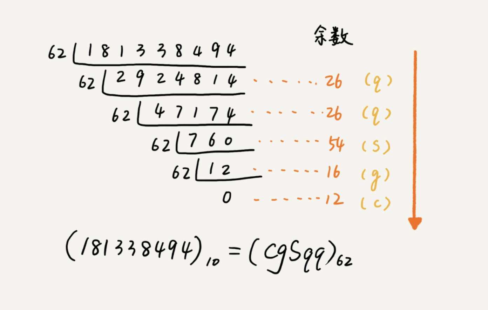

# 如何通过哈希算法生成短网址？

我们前面学过哈希算法。哈希算法可以将一个不管多长的字符串，转化成一个长度固定的哈希值。我们可以利用哈希算法，来生成短网址。

前面我们已经提过一些哈希算法了，比如 MD5、SHA 等。但是，实际上，我们并不需要这些复杂的哈希算法。在生成短网址这个问题上，毕竟，我们不需要考虑反向解密的难度，所以我们只需要关心哈希算法的计算速度和冲突概率。

能够满足这样要求的哈希算法有很多，其中比较著名并且应用广泛的一个哈希算法，那就是[MurmurHash 算法](https://zh.wikipedia.org/wiki/Murmur哈希)。尽管这个哈希算法在 2008 年才被发明出来，但现在它已经广泛应用到 Redis、MemCache、Cassandra、HBase、Lucene 等众多著名的软件中。

MurmurHash 算法提供了两种长度的哈希值，一种是 32bits，一种是 128bits。为了让最终生成的短网址尽可能短，我们可以选择 32bits 的哈希值。对于开头那个 GitHub 网址，经过 MurmurHash 计算后，得到的哈希值就是 181338494。我们再拼上短网址服务的域名，就变成了最终的短网址 http://t.cn/181338494（其中，http://t.cn 是短网址服务的域名）。

# 1. 如何让短网址更短？

不过，你可能已经看出来了，通过 MurmurHash 算法得到的短网址还是很长啊，而且跟我们开头那个网址的格式好像也不一样。别着急，我们只需要稍微改变一个哈希值的表示方法，就可以轻松把短网址变得更短些。

我们可以将 10 进制的哈希值，转化成更高进制的哈希值，这样哈希值就变短了。我们知道，16 进制中，我们用 A～E，来表示 10～15。在网址 URL 中，常用的合法字符有 0～9、a～z、A～Z 这样 62 个字符。为了让哈希值表示起来尽可能短，我们可以将 10 进制的哈希值转化成 62 进制。具体的计算过程，我写在这里了。最终用 62 进制表示的短网址就是[http://t.cn/cgSqq](http://t.cn/cgSqq。)。

# 2. 如何解决哈希冲突问题？

不过，我们前面讲过，哈希算法无法避免的一个问题，就是哈希冲突。尽管 MurmurHash 算法，冲突的概率非常低。但是，一旦冲突，就会导致两个原始网址被转化成同一个短网址。当用户访问短网址的时候，我们就无从判断，用户想要访问的是哪一个原始网址了。这个问题该如何解决呢？

一般情况下，我们会保存短网址跟原始网址之间的对应关系，以便后续用户在访问短网址的时候，可以根据对应关系，查找到原始网址。存储这种对应关系的方式有很多，比如我们自己设计存储系统或者利用现成的数据库。前面我们讲到的数据库有 MySQL、Redis。我们就拿 MySQL 来举例。假设短网址与原始网址之间的对应关系，就存储在 MySQL 数据库中。

当有一个新的原始网址需要生成短网址的时候，我们先利用 MurmurHash 算法，生成短网址。然后，我们拿这个新生成的短网址，在 MySQL 数据库中查找。

如果没有找到相同的短网址，这也就表明，这个新生成的短网址没有冲突。于是我们就将这个短网址返回给用户（请求生成短网址的用户），然后将这个短网址与原始网址之间的对应关系，存储到 MySQL 数据库中。

如果我们在数据库中，找到了相同的短网址，那也并不一定说明就冲突了。我们从数据库中，将这个短网址对应的原始网址也取出来。如果数据库中的原始网址，跟我们现在正在处理的原始网址是一样的，这就说明已经有人请求过这个原始网址的短网址了。我们就可以拿这个短网址直接用。如果数据库中记录的原始网址，跟我们正在处理的原始网址不一样，那就说明哈希算法发生了冲突。不同的原始网址，经过计算，得到的短网址重复了。这个时候，我们该怎么办呢？

我们可以给原始网址拼接一串特殊字符，比如“[DUPLICATED]”，然后跟再重新计算哈希值，两次哈希计算都冲突的概率，显然是非常低的。假设出现非常极端的情况，又发生冲突了，我们可以再换一个拼接字符串，比如“[OHMYGOD]”，再计算哈希值。然后把计算得到的哈希值，跟原始网址拼接了特殊字符串之后的文本，一并存储在 MySQL 数据库中。

当用户访问短网址的时候，短网址服务先通过短网址，在数据库中查找到对应的原始网址。如果原始网址有拼接特殊字符（这个很容易通过字符串匹配算法找到），我们就先将特殊字符去掉，然后再将不包含特殊字符的原始网址返回给浏览器。

# 3. 如何优化哈希算法生成短网址的性能？

为了判断生成的短网址是否冲突，我们需要拿生成的短网址，在数据库中查找。如果数据库中存储的数据非常多，那查找起来就会非常慢，势必影响短网址服务的性能。那有没有什么优化的手段呢？

还记得我们之前讲的 MySQL 数据库索引吗？我们可以给短网址字段添加 B+ 树索引。这样通过短网址查询原始网址的速度就提高了很多。实际上，在真实的软件开发中，我们还可以通过一个小技巧，来进一步提高速度。

在短网址生成的过程中，我们会跟数据库打两次交道，也就是会执行两条 SQL 语句。第一个 SQL 语句是通过短网址查询短网址与原始网址的对应关系，第二个 SQL 语句是将新生成的短网址和原始网址之间的对应关系存储到数据库。

我们知道，一般情况下，数据库和应用服务（只做计算不存储数据的业务逻辑部分）会部署在两个独立的服务器或者虚拟服务器上。那两条 SQL 语句的执行就需要两次网络通信。这种 IO 通信耗时以及 SQL 语句的执行，才是整个短网址服务的性能瓶颈所在。所以，为了提高性能，我们需要尽量减少 SQL 语句。那又该如何减少 SQL 语句呢？

我们可以给数据库中的短网址字段，添加一个唯一索引（不止是索引，还要求表中不能有重复的数据）。当有新的原始网址需要生成短网址的时候，我们并不会先拿生成的短网址，在数据库中查找判重，而是直接将生成的短网址与对应的原始网址，尝试存储到数据库中。如果数据库能够将数据正常写入，那说明并没有违反唯一索引，也就是说，这个新生成的短网址并没有冲突。

当然，如果数据库反馈违反唯一性索引异常，那我们还得重新执行刚刚讲过的“查询、写入”过程，SQL 语句执行的次数不减反增。但是，在大部分情况下，我们把新生成的短网址和对应的原始网址，插入到数据库的时候，并不会出现冲突。所以，大部分情况下，我们只需要执行一条写入的 SQL 语句就可以了。所以，从整体上看，总的 SQL 语句执行次数会大大减少。

实际上，我们还有另外一个优化 SQL 语句次数的方法，那就是借助布隆过滤器。

我们把已经生成的短网址，构建成布隆过滤器。我们知道，布隆过滤器是比较节省内存的一种存储结构，长度是 10 亿的布隆过滤器，也只需要 125MB 左右的内存空间。

当有新的短网址生成的时候，我们先拿这个新生成的短网址，在布隆过滤器中查找。如果查找的结果是不存在，那就说明这个新生成的短网址并没有冲突。这个时候，我们只需要再执行写入短网址和对应原始网页的 SQL 语句就可以了。通过先查询布隆过滤器，总的 SQL 语句的执行次数减少了。

到此，利用哈希算法来生成短网址的思路，我就讲完了。实际上，这种解决思路已经完全满足需求了，我们已经可以直接用到真实的软件开发中。不过，我们还有另外一种短网址的生成算法，那就是利用自增的 ID 生成器来生成短网址。我们接下来就看一下，这种算法是如何工作的？对于哈希算法生成短网址来说，它又有什么优势和劣势？