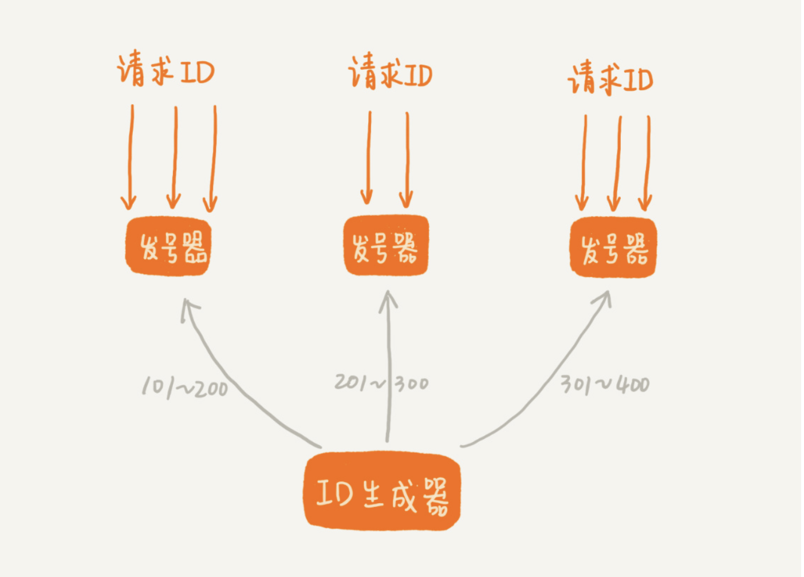
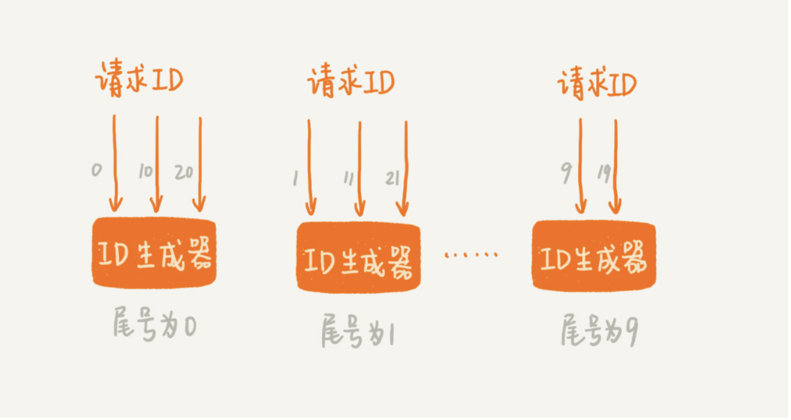

# 如何通过 ID 生成器生成短网址？

我们可以维护一个 ID 自增生成器。它可以生成 1、2、3…这样自增的整数 ID。当短网址服务接收到一个原始网址转化成短网址的请求之后，它先从 ID 生成器中取一个号码，然后将其转化成 62 进制表示法，拼接到短网址服务的域名（比如http://t.cn/）后面，就形成了最终的短网址。最后，我们还是会把生成的短网址和对应的原始网址存储到数据库中。

理论非常简单好理解。不过，这里有几个细节问题需要处理。

# 1. 相同的原始网址可能会对应不同的短网址

每次新来一个原始网址，我们就生成一个新的短网址，这种做法就会导致两个相同的原始网址生成了不同的短网址。这个该如何处理呢？实际上，我们有两种处理思路。

第一种处理思路是**不做处理**。听起来有点无厘头，我稍微解释下你就明白了。实际上，相同的原始网址对应不同的短网址，这个用户是可以接受的。在大部分短网址的应用场景里，用户只关心短网址能否正确地跳转到原始网址。至于短网址长什么样子，他其实根本就不关心。所以，即便是同一个原始网址，两次生成的短网址不一样，也并不会影响到用户的使用。

第二种处理思路是**借助哈希算法生成短网址的处理思想，**当要给一个原始网址生成短网址的时候，我们要先拿原始网址在数据库中查找，看数据库中是否已经存在相同的原始网址了。如果数据库中存在，那我们就取出对应的短网址，直接返回给用户。

不过，这种处理思路有个问题，我们需要给数据库中的短网址和原始网址这两个字段，都添加索引。短网址上加索引是为了提高用户查询短网址对应的原始网页的速度，原始网址上加索引是为了加快刚刚讲的通过原始网址查询短网址的速度。这种解决思路虽然能满足“相同原始网址对应相同短网址”这样一个需求，但是是有代价的：一方面两个索引会占用更多的存储空间，另一方面索引还会导致插入、删除等操作性能的下降。

# 2. 如何实现高性能的 ID 生成器？

实现 ID 生成器的方法有很多，比如利用数据库自增字段。当然我们也可以自己维护一个计数器，不停地加一加一。但是，一个计数器来应对频繁的短网址生成请求，显然是有点吃力的（因为计数器必须保证生成的 ID 不重复，笼统概念上讲，就是需要加锁）。如何提高 ID 生成器的性能呢？关于这个问题，实际上，有很多解决思路。我这里给出两种思路。

第一种思路是我们可以给 ID 生成器装多个前置发号器。我们批量地给每个前置发号器发送 ID 号码。当我们接受到短网址生成请求的时候，就选择一个前置发号器来取号码。这样通过多个前置发号器，明显提高了并发发号的能力。

第二种思路跟第一种差不多。不过，我们不再使用一个 ID 生成器和多个前置发号器这样的架构，而是，直接实现多个 ID 生成器同时服务。为了保证每个 ID 生成器生成的 ID 不重复。我们要求每个 ID 生成器按照一定的规则，来生成 ID 号码。比如，第一个 ID 生成器只能生成尾号为 0 的，第二个只能生成尾号为 1 的，以此类推。这样通过多个 ID 生成器同时工作，也提高了 ID 生成的效率。

总结：

第一种实现思路是通过哈希算法生成短网址。我们采用计算速度快、冲突概率小的 MurmurHash 算法，并将计算得到的 10 进制数，转化成 62 进制表示法，进一步缩短短网址的长度。对于哈希算法的哈希冲突问题，我们通过给原始网址添加特殊前缀字符，重新计算哈希值的方法来解决。

第二种实现思路是通过 ID 生成器来生成短网址。我们维护一个 ID 自增的 ID 生成器，给每个原始网址分配一个 ID 号码，并且同样转成 62 进制表示法，拼接到短网址服务的域名之后，形成最终的短网址。