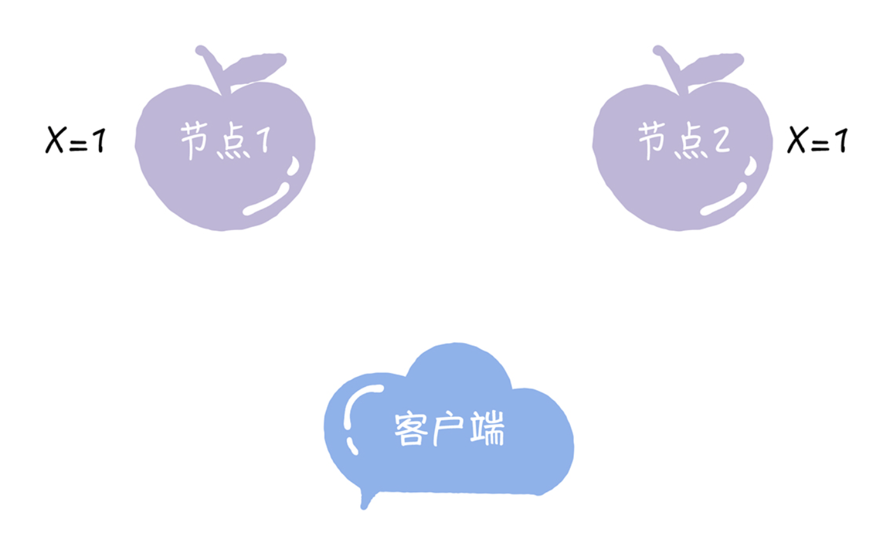
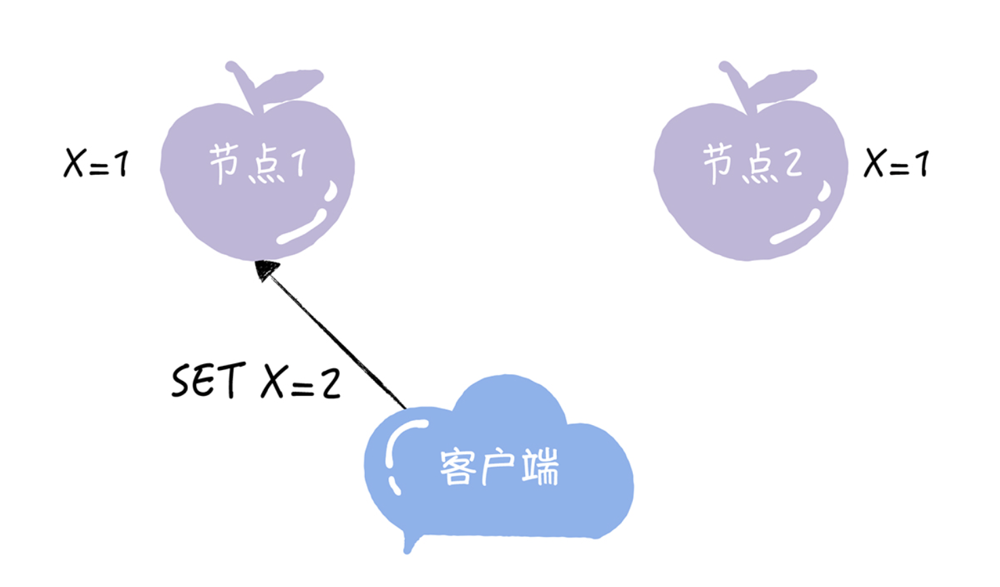
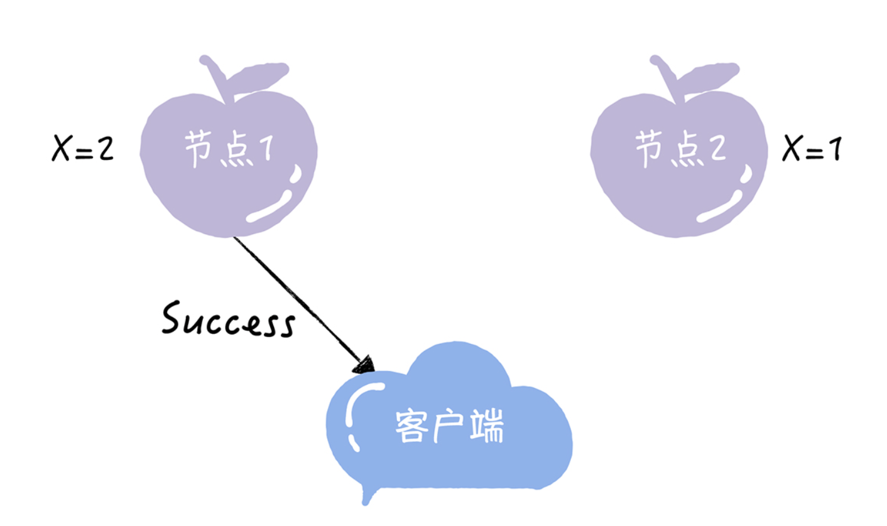
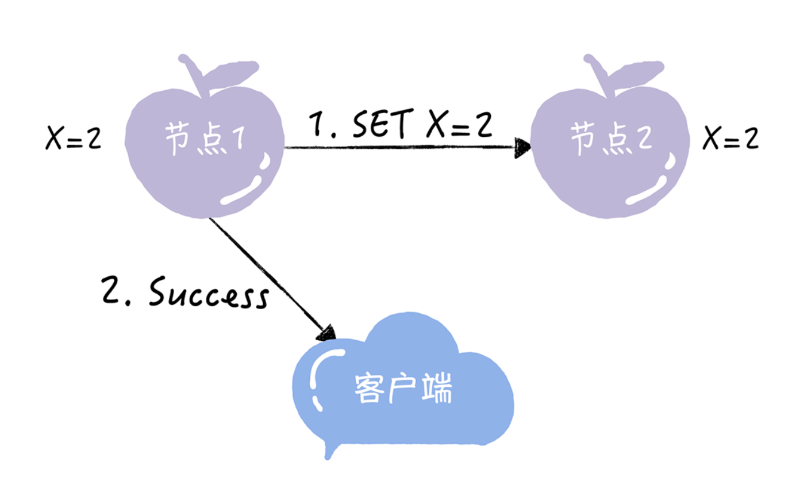
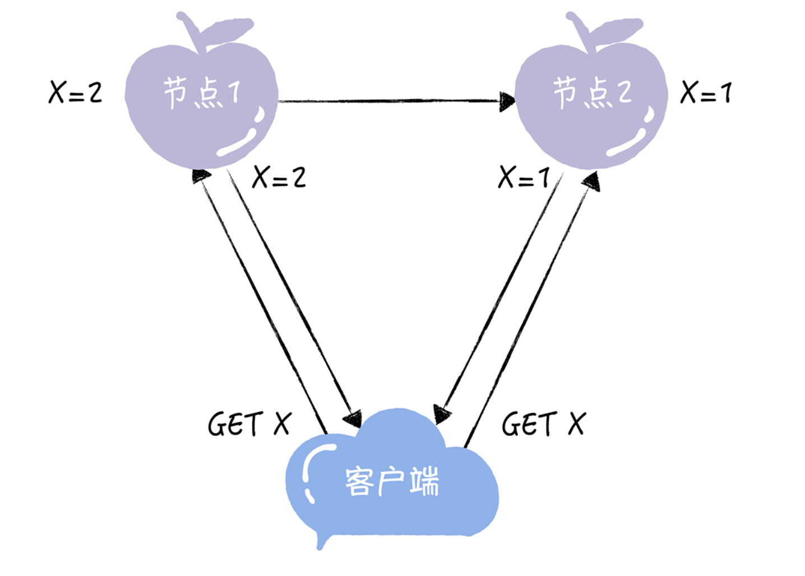
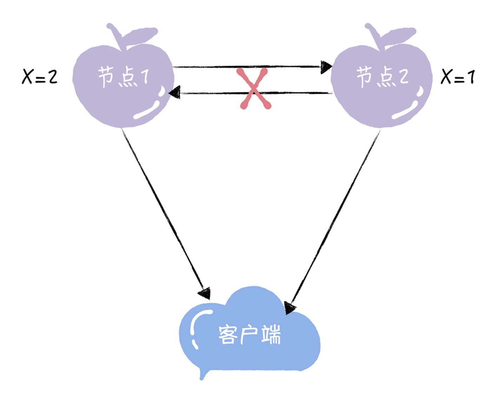

# CAP三指标

CAP 理论对分布式系统的特性做了高度抽象，形成了三个指标:

- 一致性(Consistency)

- 可用性(Availability)

- 分区容错性(Partition Tolerance)

# 一致性

一致性说的是客户端的每次读操作，不管访问哪个节点，要么读到的都是同一份最新的数据，要么读取失败。

你可以把一致性看作是分布式系统对访问本系统的客户端的一种承诺：不管你访问哪个节点，要么我给你返回的都是绝对一致的数据，要么你都读取失败。**你可以看到，一致性强调的不是数据完整，而是各节点间的数据一致。**

为了帮你理解一致性这个指标，我给你举一个具体的例子。比如，2 个节点的 KV 存储，原始的 KV 记录为“X = 1”。

紧接着，客户端向节点 1 发送写请求“SET X = 2”。

如果节点 1 收到写请求后，只将节点 1 的 X 值更新为 2，然后返回成功给客户端，这个时候节点 2 的 X 值还是1，那么两个节点是非一致性的。

如果节点 1 收到写请求后，通过节点间的通讯，同时将节点 1 和节点 2 的 X 值都更新为 2，然后返回成功给客户端，那么在完成写请求后，两个节点的数据就是一致的了，之后，不管客户端访问哪个节点，读取到的都是同一份最新数据。

一致性这个指标，描述的是分布式系统非常重要的一个特性，强调的是数据的一致。也就是说，在客户端看来，集群和单机在数据一致性上是一样的。

不过集群毕竟不是单机，当发生分区故障的时候，有时不能仅仅因为节点间出现了通讯问题，节点中的数据会不一致，就拒绝写入新数据，之后在客户端查询数据时，就一直返回给客户端出错信息。这句话怎么理解呢？我来举个例子。

业务集群中的一些关键系统，比如名字路由系统，如果仅仅因为发生了分布故障，节点中的数据会不一致，集群就拒绝写入新的路由信息，之后，当客户端查询相关路由信息时，系统就一直返回给客户端出错信息，那么相关的服务都将因为获取不到指定路由信息而不可用、瘫痪，这可以说是灾难性的故障了。

这个时候，我们就需要牺牲数据的一致性，每个节点使用本地数据来响应客户端请求，来保证服务可用，**这就是我要说的另外一个指标，可用性。**

# 可用性

可用性说的是任何来自客户端的请求，不管访问哪个节点，都能得到响应数据，但不保证是同一份最新数据。你也可以把可用性看作是分布式系统对访问本系统的客户端的另外一种承诺：我尽力给你返回数据，不会不响应你，但是我不保证每个节点给你的数据都是最新的。 **这个指标强调的是服务可用，但不保证**数据的一致性。

比如，用户可以选择向节点 1 或节点 2 发起读操作，如果不管节点间的数据是否一致，只要节点服务器收到请求，就响应 X 的值，那么，2 个节点的服务是满足可用性的。

# 分区容错性

最后的分区容错性说的是，当节点间出现任意数量的消息丢失或高延迟的时候，系统仍然可以继续提供服务。也就是说，分布式系统在告诉访问本系统的客户端:不管我的内部出现什么样的数据同步问题，我会一直运行，提供服务。**这个指标，强调的是集群对分区故障的容错能力。**

来看下面的图，当节点 1 和节点 2 通信出问题的时候，如果系统仍能提供服务，那么，2 个节点是满足分区容错性的。

因为分布式系统与单机系统不同，它涉及到多节点间的通讯和交互，节点间的分区故障是必然发生的，**所以我要提醒你，在分布式系统中分区容错性是必须要考虑的。**