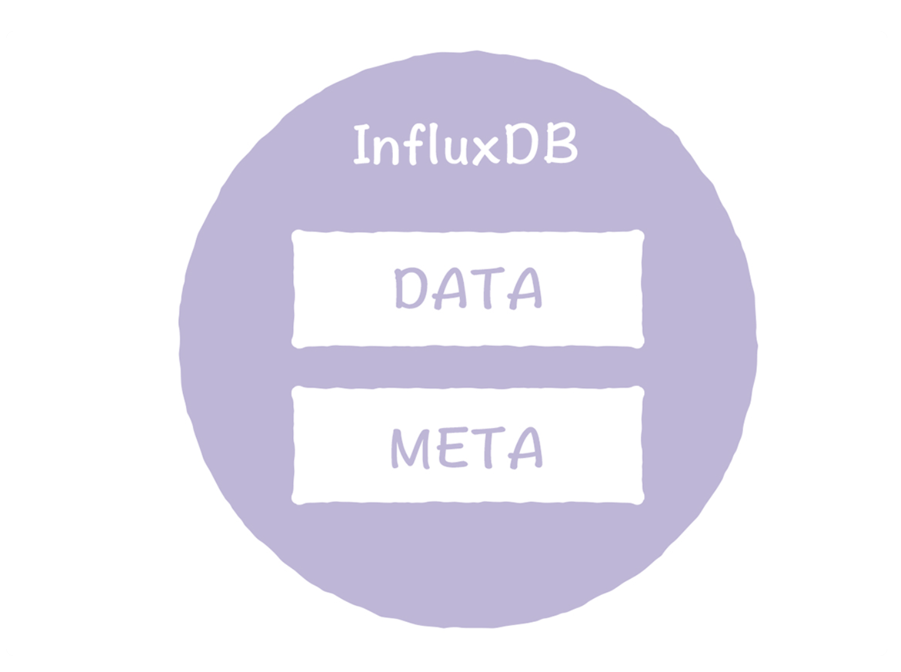

# 如何使用CAP理论

我们都知道，只要有网络交互就一定会有延迟和数据丢失，而这种状况我们必须接受，还必须保证系统不能挂掉。所以就像我上面提到的，节点间的分区故障是必然发生的。也就是说，分区容错性（P）是前提，是必须要保证的。

现在就只剩下一致性(C)和可用性(A)可以选择了:要么选择一致性，保证数据绝对一致;要么选择可用性，保证服务可用。那么 CP 和 AP 的含义是什么呢?

当选择了一致性(C)的时候，如果因为消息丢失、延迟过高发生了网络分区，部分节点无法保证特定信息是最新的，那么这个时候，当集群节点接收到来自客户端的写请求时，因为无法保证所有节点都是最新信息，所以系统将返回写失败错误，也就是说集群 拒绝新数据写入。

当选择了可用性(A)的时候，系统将始终处理客户端的查询，返回特定信息，如果发生了网络分区，一些节点将无法返回最新的特定信息，它们将返回自己当前的相对新的信息。

那么我当时是怎么根据场景特点，进行 CAP 权衡，设计适合的分布式系统呢?为了便于你理解，我先来说说背景。

开源版的 InfluxDB，缺乏集群能力和可用性，而且，InfluxDB 是由 META 节点和 DATA 节点 2 个逻辑单元组成，这 2 个节点的功能和数据特点不同，需要我们分别为它们设计分区容错一致性模型。

我具体是这么设计的:

作为分布式系统，分区容错性是必须要实现的，不能因为节点间出现了分区故障，而出现整个系统不能用的情况。

考虑到 META 节点保存的是系统运行的关键元信息，比如数据库名、表名、保留策略信息等，所以必须保持所有节点的一致性，这样才能避免由于各节点元信息不一致，导致时序数据记录不一致或者影响系统运行。比如，数据库 Telegraf 的信息在一些节点上存在，在另外一些节点上不存在，那么将导致向某些节点写入时序数据记录失败，所以， 我选择 CAP 理论中的 C 和 P，采用 CP 架构。

DATA 节点保存的是具体的时序数据记录，比如一条记录 CPU 负载的时序数据，“cpu_usage,host=server01,location=cn-sz user=23.0,system=57.0”。虽然 不是系统运行相关的元信息，但服务会被访问频繁，水平扩展、性能、可用性等是关键，所以，我选择了 CAP 理论中的 A 和 P，采用 AP 架构。

总结：

CA 模型，在分布式系统中不存在。因为舍弃 P，意味着舍弃分布式系统，就比如单机版关系型数据库 MySQL，如果 MySQL 要考虑主备或集群部署时，它必须考虑 P。

CP 模型，采用 CP 模型的分布式系统，一旦因为消息丢失、延迟过高发生了网络分区，就影响用户的体验和业务的可用性。因为为了防止数据不一致，集群将拒绝新数据的写入，典型的应用是 ZooKeeper，Etcd 和 HBase。

AP 模型，采用 AP 模型的分布式系统，实现了服务的高可用。用户访问系统的时候，都能得到响应数据，不会出现响应错误，但当出现分区故障时，相同的读操作，访问不同的节点，得到响应数据可能不一样。典型应用就比如 Cassandra 和 DynamoDB。