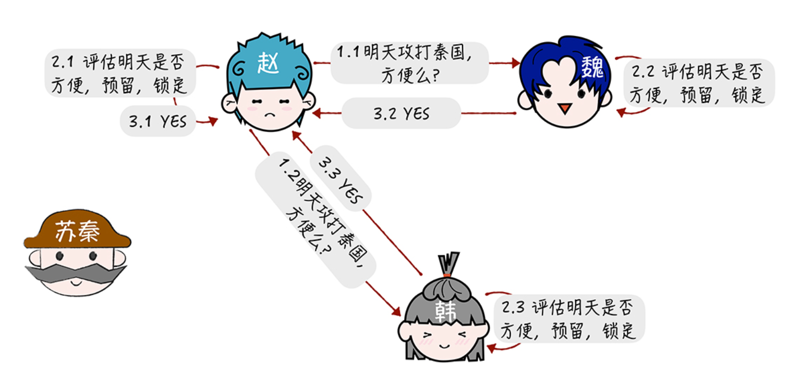
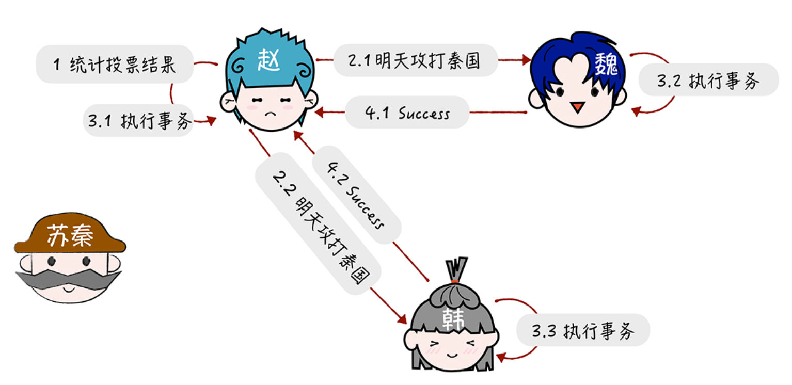

# 两阶段提交

到 ACID，我想你并不陌生，很多同学也会觉得它容易理解，在单机上实现 ACID 也不 难，比如可以通过锁、时间序列等机制保障操作的顺序执行，让系统实现 ACID 特性。

在我看来，ACID 理论是对事务特性的抽象和总结，方便我们实现事务。你可以理解成：如果实现了操作的 ACID 特性，那么就实现了事务。而大多数人觉得比较难，是因为分布式 系统涉及多个节点间的操作。加锁、时间序列等机制，只能保证单个节点上操作的 ACID 特性，无法保证节点间操作的 ACID 特性。

那么怎么做才会让实现不那么难呢？答案是你要掌握分布式事务协议，比如**二阶段提交协议**和 **TCC(Try-Confirm-Cancel)**。

咱们先看看苏秦的故事，秦国按捺不住自己躁动的心，开始骚扰魏国边境，魏王头疼，向苏秦求助，苏秦认为“三晋一家亲”，建议魏王联合赵、韩一起对抗秦国。但是这三个国家实力都很弱，需要大家都同意联合，一致行动，如果有任何一方不方便行动，就取消整个计划。

那么对苏秦来说，他面临的问题是，如何高效协同赵、魏、韩一起行动，并且保证当有一方不方便行动时，取消整个计划。

这就是典型的如何实现分布式事务的问题，**赵、魏、韩明天攻打秦 国，这三个操作组成一个分布式事务，要么全部执行，要么全部不执行。**

两阶段提交怎么解决这个分布式事务问题呢？

首先，苏秦发消息给赵，赵接收到消息后就扮演协调者(Coordinator)的身份，由赵联系魏和韩，发起二阶段提交，赵发起二阶段提交后，先进入**提交请求阶段(又称投票阶段)。**

第一步，赵分别向魏、韩发送消息:“明天攻打秦国，方便吗?”

第二步，赵、魏、韩，分别评估明天能否去攻打秦国，如果能，就预留时间并锁定，不再安
排其他军事活动。

第三步，赵得到全部的回复结果(包括他自己的评估结果)，都是 YES。

赵收到所有回复后，进入**提交执行阶段(又称完成阶段)，** 也就是具体执行操作了：

首先，赵按照“要么全部执行，要么放弃”的原则，统计投票结果，因为所有的回复结果都 是 YES，所以赵决定执行分布式事务，明天攻打秦国。

然后，赵通知魏、韩:“明天攻打秦国。”

接到通知之后，魏、韩执行事务，明天攻打秦国。

最后，魏、韩将执行事务的结果返回给赵。

这样一来，赵就将事务执行的结果(也就是赵、魏、韩明天一起攻打秦国)，返回给苏秦，

那么，这时苏秦就解决了问题，协调好了明天的作战计划。

在这里，赵采用的方法就是二阶段提交协议。在这个协议中:

- 你可以将“赵明天攻打秦国、魏明天攻打秦国、韩明天攻打秦国”，理解成一个分布式事务操作。

- 将赵、魏、韩理解为分布式系统的三个节点，其中，赵是协调者(Coordinator)，将苏 秦理解为业务，也就是客户端。

- 将消息理解为网络消息。

- 将“明天能否攻打秦国，预留时间”，理解为评估事务中需要操作的对象和对象状态，是否准备好，能否提交新操作。

在第一个阶段，每个参与者投票表决事务是放弃还是提交。一旦参与者投票 要求提交事务，那么就不允许放弃事务。也就是说，**在一个参与者投票要求提交事务之前， 它必须保证能够执行提交协议中它自己那一部分，即使参与者出现故障或者中途被替换掉。**

二阶段提交协议最早是用来实现数据库的分布式事务的，不过现在最常用的协议是 XA 协 议。这个协议是 X/Open 国际联盟基于二阶段提交协议提出的，也叫作 X/Open Distributed Transaction Processing(DTP)模型，比如MySQL 就是通过 MySQL XA 实现了分布式事务。

但是不管是原始的二阶段提交协议，还是 XA 协议，都存在一些问题:

- 在提交请求阶段，需要预留资源，在资源预留期间，其他人不能操作(比如，XA 在第一 阶段会将相关资源锁定)。

- 数据库是独立的系统。

::: tip
三阶段提交协议，虽然针对二阶段提交协议的“协调者故障，参与者 长期锁定资源”的痛点，通过引入了询问阶段和超时机制，来减少资源被长时间锁定的情 况，不过这会导致集群各节点在正常运行的情况下，使用更多的消息进行协商，增加系统负 载和响应延迟。也正是因为这些问题，三阶段提交协议很少被使用。
:::

因为上面这两点，我们无法根据业务特点弹性地调整锁的粒度，而这些都会影响数据库的并发性能。那用什么办法可以解决这些问题呢?答案就是 TCC。