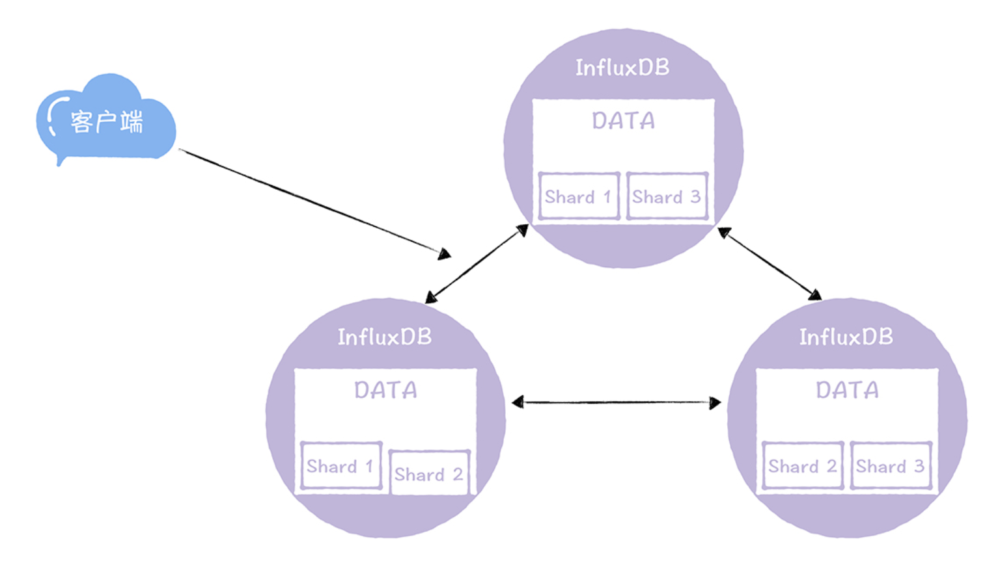

# 如何使用BASE理论

我以自研 InfluxDB 系统中 DATA 节点的集群实现为例，带你来使用 BASE 理论。咱们先来看看如何保障基本可用。

DATA 节点的核心功能是读和写，所以基本可用是指读和写的基本可用。那么我们可以通过分片和多副本，实现读和写的基本可用。也就是说，将同一业务的数据先分片，然后再以 多份副本的形式分布在不同的节点上。比如下面这张图，这个 3 节点 2 副本的集群，除非超过一半的节点都故障了，否则是能保障所有数据的读写的。

那么如果实现最终一致性呢？我们可以通过写时修复和异步修复实 现最终一致性。另外，还实现自定义写一致性级别，支持 All、Quorum、One、Any 4 种写一致性级别，用户在写数据的时候，可以根据业务数据的特点，设置不同的写一致性级别。

总结：

- BASE 理论是对 CAP 中一致性和可用性权衡的结果，它来源于对大规模互联网分布式系 统实践的总结，是基于 CAP 定理逐步演化而来的。它的核心思想是，如果不是必须的话，不推荐实现事务或强一致性，鼓励可用性和性能优先，根据业务的场景特点，来实现非常弹性的基本可用，以及实现数据的最终一致性。

- BASE 理论主张通过牺牲部分功能的可用性，实现整体的基本可用，也就是说，通过服务降级的方式，努力保障极端情况下的系统可用性。

- ACID 理论是传统数据库常用的设计理念，追求强一致性模型。BASE 理论支持的是大型分布式系统，通过牺牲强一致性获得高可用性。BASE 理论在很大程度上，解决了事务型系统在性能、容错、可用性等方面痛点。另外BASE 理论在 NoSQL 中应 用广泛，是 NoSQL 系统设计的事实上的理论支撑。