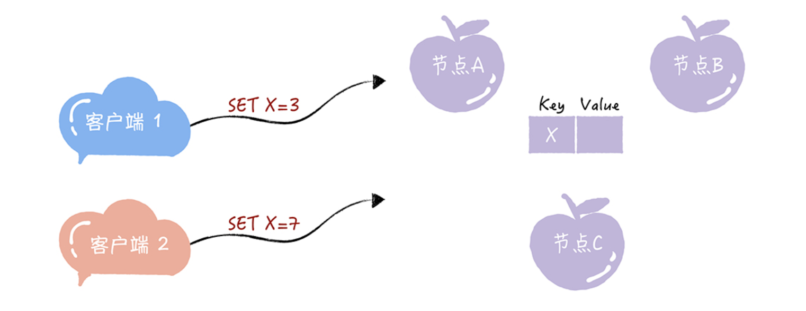
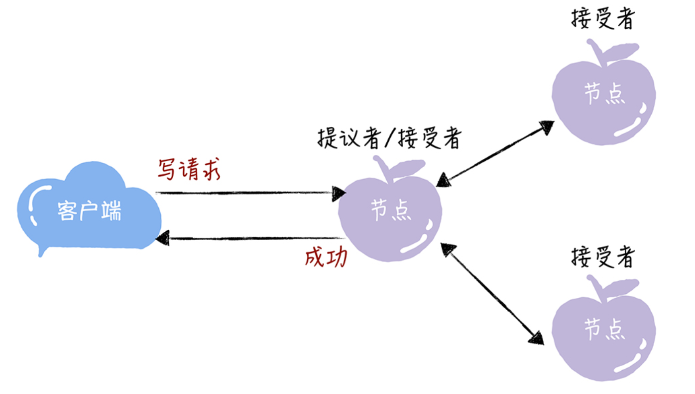

# 三种角色

兰伯特提出的 Paxos 算法包含 2 个部分:

- 一个是 Basic Paxos 算法，描述的是多节点之间如何就某个值(提案 Value)达成共识;

- 另一个是 Multi-Paxos 思想，描述的是执行多个 Basic Paxos 实例，就一系列值达成共识。

我们先看Basic Paxos算法。

**来看一道思考题。**

假设我们要实现一个分布式集群，这个集群是由节点 A、B、C 组成，提供只读 KV 存储服 务。你应该知道，创建只读变量的时候，必须要对它进行赋值，而且这个值后续没办法修 改。因此一个节点创建只读变量后就不能再修改它了，所以所有节点必须要先对只读变量的 值达成共识，然后所有节点再一起创建这个只读变量。

那么，当有多个客户端(比如客户端 1、2)访问这个系统，试图创建同一个只读变量(比 如 X)，客户端 1 试图创建值为 3 的 X，客户端 2 试图创建值为 7 的 X，这样要如何达成 共识，实现各节点上 X 值的一致呢?

先来看看三种角色。

在 Basic Paxos 中，有提议者(Proposer)、接受者(Acceptor)、学习者(Learner) 三种角色，他们之间的关系如下:

- **提议者(Proposer)**:提议一个值，用于投票表决。但在绝大多数场景中，集群中收到客户端请求的节点是提议者
- **接受者(Acceptor)**:对每个提议的值进行投票，并存储接受的值，比如 A、B、C 三 个节点。 一般来说，集群中的所有节点都在扮演接受者的角色，参与共识协商，并接受 和存储数据。
- **学习者(Learner)**:被告知投票的结果，接受达成共识的值，存储保存，不参与投票的过程。一般来说，学习者是数据备份节点，比如“Master-Slave”模型中的 Slave，被动地接受数据，容灾备份。

一个 3 节点的集 群，1 个节点收到了请求，那么该节点将作为提议者发起二阶段提交，然后这个节点和另外 2 个节点一起作为接受者进行共识协商，就像下图的样子:

其实，这三种角色，在本质上代表的是三种功能:

- 提议者代表的是接入和协调功能，收到客户端请求后，发起二阶段提交，进行共识协
  商。
- 接受者代表投票协商和存储数据，对提议的值进行投票，并接受达成共识的值，存储保
  存。
- 学习者代表存储数据，不参与共识协商，只接受达成共识的值，存储保存。