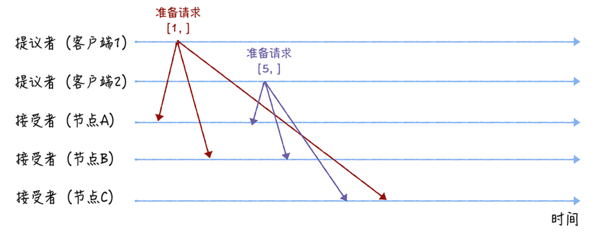
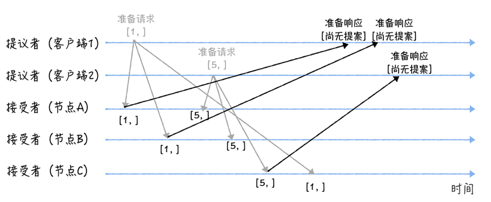
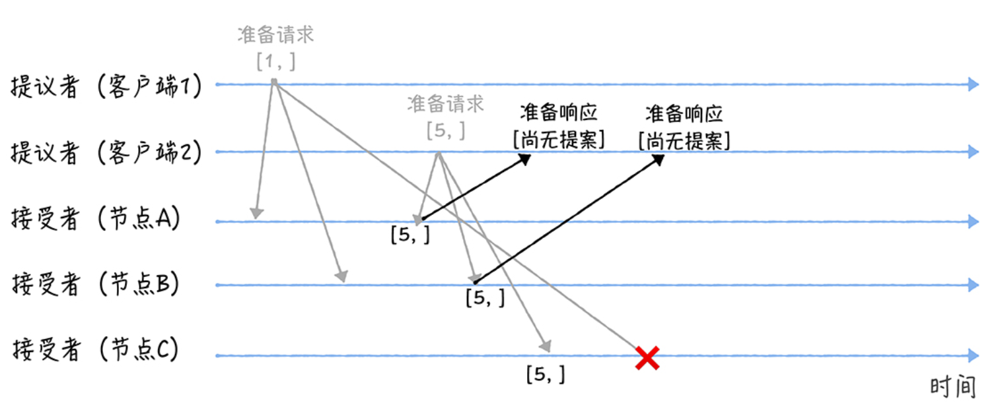
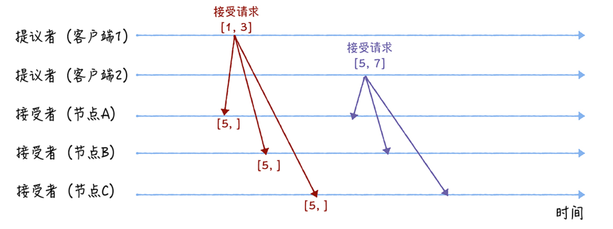
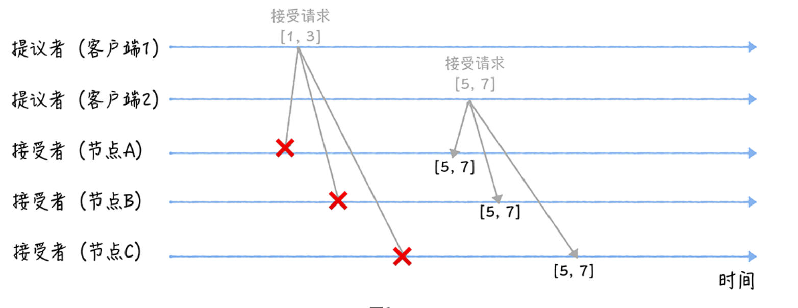

# Basic Paxos

在 Basic Paxos 中，兰伯特使用提案代表一个提议。在提案中， 除了提案编号，还包含了提议值。为了方便演示，我使用[n, v]表示一个提案，其中 n 为提案编号，v 为提议值。

整个共识协商是分 2 个阶段进行的：准备(Prepare)阶段**，**接受(Accept)阶段。

我们假设客户端 1 的提案编号为 1，客户端 2 的提案编号为 5，并假设节点 A、B 先收到 来自客户端 1 的准备请求，节点 C 先收到来自客户端 2 的准备请求。

# 准备(Prepare)阶段

首先客户端 1、2 作为提议者，分别向所有接受者发送包含提案编号的准备请求:

你要注意，在准备请求中是不需要指定提议的值的，只需要携带提案编号就可以了，这是很多同学容易产生误解的地方。

接着，当节点 A、B 收到提案编号为 1 的准备请求，节点 C 收到提案编号为 5 的准备请求 后，将进行这样的处理:

由于之前没有通过任何提案，所以节点 A、B 将返回一个 “尚无提案”的响应。也就是说节点 A 和 B 在告诉提议者，我之前没有通过任何提案呢，并承诺以后不再响应提案编 号小于等于 1 的准备请求，不会通过编号小于 1 的提案。

节点 C 也是如此，它将返回一个 “尚无提案”的响应，并承诺以后不再响应提案编号小 于等于 5 的准备请求，不会通过编号小于 5 的提案。

当节点 A、B 收到提案编号为 5 的准备请求，和节点 C 收到提案编号为 1 的准备请 求的时候，将进行这样的处理过程:

当节点 A、B 收到提案编号为 5 的准备请求的时候，因为提案编号 5 大于它们之前响应 的准备请求的提案编号 1，而且两个节点都没有通过任何提案，所以它将返回一个 “尚 无提案”的响应，并承诺以后不再响应提案编号小于等于 5 的准备请求，不会通过编号 小于 5 的提案。

当节点 C 收到提案编号为 1 的准备请求的时候，由于提案编号 1 小于它之前响应的准备 请求的提案编号 5，所以丢弃该准备请求，不做响应。

# 接受(Accept)阶段

第二个阶段也就是接受阶段，首先客户端 1、2 在收到大多数节点的准备响应之后，会分别发送接受请求:

当客户端 1 收到大多数的接受者(节点 A、B)的准备响应后，根据响应中提案编号最大的提案的值，设置接受请求中的值。因为该值在来自节点 A、B 的准备响应中都为空 (也就是图中的“尚无提案”)，所以就把自己的提议值 3 作为提案的值，发送接受请求[1, 3]。

当客户端 2 收到大多数的接受者的准备响应后(节点 A、B 和节点 C)，根据响应中提 案编号最大的提案的值，来设置接受请求中的值。因为该值在来自节点 A、B、C 的准备 响应中都为空(也就是图的“尚无提案”)，所以就把自己的提议值 7 作为 提案的值，发送接受请求[5, 7]。

当三个节点收到 2 个客户端的接受请求时，会进行这样的处理:

当节点 A、B、C 收到接受请求[1, 3]的时候，由于提案的提案编号 1 小于三个节点承诺 能通过的提案的最小提案编号 5，所以提案[1, 3]将被拒绝。

当节点 A、B、C 收到接受请求[5, 7]的时候，由于提案的提案编号 5 不小于三个节点承 诺能通过的提案的最小提案编号 5，所以就通过提案[5, 7]，也就是接受了值 7，三个节 点就 X 值为 7 达成了共识。

如果集群中有学习者，当接受者通过了一个提案时，就通知给所有的学习者。当学习者发现大多数的接受者都通过了某个提案，那么它也通过该提案，接受该提案的值。

Basic Paxos 原理总结：

1.你可以看到，Basic Paxos 是通过二阶段提交的方式来达成共识的。
2.除了共识，Basic Paxos 还实现了容错，在少于一半的节点出现故障时，集群也能工作。 它不像分布式事务算法那样，必须要所有节点都同意后才提交操作，因为“所有节点都 同意”这个原则，在出现节点故障的时候会导致整个集群不可用。也就是说，“大多数 节点都同意”的原则，赋予了 Basic Paxos 容错的能力，让它能够容忍少于一半的节点的故障。
3.本质上而言，提案编号的大小代表着优先级，你可以这么理解，根据提案编号的大小， 接受者保证**三个承诺**，具体来说:如果准备请求的提案编号，**小于等于**接受者已经响应 的准备请求的提案编号，那么接受者将承诺不响应这个准备请求;如果接受请求中的提 案的提案编号，**小于**接受者已经响应的准备请求的提案编号，那么接受者将承诺不通过 这个提案;如果接受者之前有通过提案，那么接受者将承诺，会在准备请求的响应中， 包含**已经通过的最大编号的提案信息**。

