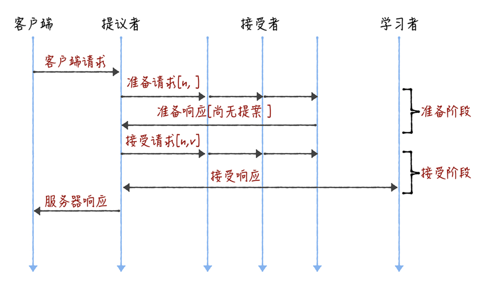
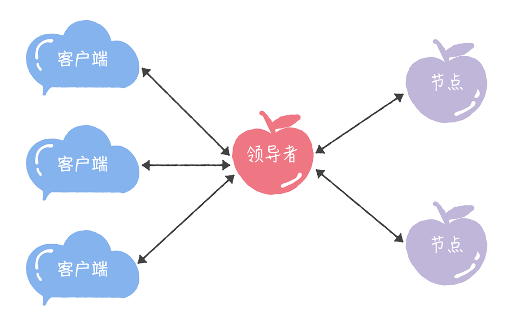
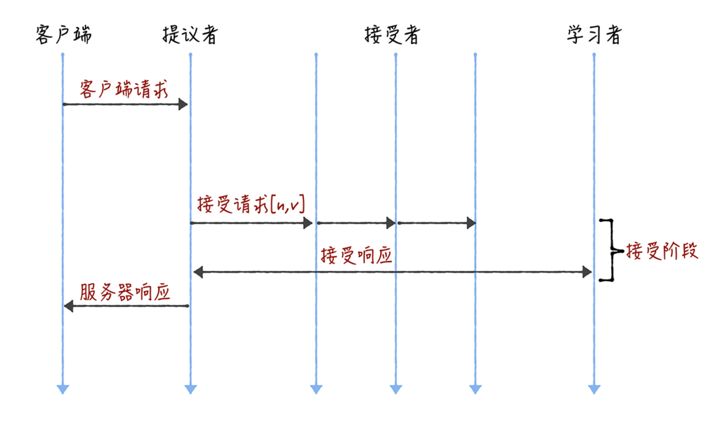
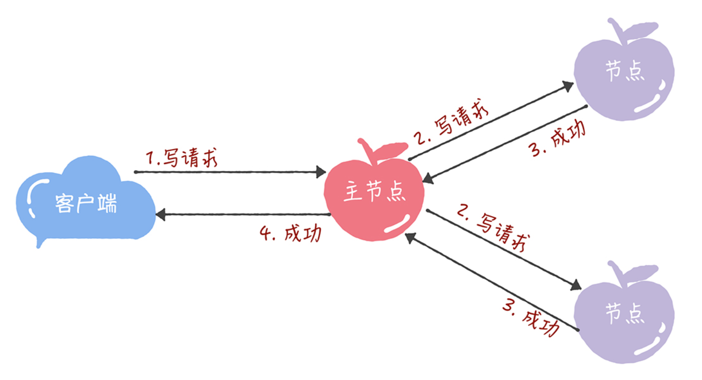
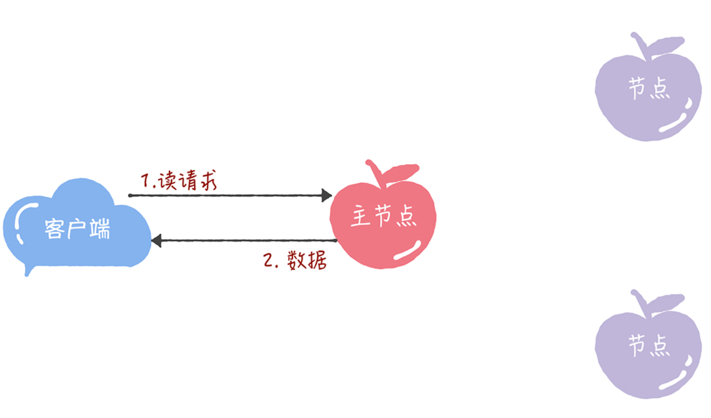

# Multi-Paxos

**兰伯特提到的 Multi-Paxos 是一种思想，不是算法。而 Multi-Paxos 算法是一个统称，它是指基于 Multi-Paxos 思想，通过多个 Basic Paxos 实例实现一系列值的共识的算法(比如 Chubby 的 Multi-Paxos 实现、Raft 算法等)。**

Basic Paxos 是通过二阶 段提交来达成共识的。在第一阶段，也就是准备阶段，接收到大多数准备响应的提议者，才 能发起接受请求进入第二阶段(也就是接受阶段)：

而如果我们直接通过多次执行 Basic Paxos 实例，来实现一系列值的共识，就会存在这样 几个问题:

- 如果多个提议者同时提交提案，可能出现因为提案冲突，在准备阶段没有提议者接收到 大多数准备响应，协商失败，需要重新协商。你想象一下，一个 5 节点的集群，如果 3 个节点作为提议者同时提案，就可能发生因为没有提议者接收大多数响应(比如 1 个提 议者接收到 1 个准备响应，另外 2 个提议者分别接收到 2 个准备响应)而准备失败，需要重新协商。

- 2 轮 RPC 通讯(准备阶段和接受阶段)往返消息多、耗性能、延迟大。你要知道，分布 式系统的运行是建立在 RPC 通讯的基础之上的，因此，延迟一直是分布式系统的痛点， 是需要我们在开发分布式系统时认真考虑和优化的。

那么如何解决上面的 2 个问题呢?可以通过引入领导者和优化 Basic Paxos 执行来解决。

# 领导者(Leader)

我们可以通过引入领导者节点，也就是说，领导者节点作为唯一提议者，这样就不存在多个提议者同时提交提案的情况，也就不存在提案冲突的情况了:

# 优化 Basic Paxos 执行

我们可以采用“当领导者处于稳定状态时，省掉准备阶段，直接进入接受阶段”这个优化机 制，优化 Basic Paxos 执行。也就是说，领导者节点上，序列中的命令是最新的，不再需 要通过准备请求来发现之前被大多数节点通过的提案，领导者可以独立指定提案中的值。这 时，领导者在提交命令时，可以省掉准备阶段，直接进入到接受阶段:

你看，和重复执行 Basic Paxos 相比，Multi-Paxos 引入领导者节点之后，因为只有领导 者节点一个提议者，只有它说了算，所以就不存在提案冲突。另外，当主节点处于稳定状态 时，就省掉准备阶段，直接进入接受阶段，所以在很大程度上减少了往返的消息数，提升了 性能，降低了延迟。

# Chubby 的 Multi-Paxos 实现

它通过引入主节点，实现了兰伯特提到的领导者(Leader)节点的特性。也就是 说，主节点作为唯一提议者，这样就不存在多个提议者同时提交提案的情况，也就不存在提 案冲突的情况了。

另外，在 Chubby 中，主节点是通过执行 Basic Paxos 算法，进行投票选举产生的，并且 在运行过程中，主节点会通过不断续租的方式来延长租期(Lease)。比如在实际场景中， 几天内都是同一个节点作为主节点。如果主节点故障了，那么其他的节点又会投票选举出新 的主节点，也就是说主节点是一直存在的，而且是唯一的。

其次，在 Chubby 中实现了兰伯特提到的，“当领导者处于稳定状态时，省掉准备阶段， 直接进入接受阶段”这个优化机制。

最后，在 Chubby 中，实现了成员变更(Group membership)，以此保证节点变更的时 候集群的平稳运行。

**在 Chubby 中，为了实现了强一致性，读操作也只能在主节点上执 行。** 也就是说，只要数据写入成功，之后所有的客户端读到的数据都是一致的。具体的过 程，就是下面的样子。

所有的读请求和写请求都由主节点来处理。当主节点从客户端接收到写请求后，作为提 议者，执行 Basic Paxos 实例，将数据发送给所有的节点，并且在大多数的服务器接受 了这个写请求之后，再响应给客户端成功:

当主节点接收到读请求后，处理就比较简单了，主节点只需要查询本地数据，然后返回给客户端就可以了:

总结：

- 兰伯特提到的 Multi-Paxos 是一种思想，不是算法，而且还缺少算法过程的细节和编程 所必须的细节，比如如何选举领导者等，这也就导致了每个人实现的 Multi-Paxos 都不 一样。而 Multi-Paxos 算法是一个统称，它是指基于 Multi-Paxos 思想，通过多个 Basic Paxos 实例实现一系列数据的共识的算法(比如 Chubby 的 Multi-Paxos 实现、 Raft 算法等)。
- Chubby 实现了主节点(也就是兰伯特提到的领导者)，也实现了兰伯特提到的 **“当领 导者处于稳定状态时，省掉准备阶段，直接进入接受阶段”** 这个优化机制，省掉 Basic Paxos 的准备阶段，提升了数据的提交效率，但是所有写请求都在主节点处理，限制了 集群处理写请求的并发能力，约等于单机。
- 因为在 Chubby 的 Multi-Paxos 实现中，也约定了“大多数原则”，也就是说，只要大 多数节点正常运行时，集群就能正常工作，所以 Chubby 能容错(n - 1)/2 个节点的 故障。
- 本质上而言，“当领导者处于稳定状态时，省掉准备阶段，直接进入接受阶段”这个优 化机制，是通过减少非必须的协商步骤来提升性能的。这种方法非常常用，也很有效。 比如，Google 设计的 QUIC 协议，是通过减少 TCP、TLS 的协商步骤，优化 HTTPS 性 能。**我希望你能掌握这种性能优化思路，后续在需要时，可以通过减少非必须的步骤， 优化系统性能。**

