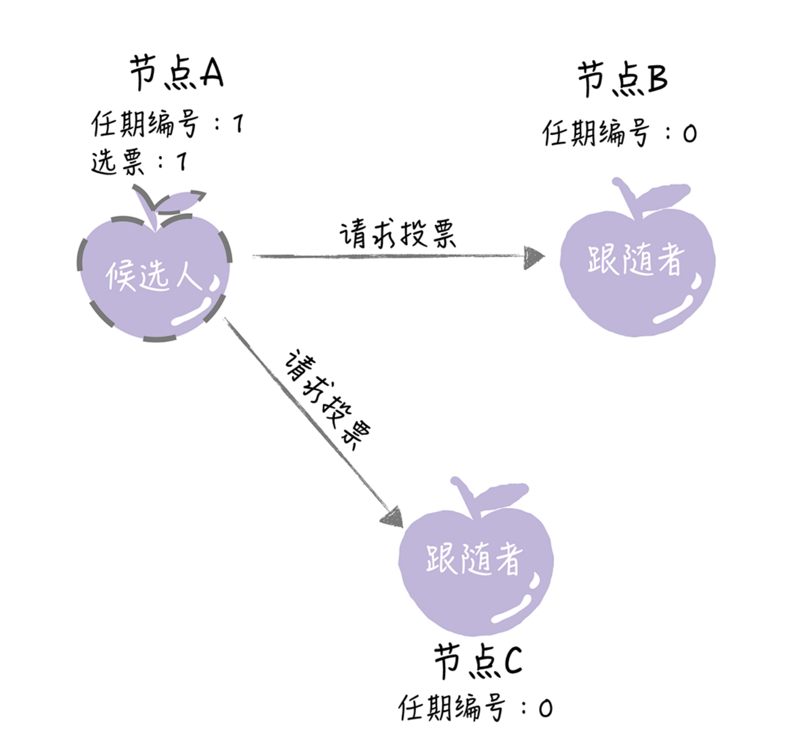
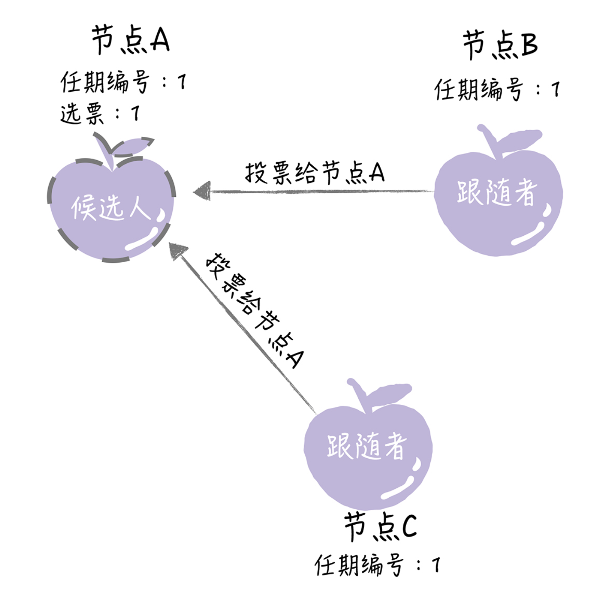
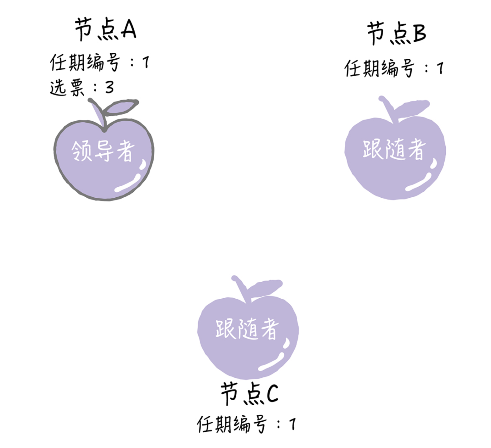
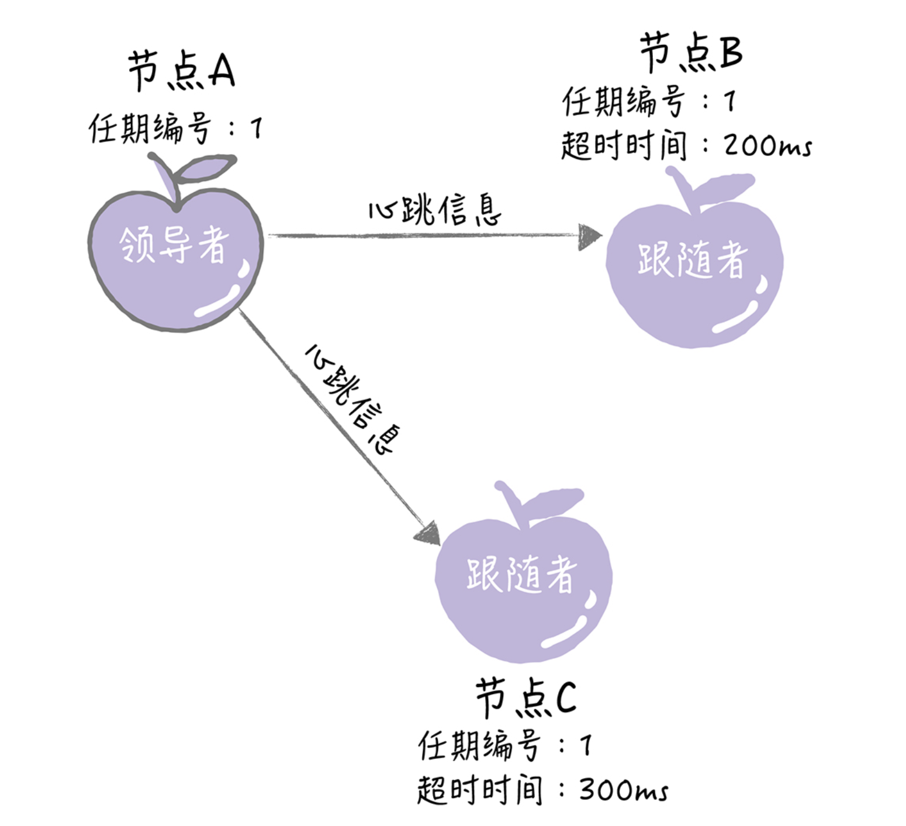
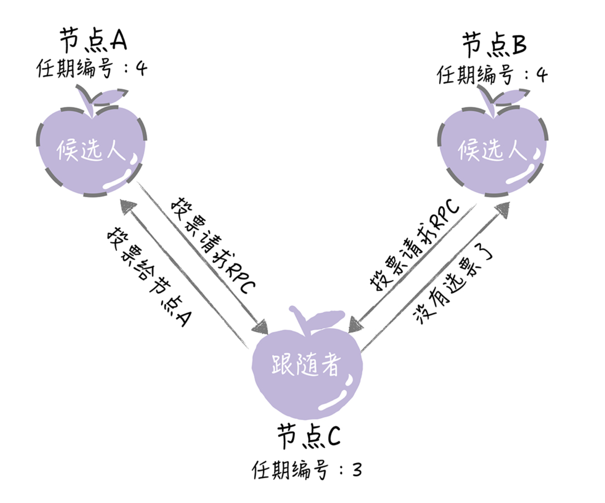

# 选举领导者

首先，在初始状态下，集群中所有的节点都是跟随者的状态。

Raft 算法实现了随机超时时间的特性。也就是说，每个节点等待领导者节点心跳信息的超 时时间间隔是随机的。通过上面的图片你可以看到，集群中没有领导者，而节点 A 的等待 超时时间最小(150ms)，它会最先因为没有等到领导者的心跳信息，发生超时。

这个时候，节点 A 就增加自己的任期编号，并推举自己为候选人，先给自己投上一张选 票，然后向其他节点发送请求投票 RPC 消息，请它们选举自己为领导者。

如果其他节点接收到候选人 A 的请求投票 RPC 消息，在编号为 1 的这届任期内，也还没有进行过投票，那么它将把选票投给节点 A，并增加自己的任期编号。

如果候选人在选举超时时间内赢得了大多数的选票，那么它就会成为本届任期内新的领导者。

节点 A 当选领导者后，他将周期性地发送心跳消息，通知其他服务器我是领导者，阻止跟 随者发起新的选举，篡权。

# 节点间如何通讯?

在 Raft 算法中，服务器节点间的沟通联络采用的是远程过程调用(RPC)，在领导者选举 中，需要用到这样两类的 RPC:

- 请求投票(RequestVote)RPC，是由候选人在选举期间发起，通知各节点进行投票;
- 日志复制(AppendEntries)RPC，是由领导者发起，用来复制日志和提供心跳消息。

我想强调的是，日志复制 RPC 只能由领导者发起，这是实现强领导者模型的关键之一。

# 什么是任期?

Raft 算法中的领导者是有任期的，每个任期由单调递增的数字(任期编号)标识，比如 节点 A 的任期编号是 1。任期编号是随着选举的举行而变化的，这是在说下面几点。

- 跟随者在等待领导者心跳信息超时后，推举自己为候选人时，会增加自己的任期号，比如节点 A 的当前任期编号为 0，那么在推举自己为候选人时，会将自己的任期编号增加为 1。

- 如果一个服务器节点，发现自己的任期编号比其他节点小，那么它会更新自己的编号到 较大的编号值。比如节点 B 的任期编号是 0，当收到来自节点 A 的请求投票 RPC 消息时，因为消息中包含了节点 A 的任期编号，且编号为 1，那么节点 B 将把自己的任期编 号更新为 1。
- 在 Raft 算法中约定，如果一个候选人或者领导者，发现自己的任期编号比其他节点小， 那么它会立即恢复成跟随者状态。比如分区错误恢复后，任期编号为 3 的领导者节点 B，收到来自新领导者的，包含任期编号为 4 的心跳消息，那么节点 B 将立即恢复成跟 随者状态。
- 还约定如果一个节点接收到一个包含较小的任期编号值的请求，那么它会直接拒绝这个 请求。比如节点 C 的任期编号为 4，收到包含任期编号为 3 的请求投票 RPC 消息，那么它将拒绝这个消息。

# 选举有哪些规则

- 领导者周期性地向所有跟随者发送心跳消息(即不包含日志项的日志复制 RPC 消息)， 通知大家我是领导者，阻止跟随者发起新的选举。

- 如果在指定时间内，跟随者没有接收到来自领导者的消息，那么它就认为当前没有领导 者，推举自己为候选人，发起领导者选举。

- 在一次选举中，赢得大多数选票的候选人，将晋升为领导者。

- 在一个任期内，领导者一直都会是领导者，直到它自身出现问题(比如宕机)，或者因 为网络延迟，其他节点发起一轮新的选举。

- 在一次选举中，每一个服务器节点最多会对一个任期编号投出一张选票，并且按照“先 来先服务”的原则进行投票。比如节点 C 的任期编号为 3，先收到了 1 个包含任期编号 为 4 的投票请求(来自节点 A)，然后又收到了 1 个包含任期编号为 4 的投票请求(来 自节点 B)。那么节点 C 将会把唯一一张选票投给节点 A，当再收到节点 B 的投票请求 RPC 消息时，对于编号为 4 的任期，已没有选票可投了。
  
  

- 当任期编号相同时，日志完整性高的跟随者(也就是最后一条日志项对应的任期编号值 更大，索引号更大)，拒绝投票给日志完整性低的候选人。比如节点 B、C 的任期编号 都是 3，节点 B 的最后一条日志项对应的任期编号为 3，而节点 C 为 2，那么当节点 C 请求节点 B 投票给自己时，节点 B 将拒绝投票。
  
  

# 如何理解随机超时时间

Raft 算法巧妙地使用随机选举超时时间的方法，把超时时间都分散开来，在大多数 情况下只有一个服务器节点先发起选举，而不是同时发起选举，这样就能减少因选票瓜分导 致选举失败的情况。

我想强调的是，**在 Raft 算法中，随机超时时间是有 2 种含义的，这里是很多同学容易理解 出错的地方，需要你注意一下:**

- 跟随者等待领导者心跳信息超时的时间间隔，是随机的;

- 当没有候选人赢得过半票数，选举无效了，这时需要等待一个随机时间间隔，也就是说，等待选举超时的时间间隔，是随机的。
