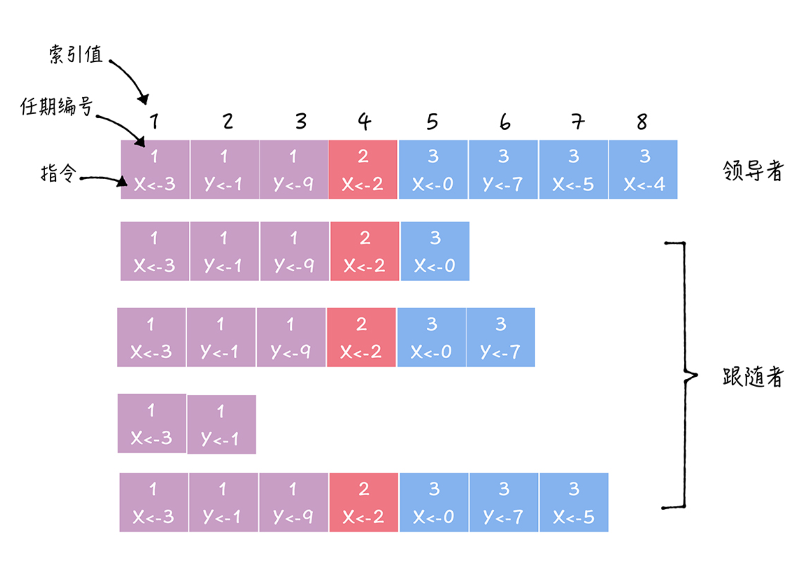
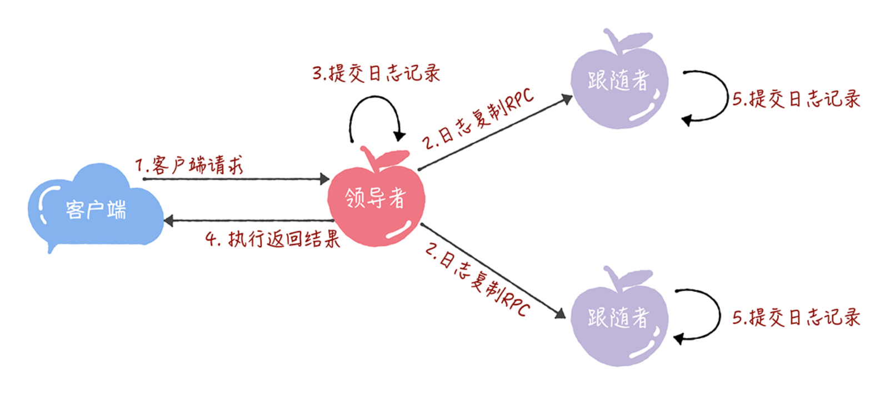
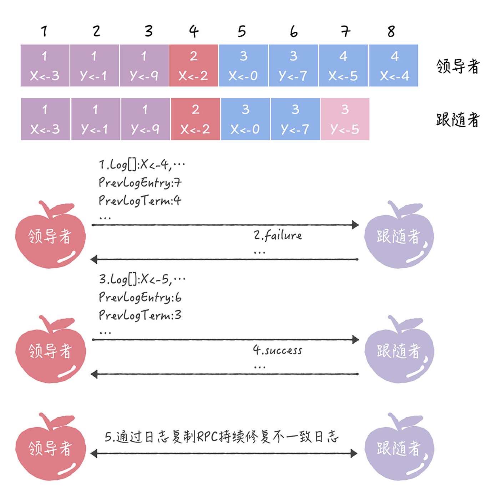

# 如何复制日志?

在 Raft 算法中，副本数据是以日志的形式存在的，领导者接收到来自客户端写请求后，处 理写请求的过程就是一个复制和提交日志项的过程。

日志是由日志项组成，日志项是一种数据格式，它主要包含用户指定的数据，也就是指令(Command)， 还包含一些附加信息，比如索引值(Log index)、任期编号(Term)。

- 指令:一条由客户端请求指定的、状态机需要执行的指令。你可以将指令理解成客户端
  指定的数据。
- 索引值:日志项对应的整数索引值。它其实就是用来标识日志项的，是一个连续的、单
  调递增的整数号码。
- 任期编号:创建这条日志项的领导者的任期编号。

**如何复制日志?**

你可以把 Raft 的日志复制理解成一个优化后的二阶段提交(将二阶段优化成了一阶段)， 减少了一半的往返消息，也就是降低了一半的消息延迟。那日志复制的具体过程是什么呢?

首先，领导者进入第一阶段，通过日志复制(AppendEntries)RPC 消息，将日志项复制到集群其他节点上。

接着，如果领导者接收到大多数的“复制成功”响应后，它将日志项提交到它的状态机，并返回成功给客户端。如果领导者没有接收到大多数的“复制成功”响应，那么就返回错误给客户端。

学到这里，有同学可能有这样的疑问了，领导者将日志项提交到它的状态机，怎么没通知跟随者提交日志项呢?

这是 Raft 中的一个优化，领导者不直接发送消息通知其他节点提交指定日志项。因为领导者的日志复制 RPC 消息或心跳消息，包含了当前最大的，将会被提交的日志项索引值。所以通过日志复制 RPC 消息或心跳消息，跟随者就可以知道领导者的日志提交位置信息。

因此，当其他节点接受领导者的心跳消息，或者新的日志复制 RPC 消息后，就会将这条日 志项提交到它的状态机。而这个优化，降低了处理客户端请求的延迟，将二阶段提交优化为 了一段提交，降低了一半的消息延迟。

为了帮你理解，我画了一张过程图，然后再带你走一遍这个过程，这样你可以更加全面地掌握日志复制。

1.接收到客户端请求后，领导者基于客户端请求中的指令，创建一个新日志项，并附加到本地日志中。

2.领导者通过日志复制 RPC，将新的日志项复制到其他的服务器。

3.当领导者将日志项，成功复制到大多数的服务器上的时候，领导者会将这条日志项提交到它的状态机中。

4.领导者将执行的结果返回给客户端。

5.当跟随者接收到心跳信息，或者新的日志复制 RPC 消息后，如果跟随者发现领导者已经提交了某条日志项，而它还没提交，那么跟随者就将这条日志项提交到本地的状态机中。

不过，这是一个理想状态下的日志复制过程。在实际环境中，复制日志的时候，你可能会遇 到进程崩溃、服务器宕机等问题，这些问题会导致日志不一致。那么在这种情况下，Raft 算法是如何处理不一致日志，实现日志的一致的呢?

# 如何实现日志的一致?

在 Raft 算法中，领导者通过强制跟随者直接复制自己的日志项，处理不一致日志。也就是 说，Raft 是通过以领导者的日志为准，来实现各节点日志的一致的。具体有 2 个步骤。

首先，领导者通过日志复制 RPC 的一致性检查，找到跟随者节点上，与自己相同日志项 的最大索引值。也就是说，这个索引值之前的日志，领导者和跟随者是一致的，之后的 日志是不一致的了。

然后，领导者强制跟随者更新覆盖的不一致日志项，实现日志的一致。

我带你详细地走一遍这个过程(为了方便演示，我们引入 2 个新变量)。

- PrevLogEntry:表示当前要复制的日志项，前面一条日志项的索引值。比如在图中，如 果领导者将索引值为 8 的日志项发送给跟随者，那么此时 PrevLogEntry 值为 7。

- PrevLogTerm:表示当前要复制的日志项，前面一条日志项的任期编号，比如在图中， 如果领导者将索引值为 8 的日志项发送给跟随者，那么此时 PrevLogTerm 值为 4。
  
  

1.领导者通过日志复制 RPC 消息，发送当前最新日志项到跟随者(为了演示方便，假设当 前需要复制的日志项是最新的)，这个消息的 PrevLogEntry 值为 7，PrevLogTerm 值 为 4。
2.如果跟随者在它的日志中，找不到与 PrevLogEntry 值为 7、PrevLogTerm 值为 4 的日 志项，也就是说它的日志和领导者的不一致了，那么跟随者就会拒绝接收新的日志项， 并返回失败信息给领导者。
3.这时，领导者会递减要复制的日志项的索引值，并发送新的日志项到跟随者，这个消息 的 PrevLogEntry 值为 6，PrevLogTerm 值为 3。
4.如果跟随者在它的日志中，找到了 PrevLogEntry 值为 6、PrevLogTerm 值为 3 的日志 项，那么日志复制 RPC 返回成功，这样一来，领导者就知道在 PrevLogEntry 值为 6、 PrevLogTerm 值为 3 的位置，跟随者的日志项与自己相同。
5.领导者通过日志复制 RPC，复制并更新覆盖该索引值之后的日志项(也就是不一致的日 志项)，最终实现了集群各节点日志的一致。

从上面步骤中你可以看到，领导者通过日志复制 RPC 一致性检查，找到跟随者节点上与自 己相同日志项的最大索引值，然后复制并更新覆盖该索引值之后的日志项，实现了各节点日 志的一致。需要你注意的是，跟随者中的不一致日志项会被领导者的日志覆盖，而且领导者 从来不会覆盖或者删除自己的日志。

