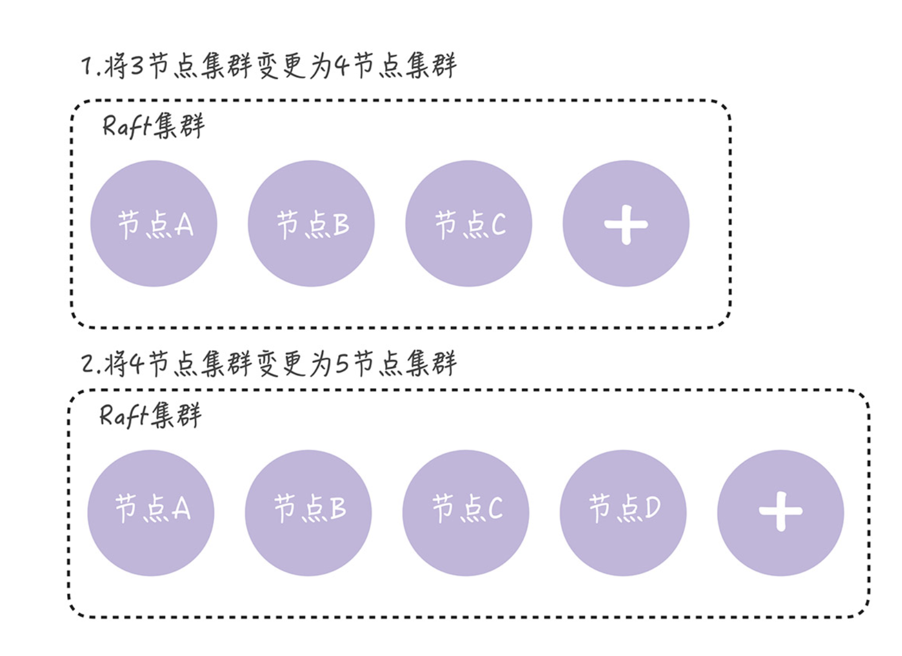
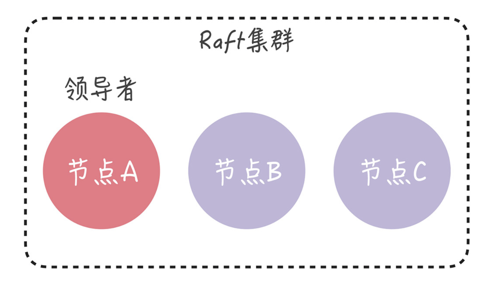
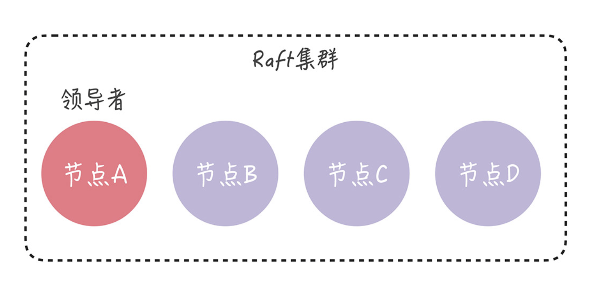
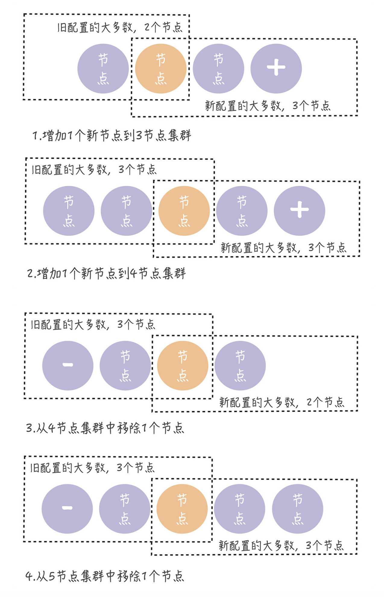

# 通过单节点变更解决成员变更问题

单节点变更，就是通过一次变更一个节点实现成员变更。如果需要变更多个节点，那你需要 执行多次单节点变更。比如将 3 节点集群扩容为 5 节点集群，这时你需要执行 2 次单节点 变更，先将 3 节点集群变更为 4 节点集群，然后再将 4 节点集群变更为 5 节点集群，就像 下图的样子。

如何用单节点变更的方法解决这个问题？

目前的集群配置为[A, B, C]，我们先向集群中加入节点 D，这意味着新配置为[A, B, C, D]。 成员变更，是通过这么两步实现的:

- 第一步，领导者(节点 A)向新节点(节点 D)同步数据;

- 第二步，领导者(节点 A)将新配置[A, B, C, D]作为一个日志项，复制到新配置中所有 节点(节点 A、B、C、D)上，然后将新配置的日志项提交到本地状态机，完成单节点 变更。
  
  

在变更完成后，现在的集群配置就是[A, B, C, D]，我们再向集群中加入节点 E，也就是说， 新配置为[A, B, C, D, E]。成员变更的步骤和上面类似。这样一来，我们就通过一次变更一个节点的方式，完成了成员变更，保证了集群中始终只有一个领导者，而且集群也在稳定运行，持续提供服务。

在正常情况下，**不管旧的集群配置是怎么组成的，旧配置的“大多数”和新配 置的“大多数”都会有一个节点是重叠的。** 也就是说，不会同时存在旧配置和新配置 2 个“大多数”:

