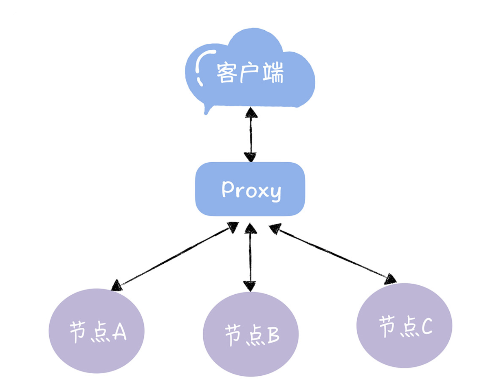
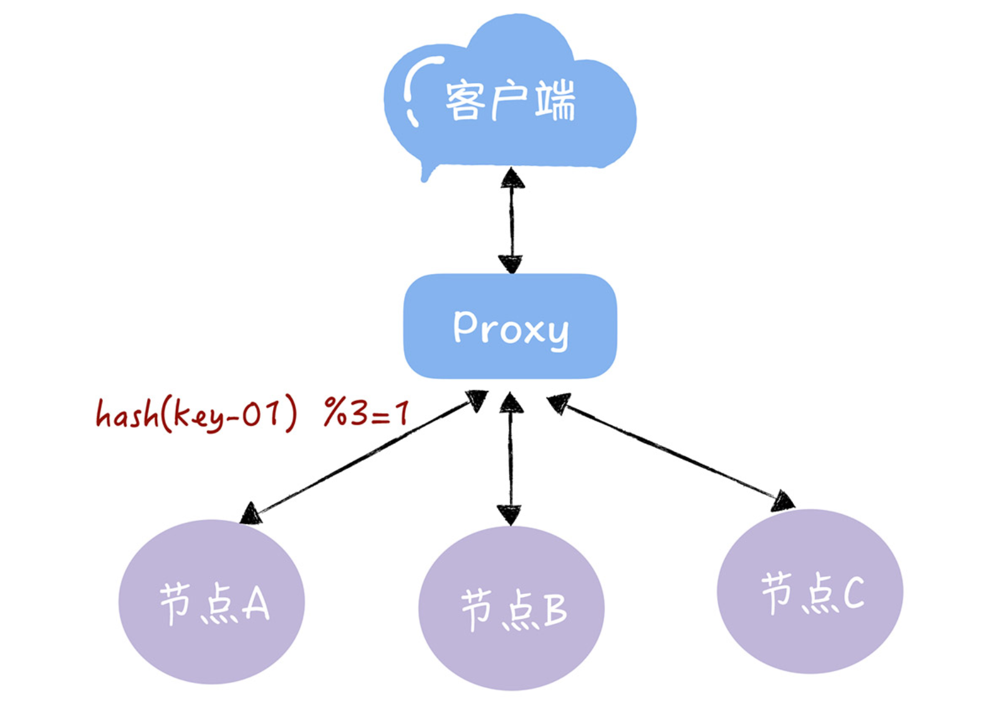
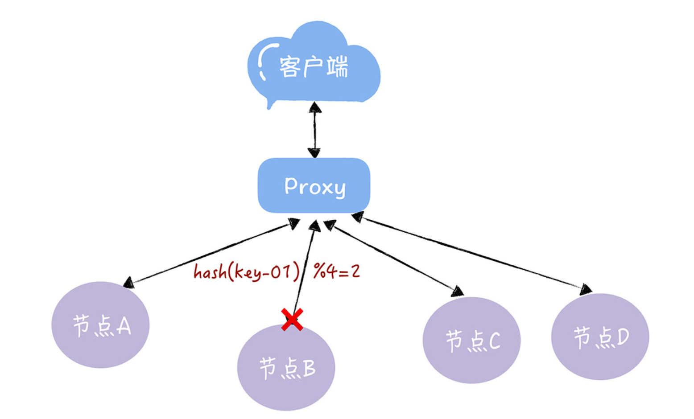

# 使用哈希算法有什么问题?

有些同学可能有这样的疑问:如果我们通过 Raft 算法实现了 KV 存储， 虽然领导者模型简化了算法实现和共识协商，但写请求只能限制在领导者节点上处理，导致 了集群的接入性能约等于单机，那么随着业务发展，集群的性能可能就扛不住了，会造成系 统过载和服务不可用，这时该怎么办呢?

其实这是一个非常常见的问题。在我看来，这时我们就要通过分集群，突破单集群的性能限制了。

说到这儿，有同学可能会说了，分集群还不简单吗？加个 Proxy 层，由 Proxy 层处理来自客户端的读写请求，接收到读写请求后，通过对 Key 做哈希找到对应的集群就可以了啊。

是的，哈希算法的确是个办法，但它有个明显的缺点:当需要变更集群数时(比如从 2 个 集群扩展为 3 个集群)，这时大部分的数据都需要迁移，重新映射，数据的迁移成本是非常高的。那么如何解决哈希算法，数据迁移成本高的痛点呢？答案就是一致哈希 (Consistent Hashing)。

假设我们有一个由 A、B、C 三个节点组成(为了方便演示，我使用节点来替代集群)的 KV 服务，每个节点存放不同的 KV 数据:

通过哈希算法，每个 key 都可以寻址到对应的服务器，比如，查询 key 是 key-01，计算 公式为 hash(key-01) % 3 ，经过计算寻址到了编号为 1 的服务器节点 A

但如果服务器数量发生变化，基于新的服务器数量来执行哈希算法的时候，就会出现路由寻 址失败的情况，Proxy 无法找到之前寻址到的那个服务器节点，这是为什么呢?

想象一下，假如 3 个节点不能满足业务需要了，这时我们增加了一个节点，节点的数量从 3 变化为 4，那么之前的 hash(key-01) % 3 = 1，就变成了 hash(key-01) % 4 = X，因为取模运算发生了变化，所以这个 X 大概率不是 1(可能 X 为 2)，这时你再查询，就会找不到数据了，因为 key-01 对应的数据，存储在节点 A 上，而不是节点 B:

而解决这个问题的办法，在于我们要迁移数据，基于新的计算公式 hash(key-01) % 4 ，来重新对数据和节点做映射。需要你注意的是，数据的迁移成本是非常高的。