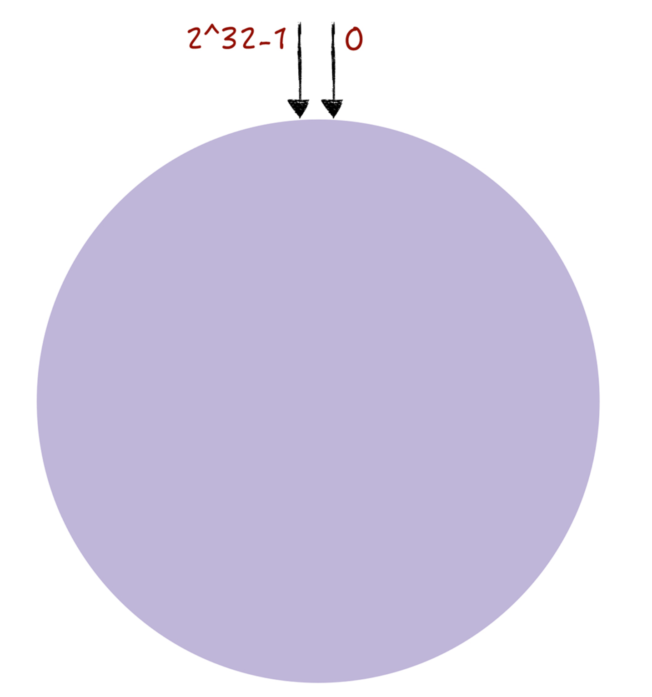
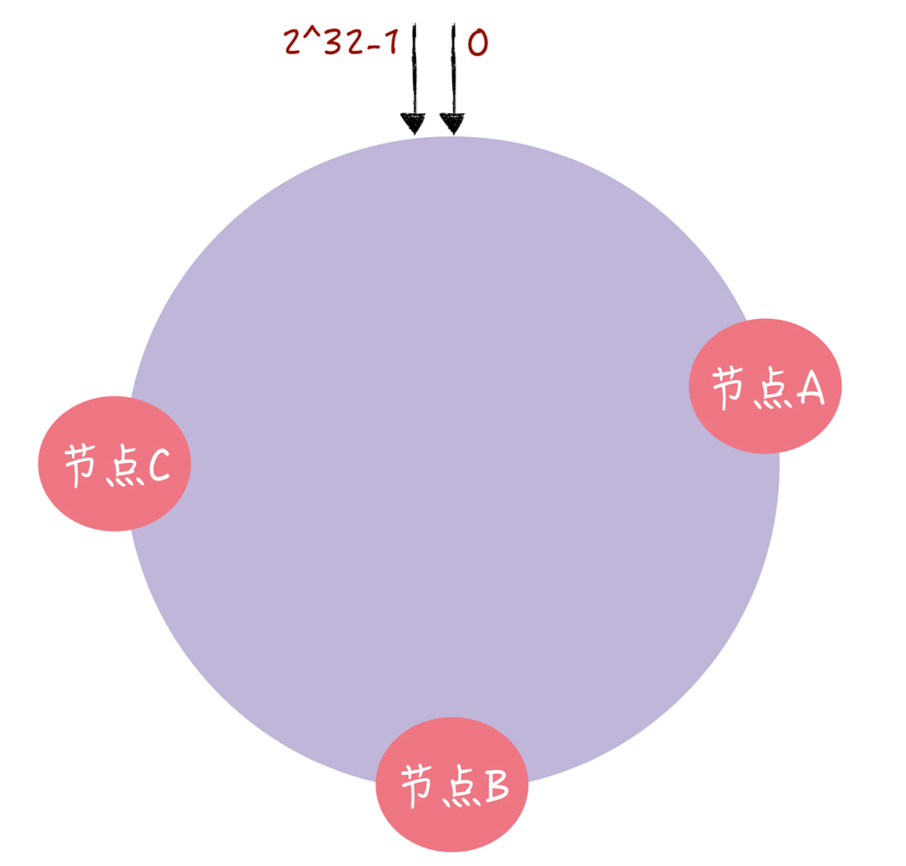
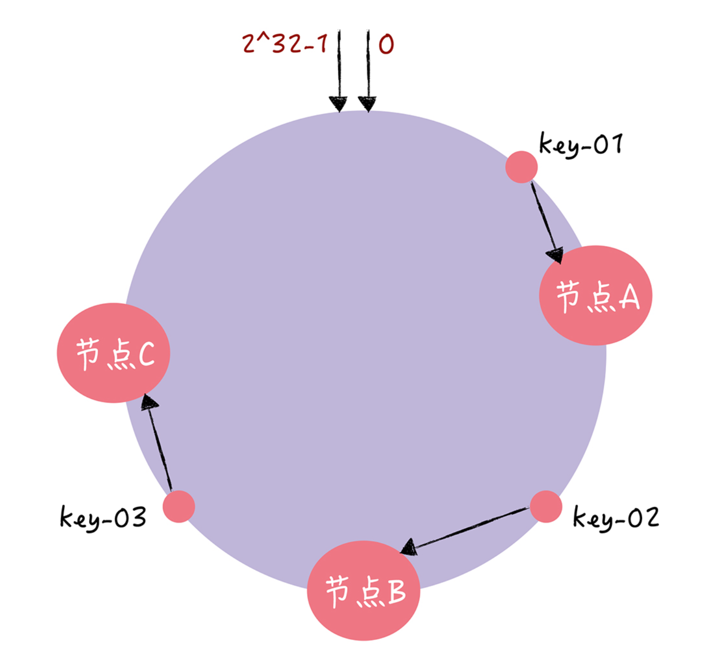
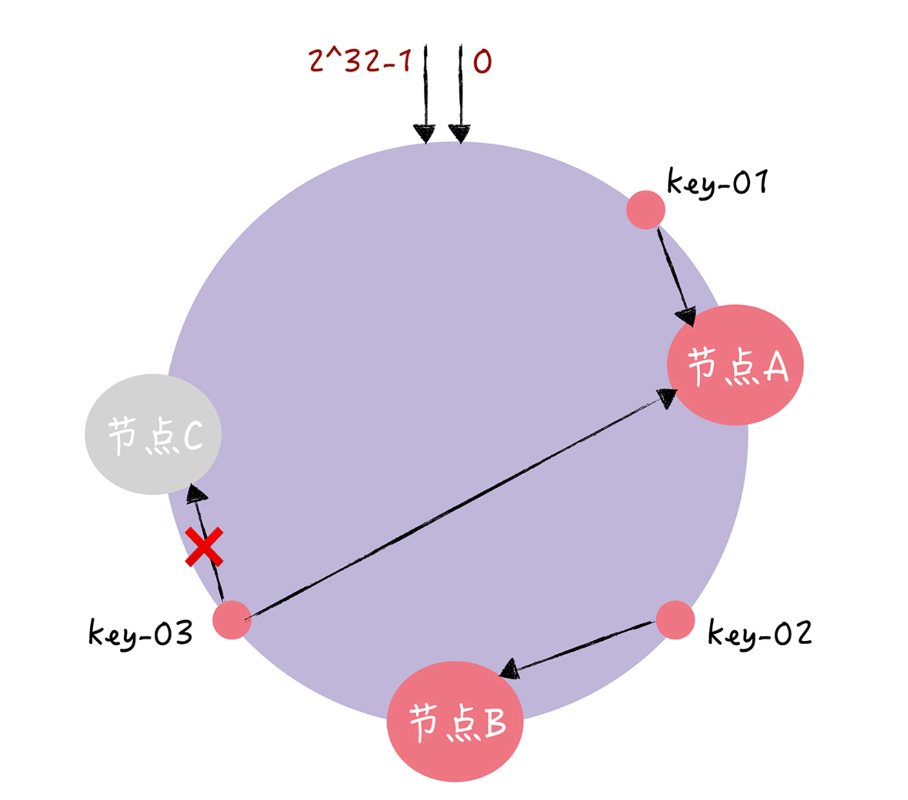

# 如何使用一致哈希实现哈希寻址?

一致哈希算法也用了取模运算，但与哈希算法不同的是，哈希算法是对节点的数量进行取模运算，而一致哈希算法是对 2^32 进行取模运算。你可以想象下，一致哈希算法，将整个哈希值空间组织成一个虚拟的圆环，也就是哈希环:

从图中你可以看到，哈希环的空间是按顺时针方向组织的，圆环的正上方的点代表 0，0 点右侧的第一个点代表 1，以此类推，2、3、4、5、6......直到 2^32-1，也就是说 0 点左侧的第一个点代表 2^32-1。

在一致哈希中，你可以通过执行哈希算法(为了演示方便，假设哈希算法函数为“c- hash()”)，将节点映射到哈希环上，比如选择节点的主机名作为参数执行 c-hash()，那么每个节点就能确定其在哈希环上的位置了:

当需要对指定 key 的值进行读写的时候，你可以通过下面 2 步进行寻址:

- 首先，将 key 作为参数执行 c-hash() 计算哈希值，并确定此 key 在环上的位置。
- 然后，从这个位置沿着哈希环顺时针“行走”，遇到的第一节点就是 key 对应的节点。

假设 key-01、key-02、 key-03 三个 key，经过哈希算法 c-hash() 计算后，在哈希环上的位置就像图 6 的样子:

那么根据一致哈希算法，key-01 将寻址到节点 A，key-02 将寻址到节点 B，key-03 将寻 址到节点 C。

假设，现在有一个节点故障了(比如节点 C):

你可以看到，key-01 和 key-02 不会受到影响，只有 key-03 的寻址被重定位到 A。一般 来说，在一致哈希算法中，如果某个节点宕机不可用了，那么受影响的数据仅仅是，会寻址 到此节点和前一节点之间的数据。比如当节点 C 宕机了，受影响的数据是会寻址到节点 B 和节点 C 之间的数据(例如 key-03)，寻址到其他哈希环空间的数据(例如 key-01)， 不会受到影响。

那如果此时集群不能满足业务的需求，需要扩容一个节点(也就是增加一个节点，比如 D):

你可以看到，key-01、key-02 不受影响，只有 key-03 的寻址被重定位到新节点 D。一般 而言，在一致哈希算法中，如果增加一个节点，受影响的数据仅仅是，会寻址到新节点和前 一节点之间的数据，其它数据也不会受到影响。

总的来说，使用了一致哈希算法后，扩容或缩容的时候，都只需要重定位环空间中的一小部 分数据。**也就是说，一致哈希算法具有较好的容错性和可扩展性。**