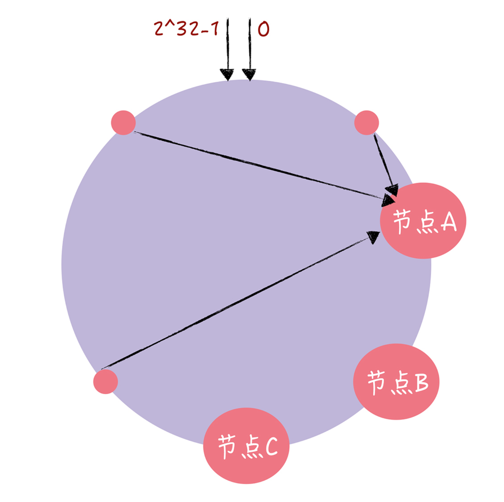
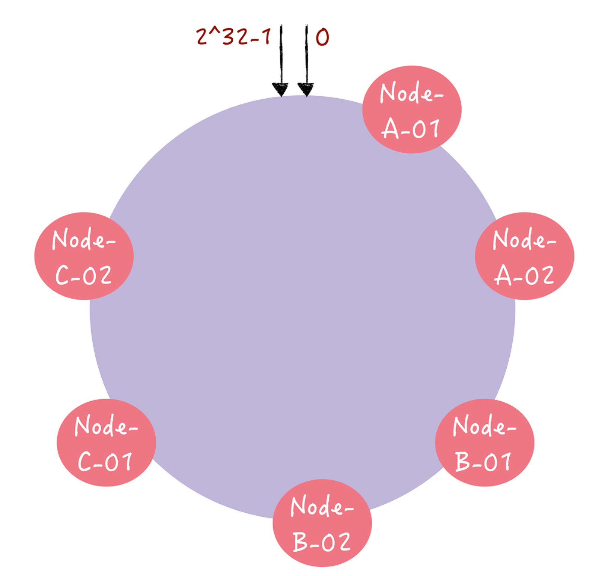

# 使用虚拟节点解决分布不均问题

**在哈希寻址中常出现这样的问题:**客户端访问请求集中在少数的节点上， 出现了有些机器高负载，有些机器低负载的情况，那么在一致哈希中，有什么办法能让数据 访问分布的比较均匀呢?答案就是虚拟节点。

在一致哈希中，如果节点太少，容易因为节点分布不均匀造成数据访问的冷热不均，也就是说大多数访问请求都会集中少量几个节点上:

你能从图中看到，虽然有 3 个节点，但访问请求主要集中的节点 A 上。**那如何通过虚拟节 点解决冷热不均的问题呢?**

其实，就是对每一个服务器节点计算多个哈希值，在每个计算结果位置上，都放置一个虚拟 节点，并将虚拟节点映射到实际节点。比如，可以在主机名的后面增加编号，分别计算 “Node-A-01”“Node-A-02”“Node-B-01”“Node-B-02”“Node-C- 01”“Node-C-02”的哈希值，于是形成 6 个虚拟节点:

你可以从图中看到，增加了节点后，节点在哈希环上的分布就相对均匀了。这时，如果有访 问请求寻址到“Node-A-01”这个虚拟节点，将被重定位到节点 A。你看，这样我们就解 决了冷热不均的问题。

