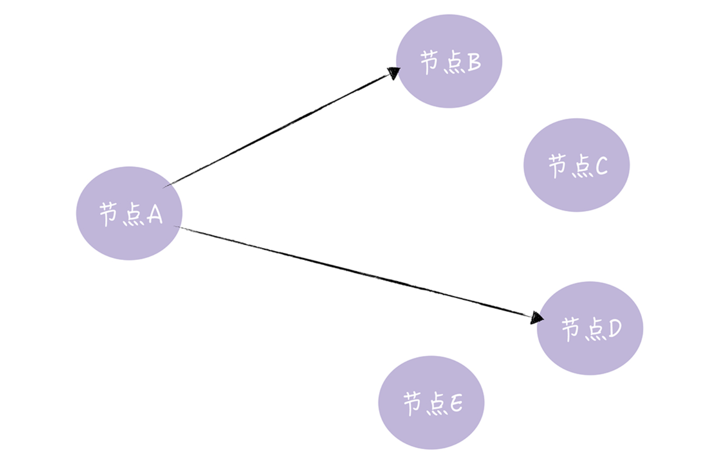
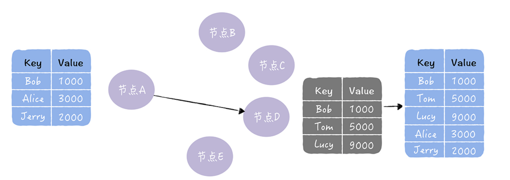
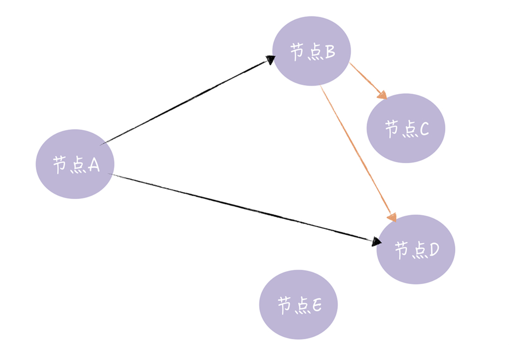

# Gossip 三板斧

有一部分同学的业务在可用性上比较敏感，比如监控主机和业务运行的告警系统。这个时 候，相信你希望自己的系统能在极端情况下(比如集群中只有一个节点在运行)也能运行。 回忆了二阶段提交协议和 Raft 算法之后，你发现它们都需要全部节点或者大多数节点正常运行，才能稳定运行，那么它们就不适合了。而根据 Base 理论，你需要实现最终一致性， 怎么样才能实现最终一致性呢?

在我看来，你可以通过 Gossip 协议实现这个目标。

Gossip 协议，顾名思义，就像流言蜚语一样，利用一种随机、带有传染性的方式，将信息 传播到整个网络中，并在一定时间内，使得系统内的所有节点数据一致。

Gossip 的三板斧分别是:直接邮寄(Direct Mail)、反熵(Anti-entropy)和谣言传播 (Rumor mongering)。

直接邮寄:就是直接发送更新数据，当数据发送失败时，将数据缓存下来，然后重传。从图中你可以看到，节点 A 直接将更新数据发送给了节点 B、D。

在这里我想补充一点，直接邮寄虽然实现起来比较容易，数据同步也很及时，但可能会因为缓存队列满了而丢数据。也就是说，只采用直接邮寄是无法实现最终一致性的。

那如何实现最终一致性呢?答案就是反熵。本质上，反熵是一种通过异步修复（BASE理论时有讲过）实现最终一致 性的方法。常见的最终一致性系统(比如 Cassandra)，都实现了反熵功能。

反熵指的是集群中的节点，每隔段时间就随机选择某个其他节点，然后通过互相交换自己的所有数据来消除两者之间的差异，实现数据的最终一致性:

从图中你可以看到，节点 A 通过反熵的方式，修复了节点 D 中缺失的数据。那具体怎么实现的呢?

**其实，在实现反熵的时候，主要有推、拉和推拉三种方式。**我将以修复下图中，2 个数据副 本的不一致为例，具体带你了解一下。

推方式，就是将自己的所有副本数据，推给对方，修复对方副本中的熵:

拉方式，就是拉取对方的所有副本数据，修复自己副本中的熵:

理解了推和拉之后，推拉这个方式就很好理解了，这个方式就是同时修复自己副本和对方副本中的熵:

也许有很多同学会觉得反熵是一个很奇怪的名词。其实，你可以这么来理解，反熵中的熵是指混乱程度，反熵就是指消除不同节点中数据的差异，提升节点间数据的相似度，降低熵值。

另外需要你注意的是，因为反熵需要节点两两交换和比对自己所有的数据，执行反熵时通讯 成本会很高，所以我不建议你在实际场景中频繁执行反熵，并且可以通过引入校验和 (Checksum)等机制，降低需要对比的数据量和通讯消息等。

虽然反熵很实用，但是执行反熵时，相关的节点都是已知的，而且节点数量不能太多，如果 是一个动态变化或节点数比较多的分布式环境(比如在 DevOps 环境中检测节点故障，并 动态维护集群节点状态)，这时反熵就不适用了。**那么当你面临这个情况要怎样实现最终一 致性呢?答案就是谣言传播。**

谣言传播，广泛地散播谣言，它指的是当一个节点有了新数据后，这个节点变成活跃状态，并周期性地联系其他节点向其发送新数据，直到所有的节点都存储了该新数据:

从图中你可以看到，节点 A 向节点 B、D 发送新数据，节点 B 收到新数据后，变成活跃节 点，然后节点 B 向节点 C、D 发送新数据。其实，谣言传播非常具有传染性，它适合动态 变化的分布式系统。

