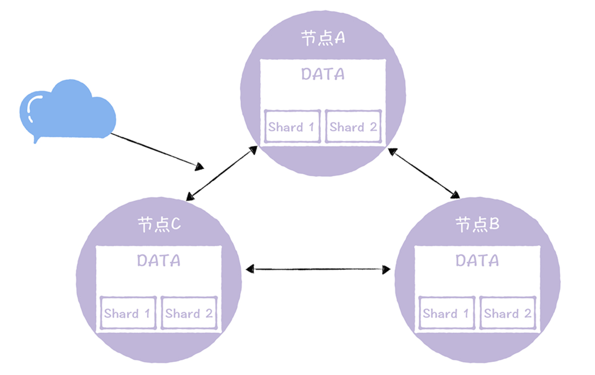
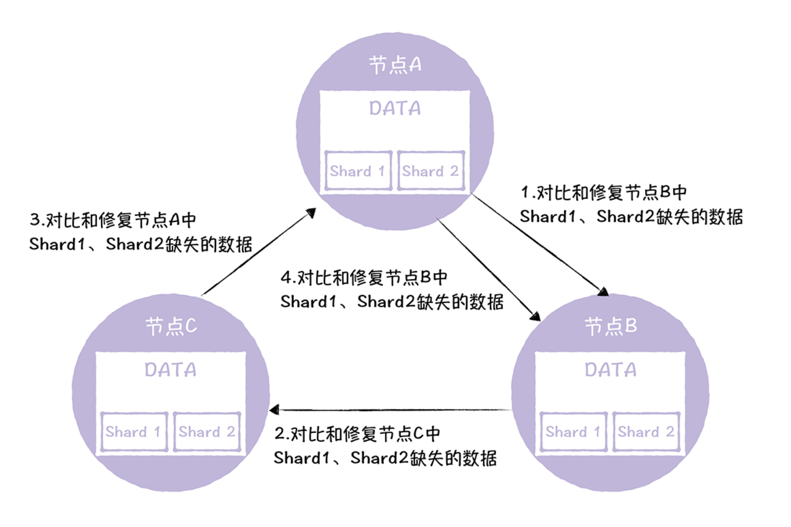

# 如何使用 Anti-entropy 实现最终一致

在分布式存储系统中，实现数据副本最终一致性，最常用的方法就是反熵了。为了帮你彻底 理解和掌握在实际环境中实现反熵的方法，我想以自研 InfluxDB 的反熵实现为例，具体带 你了解一下。

在自研 InfluxDB 中，一份数据副本是由多个分片组成的，也就是实现了数据分片，三节点 三副本的集群，就像下图的样子:

反熵的目标是确保每个 DATA 节点拥有元信息指定的分片，而且不同节点上，同一分片组 中的分片都没有差异。比如说，节点 A 要拥有分片 Shard1 和 Shard2，而且，节点 A 的 Shard1 和 Shard2，与节点 B、C 中的 Shard1 和 Shard2，是一样的。

那么，在 DATA 节点上，存在哪些数据缺失的情况呢?也就说，我们需要解决哪些问题 呢?

我们将数据缺失，分为这样 2 种情况。

- 缺失分片:也就是说，在某个节点上整个分片都丢失了。
- 节点之间的分片不一致:也就是说，节点上分片都存在，但里面的数据不一样，有数据丢失的情况发生。

第一种情况修复起来不复杂，我们只需要将分片数据，通过 RPC 通讯，从其他节点上拷 贝过来就可以了:

第二种情况修复起来要复杂一些。我们需要设计一个闭环的流程，按照一个顺序修复，执行完流程后，也就是实现了一致性了。具体是怎么设计的呢?

它是按照一定顺序来修复节点的数据差异，先随机选择一个节点，然后循环修复，每个节点 生成自己节点有、下一个节点没有的差异数据，发送给下一个节点，进行修复(为了方便演 示，假设 Shard1、Shard2 在各节点上是不一致的):

从图中你可以看到，数据修复的起始节点为节点 A，数据修复是按照顺时针顺序，循环修复 的。需要你注意的是，最后节点 A 又对节点 B 的数据执行了一次数据修复操作，因为只有 这样，节点 C 有、节点 B 缺失的差异数据，才会同步到节点 B 上。

总结：

1.作为一种异步修复、实现最终一致性的协议，反熵在存储组件中应用广泛，比如 Dynamo、InfluxDB、Cassandra，我希望你能彻底掌握反熵的实现方法，在后续工作 中，需要实现最终一致性时，优先考虑反熵。
2.因为谣言传播具有传染性，一个节点传给了另一个节点，另一个节点又将充当传播者， 传染给其他节点，所以非常适合动态变化的分布式系统，比如 Cassandra 采用这种方式 动态管理集群节点状态。

在实际场景中，实现数据副本的最终一致性时，一般而言，直接邮寄的方式是一定要实现的，因为不需要做一致性对比，只是通过发送更新数据或缓存重传，来修复数据的不一致，性能损耗低。在存储组件中，节点都是已知的，一般采用反熵修复数据副本的一致性。当集群节点是变化的，或者集群节点数比较多时，这时要采用谣言传播的方式，同步更新数据，实现最终一致。