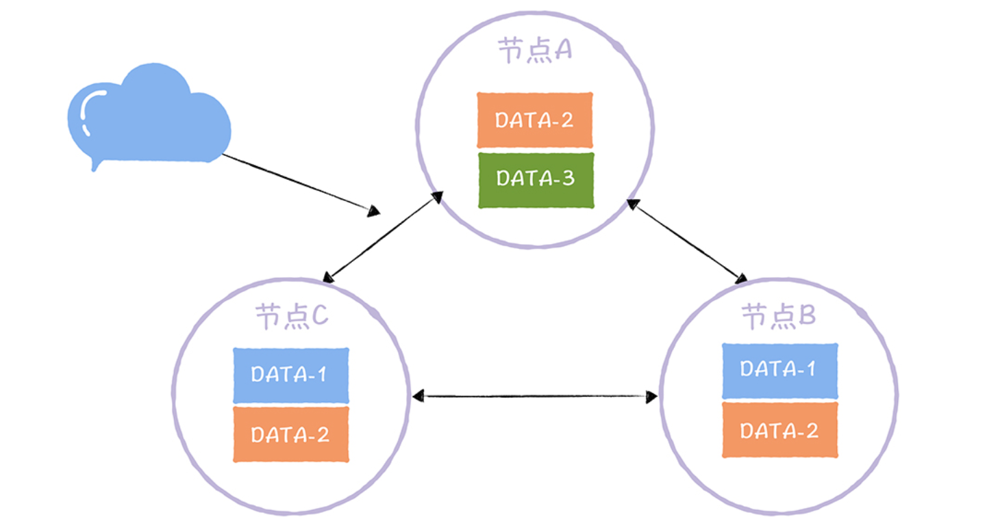
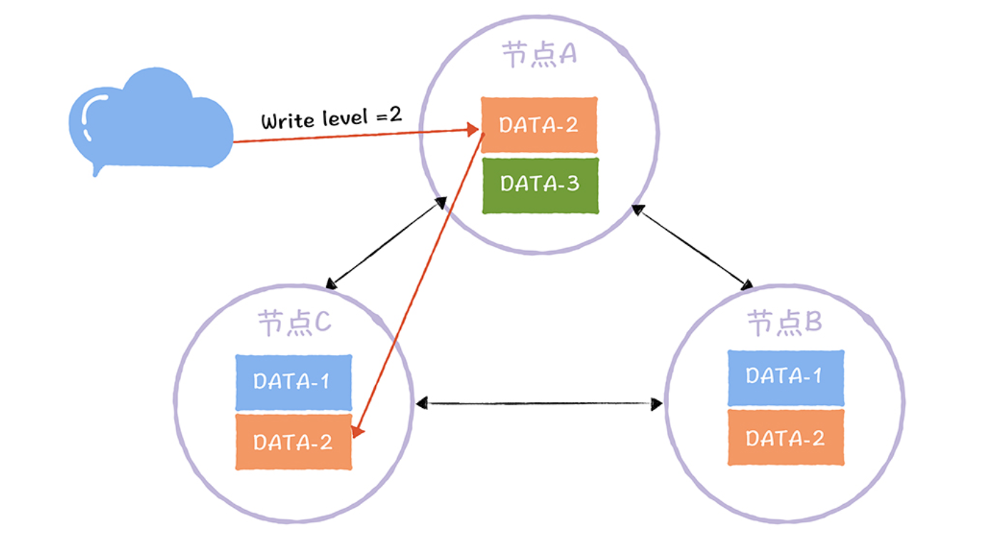
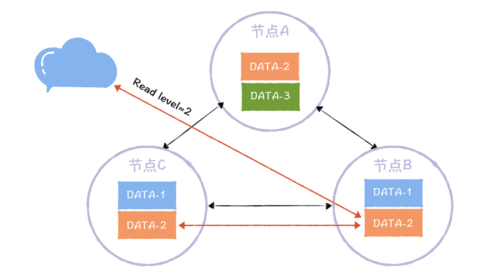

# Quorum NWR 的三要素

不知道你在工作中有没有遇到这样的事儿:你开发实现了一套 AP 型的分布式系统，实现了最终一致性。业务也接入了，运行正常，一起看起来都那么美好。
可是，突然有同事说，我们要拉这几个业务的数据做实时分析，希望数据写入成功后，就能立即读取到新数据，也就是要实现强一致性，数据更改后，要保证用户能立即查询到。这时你该怎么办呢?首 先你要明确最终一致性和强一致性有什么区别。

- 强一致性能保证写操作完成后，任何后续访问都能读到更新后的值;
- 最终一致性只能保证如果对某个对象没有新的写操作了，最终所有后续访问都能读到相同的最近更新的值。也就是说，写操作完成后，后续访问可能会读到旧数据。

其实，在我看来，为了一个临时的需求，我们重新开发一套系统，或者迁移数据到新系统， 肯定是不合适的。因为工作量比较大，而且耗时也长，而我建议你通过 Quorum NWR 解 决这个问题。

**Quorum NWR的三要素：**

N 表示副本数，又叫做复制因子(Replication Factor)。也就是说，N 表示集群中同一份 数据有多少个副本，就像下图的样子:

在这个三节点的集群中，DATA-1 有 2 个副本，DATA-2 有 3 个副 本，DATA-3 有 1 个副本。也就是说，副本数可以不等于节点数，不同的数据可以有不同 的副本数。

当我们指定了副本后，就可以对副本数据进行读写操作了。那么这么多副本，你要如何执行 读写操作呢?先来看一看写操作，也就是 W。

W，又称写一致性级别(Write Consistency Level)，表示成功完成 W 个副本更新，才完成写操作:

从图中你可以看到，DATA-2 的写副本数为 2，也就说，对 DATA-2 执行写操作时，完成 了 2 个副本的更新(比如节点 A、C)，才完成写操作。

那么有的同学会问了，DATA-2 有 3 个数据副本，完成了 2 副本的更新，就完成了写操作，那么如何实现强一致性呢?如果读到了第三个数据副本(比如节点 B)，不就可能无法 读到更新后的值了吗?别急，我讲完如何执行读操作后，你就明白了。

R，又称读一致性级别(Read Consistency Level)，表示读取一个数据对象时需要读 R 个副本。你可以这么理解，读取指定数据时，要读 R 副本，然后返回 R 个副本中最新的那份数据:

从图中你可以看到，DATA-2 的读副本数为 2。也就是说，客户端读取 DATA-2 的数据 时，需要读取 2 个副本中的数据，然后返回最新的那份数据。

这里需要你注意的是，无论客户端如何执行读操作，哪怕它访问的是写操作未强制更新副本 数据的节点(比如节点 B)，但因为 W(2) + R(2) > N(3)，也就是说，访问节点 B，执行 读操作时，因为要读 2 份数据副本，所以除了节点 B 上的 DATA-2，还会读取节点 A 或节 点 C 上的 DATA-2，就像上图的样子(比如节点 C 上的 DATA-2)，而节点 A 和节点 C 的 DATA-2 数据副本是强制更新成功的。这个时候，返回给客户端肯定是最新的那份数 据。

总结：

- 当 W + R > N 的时候，对于客户端来讲，整个系统能保证强一致性，一定能返回更新后 的那份数据。

- 当 W + R < N 的时候，对于客户端来讲，整个系统只能保证最终一致性，可能会返回旧 数据。

