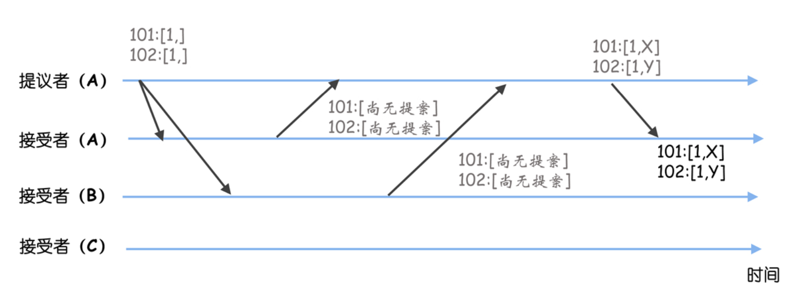
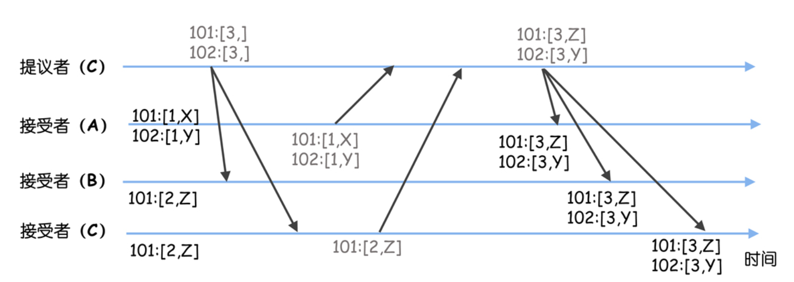

# 为什么 Multi-Paxos 无法实现操作顺序性?

很多同学应该使用过 ZooKeeper，它是一个开源的分布式协调服务，比如你可以使用它进 行配置管理、名字服务等等。在 ZooKeeper 中，数据是以节点的形式存储的。如果你要用 ZooKeeper 做配置管理，那么就需要在里面创建指定配置，假设创建节 点"/geekbang"和"/geekbang/time"，步骤如下:

```sh
1 [zk: localhost:2181(CONNECTED) 7] create /geekbang 123
2 Created /geekbang
3 [zk: localhost:2181(CONNECTED) 8] create /geekbang/time 456 4 Created /geekbang/time
```

我们分别创建了配置"/geekbang" 和"/geekbang/time"，对应的值分别为 123 和 456。 那么在这里我提个问题:你觉得在 ZooKeeper 中，能用兰伯特的 Multi-Paxos 实现各节 点数据的共识和一致吗?

当然不行。因为兰伯特的 Multi-Paxos，虽然能保证达成共识后的值不再改变，但它不管关心达成共识的值是什么，也无法保证各值(也就是操作)的顺序性。


**为什么 Multi-Paxos 无法实现操作顺序性?**

假设有一个 3 节点的 Multi-Paxos 集群，当前所有节点被选定的指令的最大序号为 100，也就是说，新提议的指令对应的序号将为 101。

首先节点 A 是领导者，提议了指令 X、Y，但是因为网络故障，指令只成功复制到了节点 A。



假设这时节点 A 故障了，新当选的领导者为节点 B。节点 B 当选领导者后，需要先作为学 习者了解目前已被选定的指令。节点 B 学习之后，发现当前被选定指令的最大序号为 100(因为节点 A 故障了，它被选定指令的最大序号 102，无法被节点 B 发现)，那么它 可以从序号 101 开始提议新的指令。这时它接收到客户端请求，并提议了指令 Z，指令 Z 被成功复制到节点 B、C。


这时节点 B 故障了，节点 A 恢复了，选举出领导者 C 后，节点 B 故障也恢复了。节点 C 当选领导者后，需要先作为学习者，了解目前已被选定的指令，这时它执行 Basic Paxos 的准备阶段，就会发现之前选定的值(比如 Z、Y)，然后发送接受请求，最终在序号 101、102 处达成共识的指令是 Z、Y。就像下图的样子。



在这里，你可以看到，原本预期的指令是 X、Y，最后变成了 Z、Y，也就是说，虽然 Multi-Paxos 能就一系列值达成共识，但它不关心达成共识后的值是什么，这显然不是我们 想要的结果。


比如，假设在 ZooKeeper 中直接使用了兰伯特的 Multi-Paxos，这时咱们创建节 点"/geekbang"和"/geekbang/time"，那么就可能出现，系统先创建了节 点"/geekbang/time"，这样肯定就出错了:

```sh
[zk: localhost:2181(CONNECTED) 6] create /geekbang/time 456 
Node does not exist: /geekbang/time
```

因为创建节点"/geekbang/time"时，找不到节点"/geekbang"，所以就会创建失败。