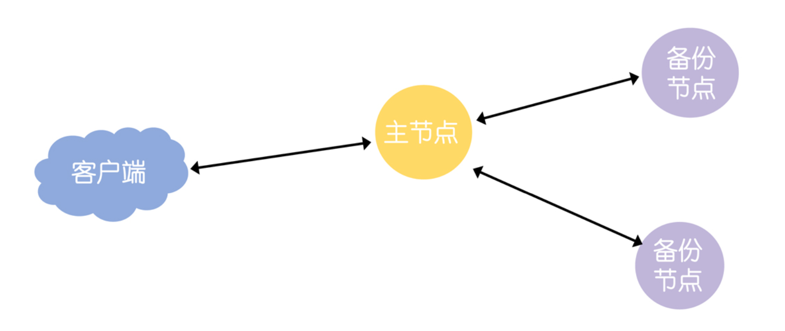

# ZAB 是如何保证操作的顺序性的?

与兰伯特的 Multi-Paxos 不同，ZAB 不是共识算法，不基于状态机，而是基于主备模式的原子广播协议，最终实现了操作的顺序性。

这里我说的主备，就是 Master-Slave 模型，一个主节点和多个备份节点，所有副本的数据 都以主节点为准，主节点采用二阶段提交，向备份节点同步数据，如果主节点发生故障，数 据最完备的节点将当选主节点。而原子广播协议，你可以理解成广播一组消息，消息的顺序 是固定的。

需要你注意的是，ZAB 在这里做了个优化，为了实现分区容错能力，将数据复制到大多数 节点后(也就是如果大多数节点准备好了)，领导者就会进入提交执行阶段，通知备份节点执行提交操作。

首先，ZAB 实现了主备模式，也就是所有的数据都以主节点为准:

其次，ZAB 实现了 FIFO 队列，保证消息处理的顺序性。

另外，ZAB 还实现了当主节点崩溃后，只有日志最完备的节点才能当选主节点，因为日志 最完备的节点包含了所有已经提交的日志，所以这样就能保证提交的日志不会再改变。

你看，ZAB 协议通过这几个特性就能保证后来的操作不会比当前的操作先执行，也就能保 证节点"/geekbang"会在节点"/geekbang/time"之前创建。

学到这里，想必你已经发现了，这些特性好像和 Raft 很像。是的，因为在前面几讲，我们 已经学习了 Raft 算法，所以你可以类比 Raft 来理解，在 Raft 中:

- 所有日志以领导者的为准。

- 领导者接收到客户端请求后，会基于请求中的指令，创建日志项，并将日志项缓存在本 地，然后按照顺序，复制到其他节点和提交 。

- 在 Raft 中，也是日志最完备的节点才能当选领导者。

