# 简述 HTTP 1.0，1.1，2 的主要区别

下面来自《趣谈网络协议》

HTTP 1.1 在应用层以纯文本的形式进行通信。每次通信都要带完整的 HTTP 的头，而且不考虑 pipeline 模式的话每次的过程总是一去一回。这样在实时性、并发性上都存在问题。

为了解决这些问题，HTTP 2.0 会对 HTTP 的头进行一定的压缩，将原来每次都要携带的大量 key value 在两端建立一个索引表，对相同的头只发送索引表中的索引。

另外，HTTP 2.0 协议将一个 TCP 的连接中，切分成多个流，每个流都有自己的 ID，而且流可以是客户端发往服务端，也可以是服务端发往客户端。它其实只是一个虚拟的通道。流是有优先级的。

HTTP 2.0 还将所有的传输信息分割为更小的消息和帧，并对它们采用二进制格式编码。常见的帧有Header 帧，用于传输 Header 内容，并且会开启一个新的流。再就是Data 帧，用来传输正文实体。多个 Data 帧属于同一个流。

通过这两种机制，HTTP 2.0 的客户端可以将多个请求分到不同的流中，然后将请求内容拆成帧，进行二进制传输。这些帧可以打散乱序发送， 然后根据每个帧首部的流标识符重新组装，并且可以根据优先级，决定优先处理哪个流的数据。

我们来举一个例子。

假设我们的一个页面要发送三个独立的请求，一个获取 css，一个获取 js，一个获取图片 jpg。如果使用 HTTP 1.1 就是串行的，但是如果使用 HTTP 2.0，就可以在一个连接里，客户端和服务端都可以同时发送多个请求或回应，而且不用按照顺序一对一对应。

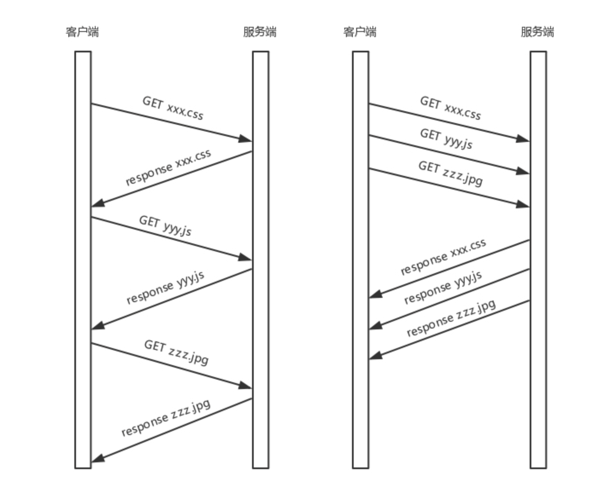

HTTP 2.0 其实是将三个请求变成三个流，将数据分成帧，乱序发送到一个 TCP 连接中。

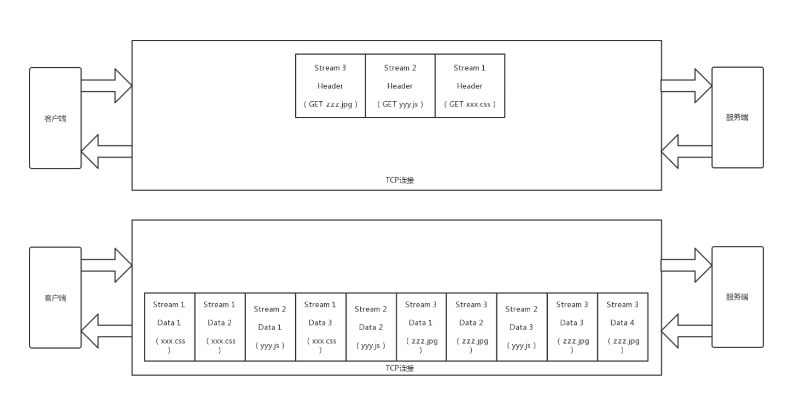

HTTP 2.0 成功解决了 HTTP 1.1 的队首阻塞问题，同时，也不需要通过 HTTP 1.x 的 pipeline 机制用多条 TCP 连接来实现并行请求与响应；减少了 TCP 连接数对服务器性能的影响，同时将页面的多个数据 css、js、 jpg 等通过一个数据链接进行传输，能够加快页面组件的传输速度。

  
****
  
下面来自《透视HTTP协议》

# HTTP/2

HTTPS 通过引入 SSL/TLS 在安全上达到了“极致”，但在性能提升方面却是乏善可陈，只优化了握手加密的环节，对于整体的数据传输没有提出更好的改进方案，还只能依赖于“长连接”这种“落后”的技术。所以 HTTP/2 的唯一目标就是改进性能。

HTTP/2 把 HTTP 分解成了“语义”和“语法”两个部分，“语义”层不做改动，与 HTTP/1 完全一致（即 RFC7231）。比如请求方法、URI、状态码、头字段等概念都保留不变，这样就消除了再学习的成本，基于 HTTP 的上层应用也不需要做任何修改，可以无缝转换到 HTTP/2。

**头部压缩**

HTTP/1 里可以用头字段“Content-Encoding”指定 Body 的编码方式，比如用 gzip 压缩来节约带宽，但报文的另一个组成部分——Header 却被无视了，没有针对它的优化手段。

由于报文 Header 一般会携带“User Agent”“Cookie”“Accept”“Server”等许多固定的头字段，多达几百字节甚至上千字节，但 Body 却经常只有几十字节（比如 GET 请求、204/301/304 响应），成了不折不扣的“大头儿子”。更要命的是，成千上万的请求响应报文里有很多字段值都是重复的，非常浪费，“长尾效应”导致大量带宽消耗在了这些冗余度极高的数据上。

**不过 HTTP/2 并没有使用传统的压缩算法，而是开发了专门的“HPACK”算法，在客户端和服务器两端建立“字典”，用索引号表示重复的字符串，还釆用哈夫曼编码来压缩整数和字符串，可以达到 50%~90% 的高压缩率。**

**二进制格式**

HTTP/2 不再使用肉眼可见的 ASCII 码，而是向下层的 TCP/IP 协议“靠拢”，全面采用二进制格式。

这样虽然对人不友好，但却大大方便了计算机的解析。原来使用纯文本的时候容易出现多义性，比如大小写、空白字符、回车换行、多字少字等等，程序在处理时必须用复杂的状态机，效率低，还麻烦。

而二进制里只有“0”和“1”，可以严格规定字段大小、顺序、标志位等格式，“对就是对，错就是错”，解析起来没有歧义，实现简单，而且体积小、速度快，做到“内部提效”。

HTTP/2 把 TCP 协议的部分特性挪到了应用层，把原来的“Header+Body”的消息“打散”为数个小片的二进制“帧”（Frame），用“HEADERS”帧存放头数据、“DATA”帧存放实体数据。

这种做法有点像是“Chunked”分块编码的方式，也是“化整为零”的思路，但 HTTP/2 数据分帧后“Header+Body”的报文结构就完全消失了，协议看到的只是一个个的“碎片”。

**虚拟的“流”**

消息的“碎片”到达目的地后应该怎么组装起来呢？

HTTP/2 为此定义了一个“流”（Stream）的概念，它是二进制帧的双向传输序列，同一个消息往返的帧会分配一个唯一的流 ID。**你可以把它想象成是一个虚拟的“数据流”，在里面流动的是一串有先后顺序的数据帧，这些数据帧按照次序组装起来就是 HTTP/1 里的请求报文和响应报文。**

因为“流”是虚拟的，实际上并不存在，所以 HTTP/2 就可以在一个 TCP 连接上用“流”同时发送多个“碎片化”的消息，这就是常说的 **“多路复用”（Multiplexing）——多个往返通信都复用一个连接来处理。**

在“流”的层面上看，消息是一些有序的“帧”序列，而在“连接”的层面上看，消息却是乱序收发的“帧”。多个请求/响应之间没有了顺序关系，不需要排队等待，也就不会再出现“队头阻塞”问题，降低了延迟，大幅度提高了连接的利用率。

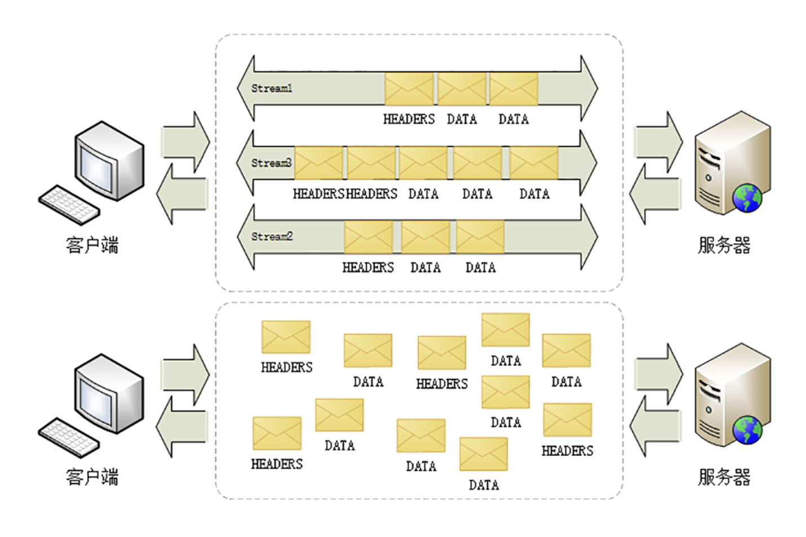

为了更好地利用连接，加大吞吐量，HTTP/2 还添加了一些控制帧来管理虚拟的“流”，实现了优先级和流量控制，这些特性也和 TCP 协议非常相似。

HTTP/2 还在一定程度上改变了传统的“请求 - 应答”工作模式，服务器不再是完全被动地响应请求，也可以新建“流”主动向客户端发送消息。比如，在浏览器刚请求 HTML 的时候就提前把可能会用到的 JS、CSS 文件发给客户端，减少等待的延迟，这被称为 **“服务器推送”**（Server Push，也叫 Cache Push）。

**强化安全**

出于兼容的考虑，HTTP/2 延续了 HTTP/1 的“明文”特点，可以像以前一样使用明文传输数据，不强制使用加密通信，不过格式还是二进制，只是不需要解密。

但由于 HTTPS 已经是大势所趋，而且主流的浏览器 Chrome、Firefox 等都公开宣布只支持加密的 HTTP/2，所以“事实上”的 HTTP/2 是加密的。也就是说，互联网上通常所能见到的 HTTP/2 都是使用“https”协议名，跑在 TLS 上面。

为了区分“加密”和“明文”这两个不同的版本，HTTP/2 协议定义了两个字符串标识符：“h2”表示加密的 HTTP/2，“h2c”表示明文的 HTTP/2，多出的那个字母“c”的意思是“clear text”。

**协议栈**

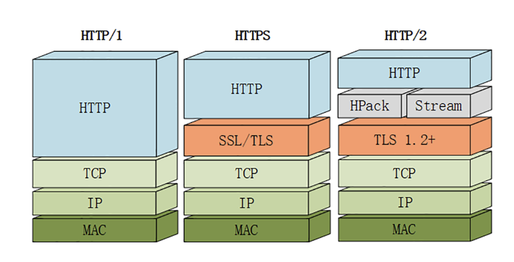

**总结：**

1.HTTP/2 在“语义”上兼容 HTTP/1，保留了请求方法、URI 等传统概念；

2.HTTP/2 使用“HPACK”算法压缩头部信息，消除冗余数据节约带宽；

3.HTTP/2 的消息不再是“Header+Body”的形式，而是分散为多个二进制“帧”；

4.HTTP/2 使用虚拟的“流”传输消息，解决了困扰多年的“队头阻塞”问题，同时实现了“多路复用”，提高连接的利用率；

5.HTTP/2 也增强了安全性，要求至少是 TLS1.2，而且禁用了很多不安全的密码套件。

接下来看看 HTTP/2 的实现细节：

**头部压缩实现原理**

“HPACK”算法是专门为压缩 HTTP 头部定制的算法，与 gzip、zlib 等压缩算法不同，它是一个“有状态”的算法，需要客户端和服务器各自维护一份“索引表”，也可以说是“字典”，压缩和解压缩就是查表和更新表的操作。

为了方便管理和压缩，HTTP/2 废除了原有的起始行概念，把起始行里面的请求方法、URI、状态码等统一转换成了头字段的形式，并且给这些“不是头字段的头字段”起了个特别的名字——“伪头字段”（pseudo-header fields）。而起始行里的版本号和错误原因短语因为没什么大用，顺便也给废除了。

为了与“真头字段”区分开来，这些“伪头字段”会在名字前加一个“:”，比如“:authority” “:method” “:status”，分别表示的是域名、请求方法和状态码。

现在 HTTP 报文头就简单了，全都是“Key-Value”形式的字段，于是 HTTP/2 就为一些最常用的头字段定义了一个只读的 **“静态表”**（Static Table）。

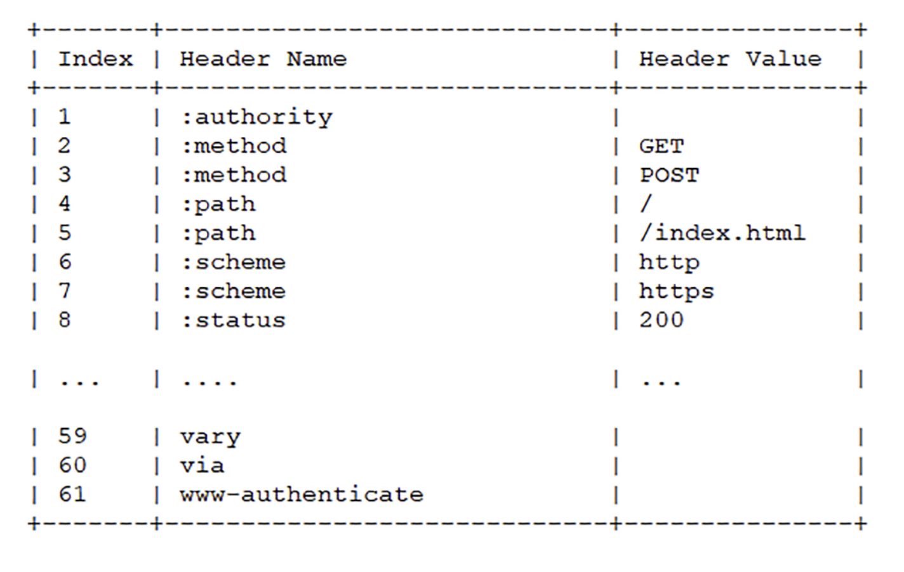

但如果表里只有 Key 没有 Value，或者是自定义字段根本找不到该怎么办呢？

这就要用到“动态表”（Dynamic Table），它添加在静态表后面，结构相同，但会在编码解码的时候随时更新。

比如说，第一次发送请求时的“user-agent”字段长是一百多个字节，用哈夫曼压缩编码发送之后，客户端和服务器都更新自己的动态表，添加一个新的索引号“65”。那么下一次发送的时候就不用再重复发那么多字节了，只要用一个字节发送编号就好。

你可以想象得出来，随着在 HTTP/2 连接上发送的报文越来越多，两边的“字典”也会越来越丰富，最终每次的头部字段都会变成一两个字节的代码，原来上千字节的头用几十个字节就可以表示了，压缩效果比 gzip 要好得多。

**二进制帧实现原理**

头部数据压缩之后，HTTP/2 就要把报文拆成二进制的帧准备发送。

HTTP/2 的帧结构有点类似 TCP 的段或者 TLS 里的记录，但报头很小，只有 9 字节，非常地节省。

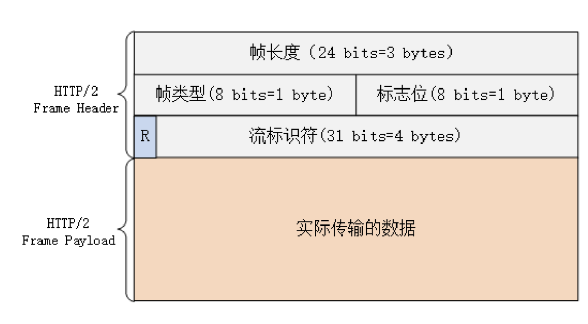

帧开头是 3 个字节的**长度**，默认上限是 2^14，最大是 2^24，也就是说 HTTP/2 的帧通常不超过 16K，最大是 16M。

长度后面的一个字节是**帧类型**，大致可以分成**数据帧**和**控制帧**两类，HEADERS 帧和 DATA 帧属于数据帧，存放的是 HTTP 报文，而 SETTINGS、PING、PRIORITY 等则是用来管理流的控制帧。

第 5 个字节是非常重要的帧标志信息，可以保存 8 个标志位，携带简单的控制信息。常用的标志位有END_HEADERS表示头数据结束，相当于 HTTP/1 里头后的空行（“\r\n”），END_STREAM表示单方向数据发送结束（即 EOS，End of Stream），相当于 HTTP/1 里 Chunked 分块结束标志（“0\r\n\r\n”）。

报文头里最后 4 个字节是流标识符，也就是帧所属的“流”，接收方使用它就可以从乱序的帧里识别出具有相同流 ID 的帧序列，按顺序组装起来就实现了虚拟的“流”。流标识符虽然有 4 个字节，但最高位被保留不用，所以只有 31 位可以使用，也就是说，流标识符的上限是 2^31，大约是 21 亿。

**我们来看一下 Wireshark 抓包的帧实例：**

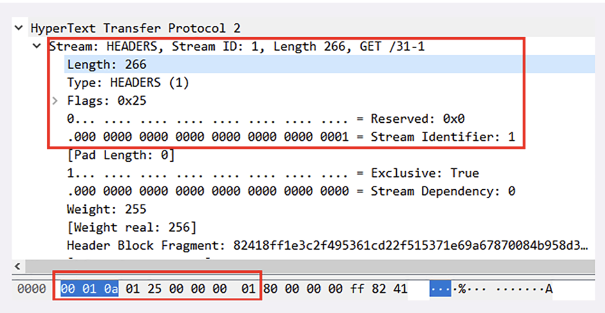

在这个帧里，开头的三个字节是“00010a”，表示数据长度是 266 字节。

帧类型是 1，表示 HEADERS 帧，负载（payload）里面存放的是被 HPACK 算法压缩的头部信息。

标志位是 0x25，转换成二进制有 3 个位被置 1。PRIORITY 表示设置了流的优先级，END_HEADERS 表示这一个帧就是完整的头数据，END_STREAM 表示单方向数据发送结束，后续再不会有数据帧（即请求报文完毕，不会再有 DATA 帧 /Body 数据）。

最后 4 个字节的流标识符是整数 1，表示这是客户端发起的第一个流，后面的响应数据帧也会是这个 ID，也就是说在 stream[1] 里完成这个请求响应。

**流与多路复用实现原理**

流是二进制帧的双向传输序列。在 HTTP/2 连接上，虽然帧是乱序收发的，但只要它们都拥有相同的流 ID，就都属于一个流，而且在这个流里帧不是无序的，而是有着严格的先后顺序。

比如下面的 Wireshark 抓包里，就有“0、1、3”一共三个流，实际上就是分配了三个流 ID 号，把这些帧按编号分组，再排一下队，就成了流。

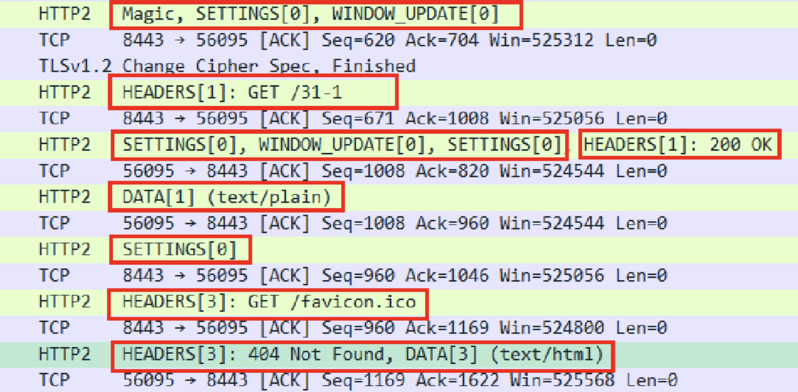

**在概念上，一个 HTTP/2 的流就等同于一个 HTTP/1 里的“请求 - 应答”。**

HTTP/2 的流有哪些特点呢？我给你简单列了一下：

1.流是可并发的，一个 HTTP/2 连接上可以同时发出多个流传输数据，也就是并发多请求，实现“多路复用”；

2.客户端和服务器都可以创建流，双方互不干扰；

3.流是双向的，一个流里面客户端和服务器都可以发送或接收数据帧，也就是一个“请求 - 应答”来回；

4.流之间没有固定关系，彼此独立，但流内部的帧是有严格顺序的；

5.流可以设置优先级，让服务器优先处理，比如先传 HTML/CSS，后传图片，优化用户体验；

6.流 ID 不能重用，只能顺序递增，客户端发起的 ID 是奇数，服务器端发起的 ID 是偶数；

7.在流上发送“RST_STREAM”帧可以随时终止流，取消接收或发送；

8.第 0 号流比较特殊，不能关闭，也不能发送数据帧，只能发送控制帧，用于流量控制。

下图显示了连接中无序的帧是如何依据流 ID 重组成流的。

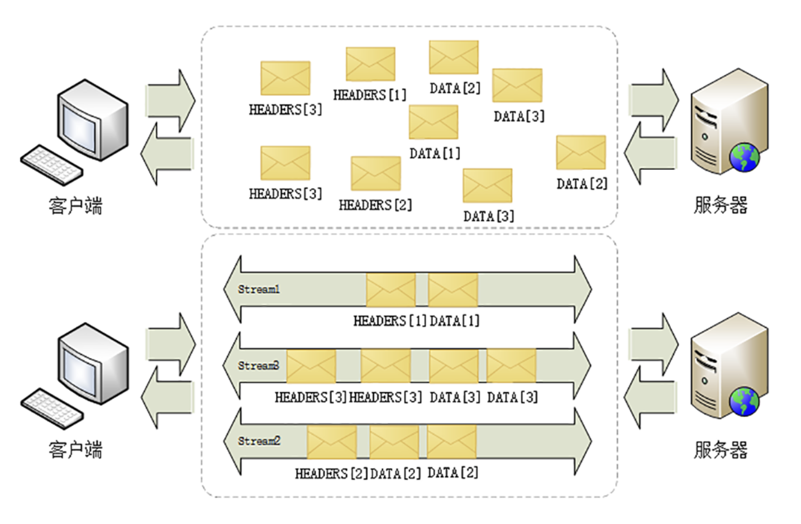

从这些特性中，我们还可以推理出一些深层次的知识点。

比如说，HTTP/2 在一个连接上使用多个流收发数据，那么它本身默认就会是长连接，所以永远不需要“Connection”头字段（keepalive 或 close）。

又比如，下载大文件的时候想取消接收，在 HTTP/1 里只能断开 TCP 连接重新“三次握手”，成本很高，而在 HTTP/2 里就可以简单地发送一个“RST_STREAM”中断流，而长连接会继续保持。

再比如，因为客户端和服务器两端都可以创建流，而流 ID 有奇数偶数和上限的区分，所以大多数的流 ID 都会是奇数，而且客户端在一个连接里最多只能发出 2^30，也就是 10 亿个请求。

所以就要问了：ID 用完了该怎么办呢？这个时候可以再发一个控制帧“GOAWAY”，真正关闭 TCP 连接。

**流状态转换**

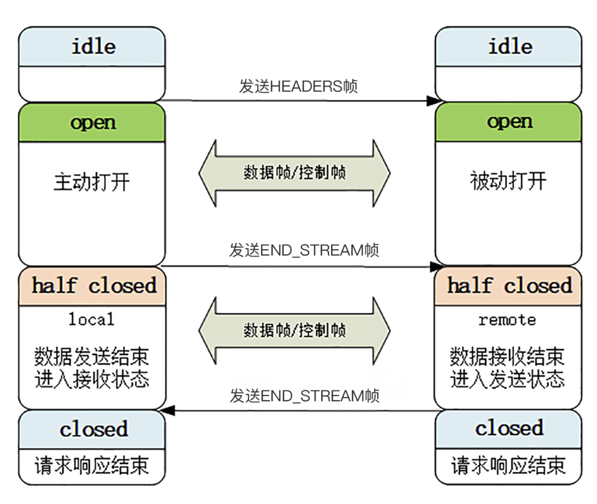

最开始的时候流都是“空闲”（idle）状态，也就是“不存在”，可以理解成是待分配的“号段资源”。

当客户端发送 HEADERS 帧后，有了流 ID，流就进入了“打开”状态，两端都可以收发数据，然后客户端发送一个带“END_STREAM”标志位的帧，流就进入了“半关闭”状态。

这个“半关闭”状态很重要，意味着客户端的请求数据已经发送完了，需要接受响应数据，而服务器端也知道请求数据接收完毕，之后就要内部处理，再发送响应数据。

响应数据发完了之后，也要带上“END_STREAM”标志位，表示数据发送完毕，这样流两端就都进入了“关闭”状态，流就结束了。

刚才也说过，流 ID 不能重用，所以流的生命周期就是 HTTP/1 里的一次完整的“请求 - 应答”，流关闭就是一次通信结束。

下一次再发请求就要开一个新流（而不是新连接），流 ID 不断增加，直到到达上限，发送“GOAWAY”帧开一个新的 TCP 连接，流 ID 就又可以重头计数。

**流状态转换**

HTTP/2使用头部压缩、二进制分帧、虚拟的“流”与多路复用，性能方面比 HTTP/1 有了很大的提升，“基本上”解决了“队头阻塞”这个“老大难”问题。但不是“完全”解决。

这是因为 HTTP/2 虽然使用“帧”“流”“多路复用”，没有了“队头阻塞”，但这些手段都是在应用层里，而在下层，也就是 TCP 协议里，还是会发生“队头阻塞”。

让我们从协议栈的角度来仔细看一下。在 HTTP/2 把多个“请求 - 响应”分解成流，交给 TCP 后，TCP 会再拆成更小的包依次发送（其实在 TCP 里应该叫 segment，也就是“段”）。

在网络良好的情况下，包可以很快送达目的地。但如果网络质量比较差，像手机上网的时候，就有可能会丢包。而 TCP 为了保证可靠传输，有个特别的“丢包重传”机制，丢失的包必须要等待重新传输确认，其他的包即使已经收到了，也只能放在缓冲区里，上层的应用拿不出来，只能“干着急”。

举个简单的例子：

客户端用 TCP 发送了三个包，但服务器所在的操作系统只收到了后两个包，第一个包丢了。那么内核里的 TCP 协议栈就只能把已经收到的包暂存起来，“停下”等着客户端重传那个丢失的包，这样就又出现了“队头阻塞”。

由于这种“队头阻塞”是 TCP 协议固有的，所以 HTTP/2 即使设计出再多的“花样”也无法解决。

Google 在推 SPDY 的时候就已经意识到了这个问题，于是就又发明了一个新的“QUIC”协议，让 HTTP 跑在 QUIC 上而不是 TCP 上。而这个“HTTP over QUIC”就是 HTTP 协议的下一个大版本，**HTTP/3**。它在 HTTP/2 的基础上又实现了质的飞跃，真正“完美”地解决了“队头阻塞”问题。

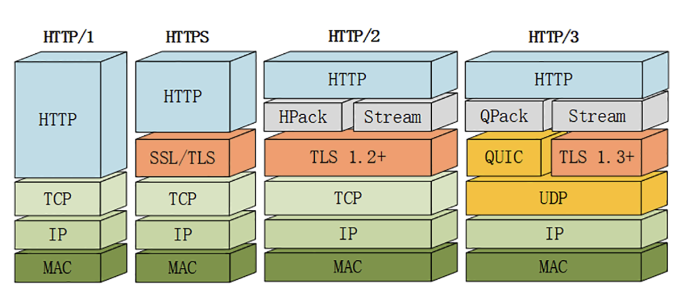

从这张图里，你可以看到 HTTP/3 有一个关键的改变，那就是它把下层的 TCP“抽掉”了，换成了 UDP。因为 UDP 是无序的，包之间没有依赖关系，所以就从根本上解决了“队头阻塞”。

你一定知道，UDP 是一个简单、不可靠的传输协议，只是对 IP 协议的一层很薄的包装，和 TCP 相比，它实际应用的较少。

不过正是因为它简单，不需要建连和断连，通信成本低，也就非常灵活、高效，“可塑性”很强。

所以，QUIC 就选定了 UDP，在它之上把 TCP 的那一套连接管理、拥塞窗口、流量控制等“搬”了过来，“去其糟粕，取其精华”，打造出了一个全新的可靠传输协议，可以认为是“新时代的 TCP”。

关于QUIC详解介绍可以参考《透视HTTP协议》

