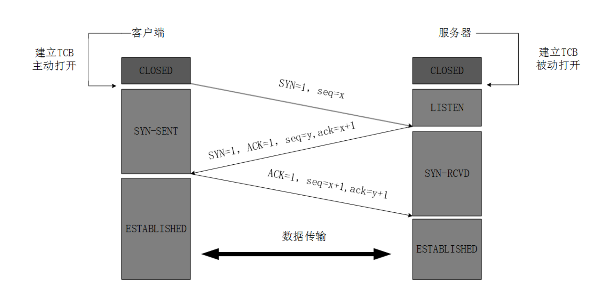
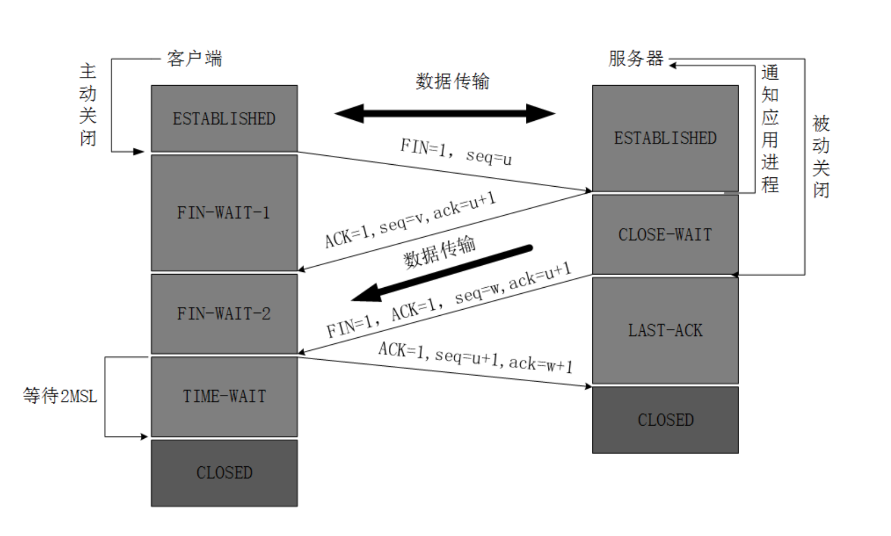

# TCP三次握手、四次挥手 为什么需要三次握手以及四次挥手？

# 三次握手

1.TCP服务器进程先创建传输控制块TCB，时刻准备接受客户进程的连接请求，此时服务器就进入了LISTEN（监听）状态；

2.TCP客户进程也是先创建传输控制块TCB，然后向服务器发出连接请求报文，这是报文首部中的同部位SYN=1，同时选择一个初始序列号 seq=x ，此时，TCP客户端进程进入了 SYN-SENT（同步已发送状态）状态。TCP规定，SYN报文段（SYN=1的报文段）不能携带数据，但需要消耗掉一个序号。

3.TCP服务器收到请求报文后，如果同意连接，则发出确认报文。确认报文中应该 ACK=1，SYN=1，确认号是ack=x+1，同时也要为自己初始化一个序列号 seq=y，此时，TCP服务器进程进入了SYN-RCVD（同步收到）状态。这个报文也不能携带数据，但是同样要消耗一个序号。

4.TCP客户进程收到确认后，还要向服务器给出确认。确认报文的ACK=1，ack=y+1，自己的序列号seq=x+1，此时，TCP连接建立，客户端进入ESTABLISHED（已建立连接）状态。TCP规定，ACK报文段可以携带数据，但是如果不携带数据则不消耗序号。

5.当服务器收到客户端的确认后也进入ESTABLISHED状态，此后双方就可以开始通信了。

**为什么TCP客户端最后还要发送一次确认呢？**

1.为了实现可靠数据传输， TCP 协议的通信双方， 都必须维护一个序列号seq，以标识发送出去的数据包中， 哪些是已经被对方收到的。 三次握手的过程即是通信双方相互告知序列号起始值， 并确认对方已经收到了序列号起始值的必经步骤。

如果只是两次握手， 至多只有连接发起方的起始序列号能被确认， 另一方选择的序列号则得不到确认。

2.主要防止已经失效的连接请求报文 突然又传送到了服务器，从而产生错误。

如果使用的是两次握手建立连接，假设有这样一种场景，客户端发送了第一个请求连接并且没有丢失，只是因为在网络结点中滞留的时间太长了，由于TCP的客户端迟迟没有收到确认报文，以为服务器没有收到，此时重新向服务器发送这条报文，此后客户端和服务器经过两次握手完成连接，传输数据，然后关闭连接。此时此前滞留的那一次请求连接，网络通畅了到达了服务器，这个报文本该是失效的，但是，两次握手的机制将会让客户端和服务器再次建立连接，这将导致不必要的错误和资源的浪费。

如果采用的是三次握手，就算是那一次失效的报文传送过来了，服务端接受到了那条失效报文并且回复了确认报文，但是客户端不会再次发出确认。由于服务器收不到确认，就知道客户端并没有请求连接。

# 四次挥手

1.客户端进程发出连接释放报文，并且停止发送数据。释放数据报文首部，FIN=1，其序列号为seq=u（等于前面已经传送过来的数据的最后一个字节的序号加1），此时，客户端进入FIN-WAIT-1（终止等待1）状态。 TCP规定，FIN报文段即使不携带数据，也要消耗一个序号。

2.服务器收到连接释放报文，发出确认报文，ACK=1，ack=u+1，并且带上自己的序列号seq=v，此时，服务端就进入了CLOSE-WAIT（关闭等待）状态。TCP服务器通知高层的应用进程，客户端向服务器的方向就释放了，这时候处于半关闭状态，即客户端已经没有数据要发送了，但是服务器若发送数据，客户端依然要接受。这个状态还要持续一段时间，也就是整个CLOSE-WAIT状态持续的时间。

3.客户端收到服务器的确认请求后，此时，客户端就进入FIN-WAIT-2（终止等待2）状态，等待服务器发送连接释放报文（在这之前还需要接受服务器发送的最后的数据）。

4.服务器将最后的数据发送完毕后，就向客户端发送连接释放报文，FIN=1，ack=u+1，由于在半关闭状态，服务器很可能又发送了一些数据，假定此时的序列号为seq=w，此时，服务器就进入了LAST-ACK（最后确认）状态，等待客户端的确认。

5.客户端收到服务器的连接释放报文后，必须发出确认，ACK=1，ack=w+1，而自己的序列号是seq=u+1，此时，客户端就进入了TIME-WAIT（时间等待）状态。注意此时TCP连接还没有释放，必须经过2∗*∗MSL（最长报文段寿命）的时间后，当客户端撤销相应的TCB后，才进入CLOSED状态。

6.服务器只要收到了客户端发出的确认，立即进入CLOSED状态。同样，撤销TCB后，就结束了这次的TCP连接。可以看到，服务器结束TCP连接的时间要比客户端早一些。

**为什么是四次挥手而不是三次？**

其实大致流程跟三次握手差不多，唯一的差别只是中间两步并没有合成一步，之所以没有并成一步应该是给应用层一点时间来做close的准备工作。

当Server端收到FIN报文时，仅仅表示对方不再发送数据了但是还能接收数据，而自己也未必全部数据都发送给对方了，所以并不会立即关闭SOCKET，只能先回复一个ACK报文，告诉Client端，“你发的FIN报文我收到了”。只有等到我Server端所有的报文都发送完了，我才能发送FIN报文，因此不能一起发送。故需要四次。

还有一个原因是，由于TCP的半关闭造成的。因为TCP 连接是全双工的（即数据可在两个方向上同时传递），所以在进行关闭时对每个方向都要单独进行关闭，这种单方向的关闭叫作半关闭。在一方完成它的数据发送任务时，就发送一个FIN来向另一方通告将要终止这个方向的连接。

总之：确保数据能够完成传输，但关闭连接时，当收到对方的 FIN 报文通知时，它仅仅表示对方没有数据发送给你了;但未必你所有的数据都全部发送给对方了，所以你可以 未必会马上会关闭 SOCKET,也即你可能还需要发送一些数据给对方之后，再发送 FIN 报文 给对方来表示你同意现在可以关闭连接了，所以它这里的 ACK 报文和 FIN 报文多数情况下 都是分开发送的

**为什么中间有一个 FIN-WAIT-2等待时间？**

防止收不到对方发送关闭连接的FIN包过来。

主动关闭的一端收到对方对FIN的确认ACK后，则进入FIN_WAIT_2状态。如果这个时候因为网络突然断掉、被动关闭的一段宕机等原因，导致主动关闭的一端不能收到被动关闭的一端发来的FIN，这个时候就需要FIN_WAIT_2定时器， 如果在该定时器超时的时候，还是没收到被动关闭一端发来的FIN，那么直接释放这个链接，进入CLOSE状态。

**为什么客户端最后还要等待2MSL？**

- 保证客户端发送的最后一个ACK报文能够到达服务器。因为这个ACK报文可能丢失，服务器已经发送了FIN+ACK报文，请求断开，客户端却没有回应，于是服务器又会重新发送一次，而客户端就能在这个2MSL时间段内收到这个重传的报文，接着给出回应报文，并且会重启2MSL计时器。

- 防止类似与“三次握手”中提到了的“已经失效的连接请求报文段”出现在本连接中。客户端发送完最后一个确认报文后，在这个2MSL时间中，就可以使上一次连接中所有的重复包都会消失。