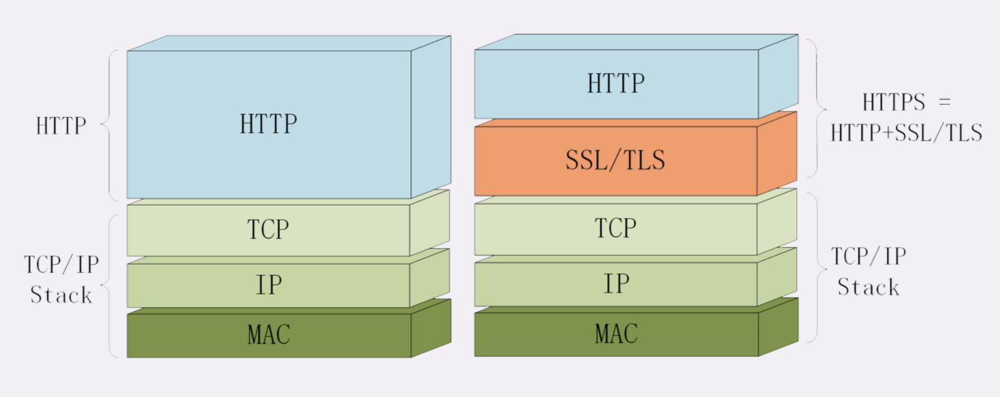
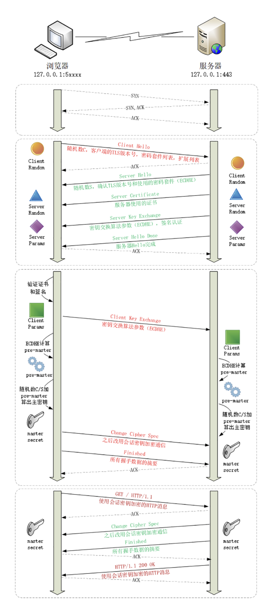

# Https的SSL/TLS握手过程

HTTPS 把 HTTP 下层的传输协议由 TCP/IP 换成了 SSL/TLS。



<font size=5>**SSL/TLS**</font>

SSL(在 1999 年把它改名为 TLS) 即安全套接层（Secure Sockets Layer），在 OSI 模型中处于第 5 层（会话层）。



在 TCP 建立连接之后，浏览器会首先发一个“Client Hello”消息，也就是跟服务器“打招呼”。里面有客户端的版本号、支持的密码套件，还有一个**随机数**（Client Random），用于后续生成会话密钥。

``` json
Handshake Protocol: Client Hello
    Version: TLS 1.2 (0x0303)
    Random: 1cbf803321fd2623408dfe…
    Cipher Suites (17 suites)
        Cipher Suite: TLS_ECDHE_RSA_WITH_AES_128_GCM_SHA256 (0xc02f)
        Cipher Suite: TLS_ECDHE_RSA_WITH_AES_256_GCM_SHA384 (0xc030)
```

> 这个的意思就是：“我这边有这些这些信息，你看看哪些是能用的，关键的随机数可得留着。”

服务器收到“Client Hello”后，会返回一个“Server Hello”消息。把版本号对一下，也给出一个随机数（Server Random），然后从客户端的列表里选一个作为本次通信使用的密码套件，在这里它选择了“TLS_ECDHE_RSA_WITH_AES_256_GCM_SHA384”。

```json
Handshake Protocol: Server Hello
    Version: TLS 1.2 (0x0303)
    Random: 0e6320f21bae50842e96…
    Cipher Suite: TLS_ECDHE_RSA_WITH_AES_256_GCM_SHA384 (0xc030)
```

> 这个的意思就是：“版本号对上了，可以加密，你的密码套件挺多，我选一个最合适的吧，用椭圆曲线加 RSA、AES、SHA384。我也给你一个随机数，你也得留着。”

然后，服务器为了证明自己的身份，就把证书也发给了客户端（Server Certificate）。

接下来是一个关键的操作，因为服务器选择了 ECDHE 算法，所以它会在证书后发送“Server Key Exchange”消息，里面是椭圆曲线的公钥（Server Params），用来实现密钥交换算法，再加上自己的私钥签名认证。

```json
Handshake Protocol: Server Key Exchange
    EC Diffie-Hellman Server Params
        Curve Type: named_curve (0x03)
        Named Curve: x25519 (0x001d)
        Pubkey: 3b39deaf00217894e...
        Signature Algorithm: rsa_pkcs1_sha512 (0x0601)
        Signature: 37141adac38ea4...
```

> 这相当于说：“刚才我选的密码套件有点复杂，所以再给你个算法的参数，和刚才的随机数一样有用，别丢了。为了防止别人冒充，我又盖了个章。”

之后是“Server Hello Done”消息，服务器说：“我的信息就是这些，打招呼完毕。”

这样第一个消息往返就结束了（两个 TCP 包），结果是客户端和服务器通过明文共享了三个信息：Client Random、Server Random 和 Server Params。

客户端这时也拿到了服务器的证书，那这个证书是不是真实有效的呢？

开始走证书链逐级验证，确认证书的真实性，再用证书公钥验证签名，就确认了服务器的身份：“刚才跟我打招呼的不是骗子，可以接着往下走。”

然后，客户端按照密码套件的要求，也生成一个椭圆曲线的公钥（Client Params），用“Client Key Exchange”消息发给服务器。

```json
Handshake Protocol: Client Key Exchange
    EC Diffie-Hellman Client Params
        Pubkey: 8c674d0e08dc27b5eaa…
```

现在客户端和服务器手里都拿到了密钥交换算法的两个参数（Client Params、Server Params），就用 ECDHE 算法一阵算，算出了一个新的东西，叫“Pre-Master”，其实也是一个随机数。

现在客户端和服务器手里有了三个随机数：Client Random、Server Random 和 Pre-Master。用这三个作为原始材料，就可以生成用于加密会 话的主密钥，叫“Master Secret”。

::: tip 为什么非要三个随机数呢？
这就必须说 TLS 的设计者考虑得非常周到了，他们不信任客户端或服务器伪随机数的可靠性，为了保证真正的“完全随机”“不可预测”，把三个不可靠的随机数混合起来，那么“随机”的程度就非常高了，足够让黑客难以猜测。
:::

有了主密钥和派生的会话密钥，握手就快结束了。客户端发一个“Change Cipher Spec”，然后再发一个“Finished”消息，把之前所有发送的数据做个摘要，再加密一下，让服务器做个验证。

> 意思就是告诉服务器：“后面都改用对称算法加密通信了啊，用的就是打招呼时说的 AES，加密对不对还得你测一下。”

服务器也是同样的操作，发“Change Cipher Spec”和“Finished”消息，双方都验证加密解密 OK，握手正式结束，后面就收发被加密的 HTTP 请求和响应了。


