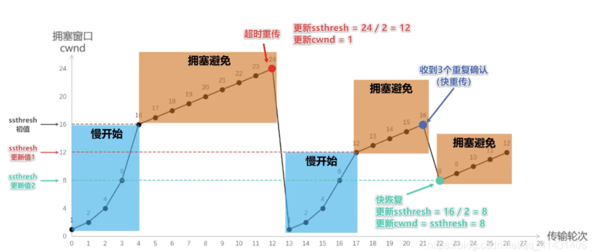

# TCP 中常见的拥塞控制算法有哪些？

**慢开始算法**

拥塞控制也叫做基于窗口的拥塞控制。为此，发送方维持一个叫作拥塞窗口cwnd的状态变量。拥塞窗口的大小取决于网络的拥塞程度，反映网络当前容量。

假设当前发送方拥塞窗口cwnd的值为1，而发送窗口swnd等于拥塞窗口cwnd，因此发送方当前只能发送一个数据报文段（拥塞窗口cwnd的值是几，就能发送几个数据报文段），接收方收到该数据报文段后，给发送方回复一个确认报文段，发送方收到该确认报文后，将拥塞窗口的值变为2，慢开始算法每经过一个传输轮次RTT，拥塞窗口cwnd就加倍。（4，8，16...）

慢开始算法虽然起始的窗口很小，但是每过一个轮次，窗口大小翻倍，呈指数爆炸增长，所以必须要对其进行一个限制，防止其增长过大引起网络拥塞。这个限制就是慢开始门限ssthresh状态变量。ssthresh的用法如下：

- 当cwnd < ssthresh时，使用上述慢开始算法。

- 当cwnd > ssthresh时，停止使用慢开始算法而改用拥塞避免算法。

**拥塞避免算法**

cwnd到达ssthresh后，转为拥塞避免算法，cwnd由每个RTT后两倍增长——>加1（加法增大）。直到发生超时重传（丢包）时，cwnd变为1，ssthresh变为当前阻塞值cwnd的一半（乘法减小），再次执行慢开始算法。

**快重传算法**

首先要求接收方每收到一个失序的报文段后就立即发出重复确认（为的是使发送方及早知道有报文段没有到达对方）。发送方如果收到连续3个冗余ACK，那么发送方就会执行快重传算法，立即重传这个被确认过3次的报文段之后的报文段，这样可以让发送方在超时事件之前知道报文发生了丢失。

**快恢复算法**

如果发送方连续接收到3个冗余ACK，发送方知道现在只是丢失了个别的报文段，此时调整门限值 ssthresh为当前拥塞窗口的一半，同时设置cwnd为新的ssthresh，然后开始执行拥塞避免算法。

**拥塞控制算法缺点：**

- 第一个问题是丢包并不代表着通道满了，也可能是管子本来就漏水。例如公网上带宽不满也会丢包，这个时候就认为拥塞了，退缩了，其实是不对的。

- 第二个问题是 TCP 的拥塞控制要等到将中间设备都填充满了，才发生丢包，从而降低速度，这时候已经晚了。其实 TCP 只要填满管道就可以了，不应该接着填，直到连缓存也填满。

为了优化这两个问题，后来有了TCP BBR 拥塞算法。BBR 算法不将出现丢包或时延增加作为拥塞的信号，而是认为当网络上的数据包总量大于瓶颈链路带宽和时延的乘积时才出现了拥塞，所以 BBR 也称为基于拥塞的拥塞控制算法（Congestion-Based Congestion Control），其适用网络为高带宽、高时延、有一定丢包率的长肥网络，可以有效降低传输时延，并保证较高的吞吐量。

BBR 算法周期性地探测网络的容量，交替测量一段时间内的带宽极大值和时延极小值，将其乘积作为作为拥塞窗口大小，使得拥塞窗口始的值始终与网络的容量保持一致。

