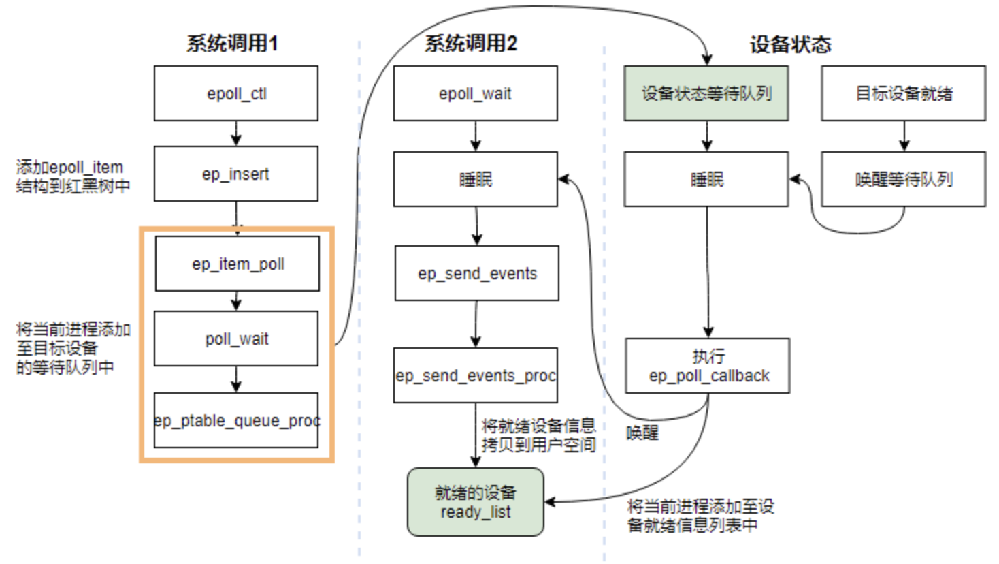

# 简述 select, poll, epoll 的使用场景以及区别，epoll 中水平触发以及边缘触发有什么不同？

所谓 I/O 多路复用指的就是 select/poll/epoll 这一系列的多路选择器：支持单一线程同时监听多个文件描述符（I/O 事件），阻塞等待，并在其中某个文件描述符可读写时收到通知。 I/O 复用其实复用的不是 I/O 连接，而是复用线程，让一个 thread of control 能够处理多个连接（I/O 事件）。

# select

下面是一个select例子，创建 5 个子进程，每个进程连接到服务器并向服务器发送消息，服务器进程使用 accept 为每个客户端创建不同的文件描述符，select 中的第一个参数应该是三个集合中任何一个中编号最大的文件描述符加上 1。创建一组所有文件描述符，调用 select 并在返回时检查哪个文件描述符已准备好读取。select 返回时， 将集合更改为仅包含准备好的文件描述符，因此我们需要在每次迭代时再次构建该集合。

``` c
#include <stdio.h>
#include <sys/types.h>
#include <sys/socket.h>
#include <netinet/in.h>
#include <wait.h>
#include <signal.h>
#include <errno.h>
#include <sys/select.h>
#include <sys/time.h>
#include <unistd.h>

#define MAXBUF 256

void child_process(void)
{
  sleep(2);
  char msg[MAXBUF];
  struct sockaddr_in addr = {0};
  int n, sockfd,num=1;
  srandom(getpid());
  /* Create socket and connect to server */
  sockfd = socket(AF_INET, SOCK_STREAM, 0);
  addr.sin_family = AF_INET;
  addr.sin_port = htons(2000);
  addr.sin_addr.s_addr = inet_addr("127.0.0.1");

  connect(sockfd, (struct sockaddr*)&addr, sizeof(addr));

  printf("child {%d} connected \n", getpid());
  while(1){
        int sl = (random() % 10 ) +  1;
        num++;
     	sleep(sl);
  	sprintf (msg, "Test message %d from client %d", num, getpid());
  	n = write(sockfd, msg, strlen(msg));	/* Send message */
  }

}

int main()
{
  char buffer[MAXBUF];
  int fds[5];
  struct sockaddr_in addr;
  struct sockaddr_in client;
  // 用于记录最大的fd位置
  int addrlen, n,i,max=0;;
  int sockfd, commfd;
  fd_set rset;
  for(i=0;i<5;i++)
  {
  	if(fork() == 0)
  	{
  		child_process();
  		exit(0);
  	}
  }

  sockfd = socket(AF_INET, SOCK_STREAM, 0);
  memset(&addr, 0, sizeof (addr));
  addr.sin_family = AF_INET;
  addr.sin_port = htons(2000);
  addr.sin_addr.s_addr = INADDR_ANY;
  bind(sockfd,(struct sockaddr*)&addr ,sizeof(addr));
  listen (sockfd, 5); 
  // 创建5个文件描述符
  for (i=0;i<5;i++) 
  {
    memset(&client, 0, sizeof (client));
    addrlen = sizeof(client);
    // 声明文件描述符
    fds[i] = accept(sockfd,(struct sockaddr*)&client, &addrlen);
    if(fds[i] > max)
    	max = fds[i];
  }
  
  while(1){
    // 由于select后的rset会被置位，所有每次循环需要对rset置空，然后再将fds赋给rset
	FD_ZERO(&rset);
  	for (i = 0; i< 5; i++ ) {
  		FD_SET(fds[i],&rset);
  	}

  puts("round again");
    // rset是一个bitmap  
    // 阻塞，每次需要把fd从用户态拷贝到内核态 
    // 当有I/O数据时，select返回，并且将rset置位，没数据的位会被清空  
	select(max+1, &rset, NULL, NULL, NULL);
    // 遍历，判断哪个fd被置位
	for(i=0;i<5;i++) {
		if (FD_ISSET(fds[i], &rset)){
			memset(buffer,0,MAXBUF);
            // 读数据
			read(fds[i], buffer, MAXBUF);
			puts(buffer);
		}
	}	
  }
  return 0;
}
```

理解 select 的关键在于理解 fd_set，为说明方便，取 fd_set 长度为 1 字节，fd_set 中的每一 bit 可以对应一个文件描述符 fd，则 1 字节长的 fd_set 最大可以对应 8 个 fd。select 的调用过程如下：

1.执行 FD_ZERO(&set), 则 set 用位表示是 0000,0000

2.若 fd＝5, 执行 FD_SET(fd, &set); 后 set 变为 0001,0000(第 5 位置为 1)

3.再加入 fd＝2, fd=1，则 set 变为 0001,0011

4.执行 select(6, &set, 0, 0, 0) 阻塞等待（这里max是5+1，这是因为set最大只能是5，内核没必要把所有set位都取出来，只需要最大到6的位置）

5.若 fd=1, fd=2 上都发生可读事件，则 select 返回，此时 set 变为 0000,0011 (注意：没有事件发生的 fd=5 被清空)

根据上面例子我们可以得出select的特点：

- 可监控的文件描述符个数取决于 sizeof(fd_set) 的值。假设服务器上 sizeof(fd_set)＝512，每 bit 表示一个文件描述符，则服务器上支持的最大文件描述符是 512*8=4096。
  
- 将 fd 加入 select 监控集的同时，还要再使用一个数据结构 array 保存放到 select 监控集中的 fd，一是用于在 select 返回后，array 作为源数据和 fd_set 进行 FD_ISSET 判断。二是 select 返回后会把以前加入的但并无事件发生的 fd 清空，则每次开始 select 前都要重新从 array 取得 fd 逐一加入（FD_ZERO 最先），扫描 array 的同时取得 fd 最大值 maxfd，用于 select 的第一个参数，可见 select 模型必须在 select 前循环 array（加 fd，取 maxfd），select 返回后循环 array（FD_ISSET 判断是否有事件发生）
  
- select会将rset全量拷贝到内核态，由内核态判读rset是否有数据，这是因为如果由用户态判断，也是交给内核态真正执行，每一个位的判断都需要用户态和内核态的切换，所以select直接将rset拷贝到内核态

所以，select 有如下的缺点：

- 监听能力有限：使用 32 个整数的 32 位，即 32*32=1024 来标识 fd，最多只能监听 1024 个文件描述符（可调整）
  
- 内存拷贝开销大：每次调用 select，都需要把 fd 集合从用户态拷贝到内核态，这个开销在 fd 很多时会很大
  
- 时间复杂度 𝑂(𝑛)：每次 kernel 都需要线性扫描整个 fd_set，所以随着监控的描述符 fd 数量增长，其 I/O 性能会线性下降，而且，rset不可重用，每次循环都要对rset置空再赋值，性能有损耗


# poll

对比select，poll 的实现和 select 非常相似，只是描述 fd 集合的方式不同，poll 使用 pollfd 结构而不是 select 的 fd_set 结构， poll 函数使用链表存储文件描述符，摆脱了 1024 的数量上限。但是同样需要从用户态拷贝所有的 fd 到内核态，也需要线性遍历所有的 fd 集合

```c
// fds是一个poll函数监听的结构列表，nfds表示fds数组的长度
// 返回值：小于0，表示出错，等于0，表示poll函数等待超时，大于0，表示struct pollfd结构体数组中有多少个非0的revents，也就是这一次调用poll产生事件的描述符的数量。
int poll (struct pollfd *fds, unsigned int nfds, int timeout);
```

与select不同，poll传入的是pollfd结构体数组，所以没有1024个描述符的限制

```c
struct pollfd {
      int fd; // 文件描述符
      short events; // 关心的事件类型
      short revents; // 实际发生了的事件类型
};
```

下面是poll的例子，与select用法相似，仍然需要从用户态拷贝所有的 fd 到内核态，也需要线性遍历所有的 fd 集合

```c
// 5个文件描述符
 for (i=0;i<5;i++) 
 {
   memset(&client, 0, sizeof (client));
   addrlen = sizeof(client);
   // 声明文件描述符
   pollfds[i].fd = accept(sockfd,(struct sockaddr*)&client, &addrlen);
   // events是读事件
   pollfds[i].events = POLLIN;
 }
 sleep(1);
 while(1){
 puts("round again");
 // 传入pollfd数组，并且数组中有5个元素，50000是超时
poll(pollfds, 5, 50000);

for(i=0;i<5;i++) {
   // 判断revents是否被置位为POLLIN
	if (pollfds[i].revents & POLLIN){
     // 恢复为0
		pollfds[i].revents = 0;
		memset(buffer,0,MAXBUF);
		read(pollfds[i].fd, buffer, MAXBUF);
		puts(buffer);
	}
}
 }
```

与select不同的是，poll不是对bitmap置位，而且改变revents字段（select对bitmap置位导致rset不可重用），这里会对revents字段赋值为POLLIN，即读事件，poll返回后需要对revents字段恢复为0。poll解决了select监听能力受限的问题，也解决了bitmap重用的问题，但是仍然需要内存拷贝以及时间复杂度𝑂(𝑛)的问题。

# epoll

I/O 多路复用的核心设计是 1 个线程处理所有连接的 等待消息准备好 I/O 事件，这一点上 epoll 和 select&poll 是大同小异的。但 select&poll在十万并发连接存在时，可能每一毫秒只有数百个活跃的连接，同时其余数十万连接在这一毫秒是非活跃的。select&&poll 的使用方法是这样的： 返回的活跃连接 == select(全部待监控的连接) 。什么时候会调用 select&poll 呢？在你认为需要找出有报文到达的活跃连接时，就应该调用。所以，select&poll 在高并发时是会被频繁调用的。这样，这个频繁调用的方法就很有必要看看它是否有效率，因为，它的轻微效率损失都会被 高频 二字所放大。它有效率损失吗？显而易见，全部待监控连接是数以十万计的，返回的只是数百个活跃连接，这本身就是无效率的表现。被放大后就会发现，处理并发上万个连接时，select&poll 就完全力不从心了。这个时候就该 epoll 上场了，epoll 通过一些新的设计和优化，基本上解决了 select&poll 的问题。

epoll 的 API 非常简洁，涉及到的只有 3 个系统调用：

```c
#include <sys/epoll.h>  
// size表明内核要监听的描述符数量
// 返回一个epoll句柄描述符，失败时返回-1
int epoll_create(int size); // int epoll_create1(int flags);
// epfd 表示epoll句柄
// op 表示fd操作类型，有如下3种：
// 1.EPOLL_CTL_ADD 注册新的fd到epfd中
// 2.EPOLL_CTL_MOD 修改已注册的fd的监听事件
// 3.EPOLL_CTL_DEL 从epfd中删除一个fd
// fd 是要监听的描述符
// event 表示要监听的事件
int epoll_ctl(int epfd, int op, int fd, struct epoll_event *event);
// epfd 是epoll句柄
// events 表示从内核得到的就绪事件集合
// maxevents 告诉内核events的大小
// timeout 表示等待的超时事件
// 返回值：返回就绪的事件数目，调用失败时返回 -1，等待超时返回 0。
int epoll_wait(int epfd, struct epoll_event *events, int maxevents, int timeout);
```

epoll_create 创建一个 epoll 实例并返回 epollfd，epoll_ctl 注册 file descriptor 等待的 I/O 事件(比如 EPOLLIN、EPOLLOUT 等) 到 epoll 实例上，epoll_wait 则是阻塞监听 epoll 实例上所有的 file descriptor 的 I/O 事件，它接收一个用户空间上的一块内存地址 (events 数组)，kernel 会在有 I/O 事件发生的时候把文件描述符列表复制到这块内存地址上，然后 epoll_wait 解除阻塞并返回，最后用户空间上的程序就可以对相应的 fd 进行读写了。

epoll能显著提高程序在大量并发连接中只有少量活跃的情况下的系统CPU利用率。原因就是获取事件的时候，它无须遍历整个被侦听的描述符集，只要遍历那些被内核IO事件异步唤醒而加入Ready队列的描述符集合就行了。

```c
struct epoll_event events[5];
  int epfd = epoll_create(10);
  ...
  ...
  for (i=0;i<5;i++) 
  {
    static struct epoll_event ev;
    memset(&client, 0, sizeof (client));
    addrlen = sizeof(client);
    ev.data.fd = accept(sockfd,(struct sockaddr*)&client, &addrlen);
    ev.events = EPOLLIN;
    epoll_ctl(epfd, EPOLL_CTL_ADD, ev.data.fd, &ev); 
  }
  
  while(1){
  	puts("round again");
  	nfds = epoll_wait(epfd, events, 5, 10000);
	
	for(i=0;i<nfds;i++) {
			memset(buffer,0,MAXBUF);
      // 从events数组中获取对应fd即可，无需遍历所有描述符集
			read(events[i].data.fd, buffer, MAXBUF);
			puts(buffer);
	}
  }
```

epoll 的工作原理如下：



与 select&poll 相比，epoll 分清了高频调用和低频调用。例如，epoll_ctl 相对来说就是非频繁调用的，而 epoll_wait 则是会被高频调用的。所以 epoll 利用 epoll_ctl 来插入或者删除一个 fd，实现用户态到内核态的数据拷贝，这确保了每一个 fd 在其生命周期只需要被拷贝一次，而不是每次调用 epoll_wait 的时候都拷贝一次。 epoll_wait 则被设计成几乎没有入参的调用，相比 select&poll需要把全部监听的 fd 集合从用户态拷贝至内核态的做法，epoll 的效率就高出了一大截。

在实现上 epoll 采用红黑树来存储所有监听的 fd，**而红黑树本身插入和删除性能比较稳定，时间复杂度 O(logN)。** 通过 epoll_ctl 函数添加进来的 fd 都会被放在红黑树的某个节点内，所以，重复添加是没有用的。当把 fd 添加进来的时候时候会完成关键的一步：该 fd 会与相应的设备（网卡）驱动程序建立回调关系，也就是在内核中断处理程序为它注册一个回调函数，在 fd 相应的事件触发（中断）之后（设备就绪了），内核就会调用这个回调函数，该回调函数在内核中被称为：ep_poll_callback，**这个回调函数其实就是把这个 fd 添加到 rdllist 这个双向链表（就绪链表）中。** epoll_wait 实际上就是去检查 rdllist 双向链表中是否有就绪的 fd，当 rdllist 为空（无就绪 fd）时挂起当前进程，直到 rdllist 非空时进程才被唤醒并返回。

相比于 select&poll 调用时会将全部监听的 fd 从用户态空间拷贝至内核态空间并线性扫描一遍找出就绪的 fd 再返回到用户态，epoll_wait 则是直接返回已就绪 fd，因此 epoll 的 I/O 性能不会像 select&poll 那样随着监听的 fd 数量增加而出现线性衰减，是一个非常高效的 I/O 事件驱动技术。

由于使用 epoll 的 I/O 多路复用需要用户进程自己负责 I/O 读写，从用户进程的角度看，读写过程是阻塞的，所以 select&poll&epoll 本质上都是同步 I/O 模型，而像 Windows 的 IOCP 这一类的异步 I/O，只需要在调用 WSARecv 或 WSASend 方法读写数据的时候把用户空间的内存 buffer 提交给 kernel，kernel 负责数据在用户空间和内核空间拷贝，完成之后就会通知用户进程，整个过程不需要用户进程参与，所以是真正的异步 I/O。


**epoll 的工作模式:**

epoll对文件描述符的操作有两种模式：LT（level trigger）和ET（edge trigger）。LT模式是默认模式，LT模式与ET模式的区别如下：

- LT模式：当epoll_wait检测到描述符事件发生并将此事件通知应用程序，应用程序可以不立即处理该事件。下次调用epoll_wait时，会再次响应应用程序并通知此事件。
  
- ET模式：当epoll_wait检测到描述符事件发生并将此事件通知应用程序，应用程序必须立即处理该事件。如果不处理，下次调用epoll_wait时，不会再次响应应用程序并通知此事件。

**边缘触发模式的意义：**

若用水平触发，系统中一旦有大量无需读写的就绪文件描述符，它们每次调用epoll_wait都会返回，这大大降低处理程序检索自己关心的就绪文件描述符的效率。 而采用边缘触发，当被监控的文件描述符上有可读写事件发生时，epoll_wait会通知处理程序去读写。如果这次没有把数据全部读写完(如读写缓冲区太小)，那么下次调用epoll_wait时，它不会通知你，即只会通知你一次，直到该文件描述符上出现第二次可读写事件才会通知你。这比水平触发效率高，系统不会充斥大量你不关心的就绪文件描述符。

::: tip 提示

epoll中有两个重要的数据结构红黑树rbt，和一个就绪列表ready-list。

调用epoll_wait时其实就是从ready-list中拿数据，

一般说来从ready-list中每拿一个事件就删除一个事件，

但如果拿到的事件是水平触发，它会放回read-list。

:::