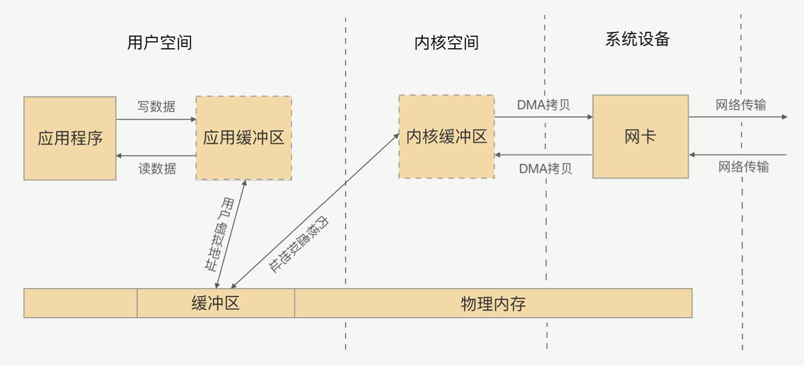

# 简述 Linux 零拷贝的原理

系统内核处理 IO 操作分为两个阶段——等待数据和拷贝数 据。等待数据，就是系统内核在等待网卡接收到数据后，把数据写到内核中;而拷贝数据， 就是系统内核在获取到数据后，将数据拷贝到用户进程的空间中。以下是具体流程:

应用进程的每一次写操作，都会把数据写到用户空间的缓冲区中，再由 CPU 将数据拷贝到系统内核的缓冲区中，之后再由 DMA 将这份数据拷贝到网卡中，最后由网卡发送出去。 这里我们可以看到，一次写操作数据要拷贝两次才能通过网卡发送出去，而用户进程的读操作则是将整个流程反过来，数据同样会拷贝两次才能让应用程序读取到数据。

应用进程的一次完整的读写操作，都需要在用户空间与内核空间中来回拷贝，并且每一次拷贝，都需要 CPU 进行一次上下文切换。很浪费cpu资源和性能，解决方案就是零拷贝技术。

所谓的零拷贝，就是取消用户空间与内核空间之间的数据拷贝操作，应用进程每一次的读写操作，可以通过一种方式，直接将数据写入内核或从内核中读取数据，再通过 DMA 将内核中的数据拷贝到网卡，或将网卡中的数据 copy 到内核。

那怎么做到零拷贝?你想一下是不是用户空间与内核空间都将数据写到一个地方，就不需要拷贝了?此时你有没有想到虚拟内存?

零拷贝有两种解决方式，分别是 mmap+write 方式和 sendfile 方式，其核心原理都是通过虚拟内存来解决的。

****

参考[王雄宁系统设计课程](http://polygonx.top/wxning-blog/interview/system-design/notes/04/03.html)