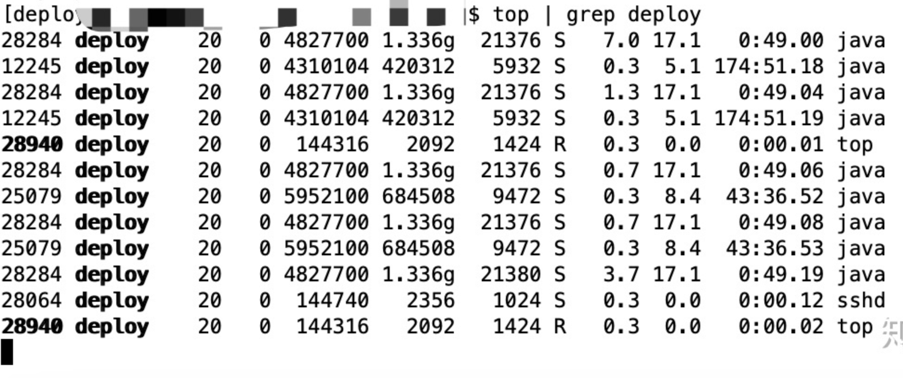

# cpu飙高怎么排查？

cpu最小执行单元是线程，导致cpu飙高的原因有几个方面：

- cpu上下文切换过多，上下文切换主要两个方面，第一需要保存线程的运行状态，第二，让处于等待中的线程恢复执行。这两个过程需要cpu执行内核指令实现状态的保存和恢复，如果较多的上下文切换会占据大量cpu资源。像文件io，网络io，锁等待这些都会造成线程阻塞，而线程阻塞就会导致cpu上下文切换

- cpu资源过度消耗，也就是在程序员创建了大量的线程，或者有线程一直占用cpu资源（比如死循环）

我们可以根据top命令找到cpu利用率过高的进程，再通过`shift+H`找到进程中cpu消耗过高的线程，这里有两种情况：

- 第一种情况：cpu利用率过高的线程一直都是同一个，也就是线程id没有变化，说明，程序中存在长期占用cpu没有释放的情况，可以通过jstack工具或者线程的dump日志，定位到线程日志后找到问题代码

- 第二种情况：cpu利用率过高的线程id一直在变化，说明线程创建过多，需要挑选几个线程id通过jstack去线程dump中进行排查，有可能定位结果是程序正常，只是cpu飙高的那一刻用户访问量大，那我们应该采取增加系统资源的手段。

****

1、查询哪个进程占用CPU

2、进程哪个线程占用CPU

3、查询线程的堆栈信息

**1、查询哪个进程占用CPU**

可以使用 Top 或者 `top | grep 用户名`，比如这里我们可以使用 top | grep deploy 查询当前用户deploy下面有哪些进程比较占用CPU，如下图，可以发现进程28284比较占用CPU

**2、进程哪个线程占用CPU**

接着我们查看上述进程内是哪些线程在捣乱，使用命令top -H -p PID

在这里我们使用top -H -p 28284，结果如下图，我们发现是有几个线程相对占用比较高，比如28389、28390等（这里我们只是展示效果，不要在乎是否真的占用比较大）

**3、查询线程的堆栈信息**

在这里我们要分两步

1、将tid转换为16进制的数字：printf “%x\n” tid

2、 查询线程信息：jstack 28284 | grep 6ee5 -A 10

执行结果如下图，我们可以看到具体是我们的应用里的哪个线程占用CPU较高，比如这里就是一个叫SimplePauseDetectorThread_1的线程，下面就是根据具体线程业务分析了

