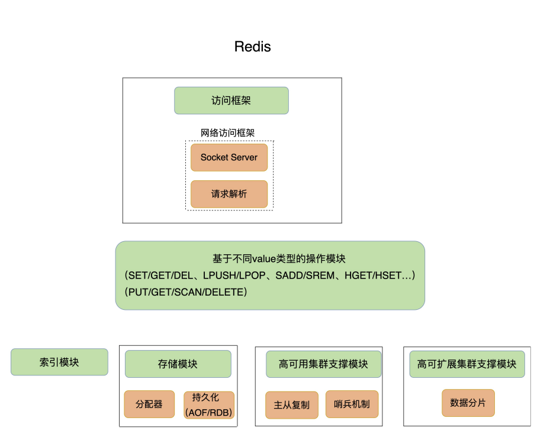

# 基本架构

大体来说，一个键值数据库包括了访问框架、索引模块、操作模块和存储模块四部分。

# 采用什么访问模式？

访问模式通常有两种：一种是通过函数库调用的方式供外部应用使用。函数库调用就是以动态链接库的形式链接到我们自己的程序中，提供键值存储功能。另一种是通过网络框架以 Socket 通信的形式对外提供键值对操作，这种形式可以提供广泛的键值存储服务。RocksDB 以动态链接库的形式使用，
而 Memcached 和 Redis 则是通过网络框架访问。

# 索引选择

Memcached 和 Redis 采用哈希表作为 key-value 索引，而 RocksDB 则采用跳表作为内存中 key-value 的索引。

一般而言，内存键值数据库（例如 Redis）采用哈希表作为索引，很大一部分原因在于，其键值数据基本都是保存在内存中的，而内存的高性能随机访问特性可以很好地与哈希表 O(1) 的操作复杂度相匹配。