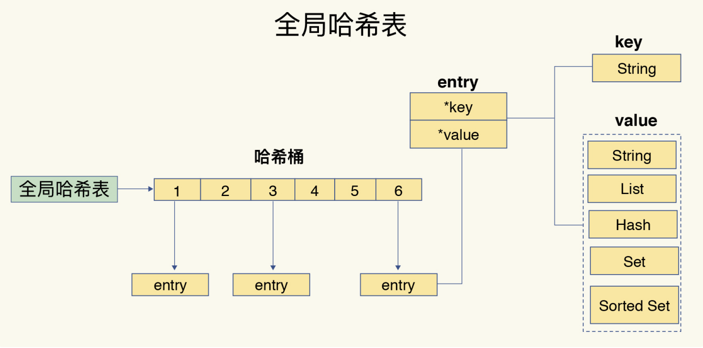
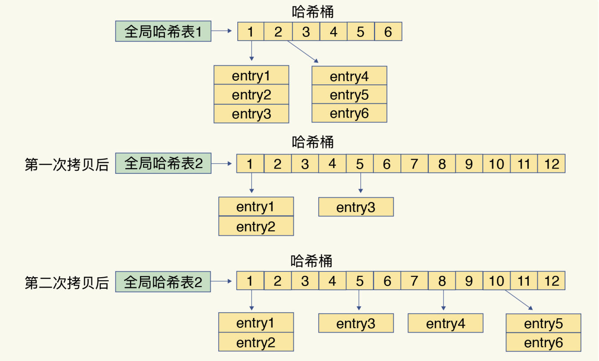
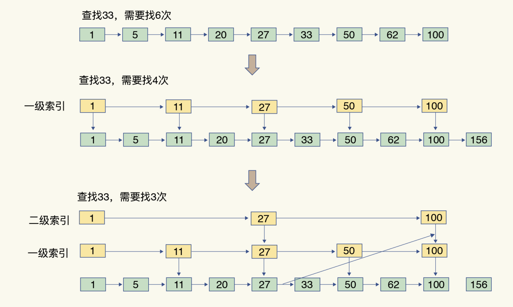
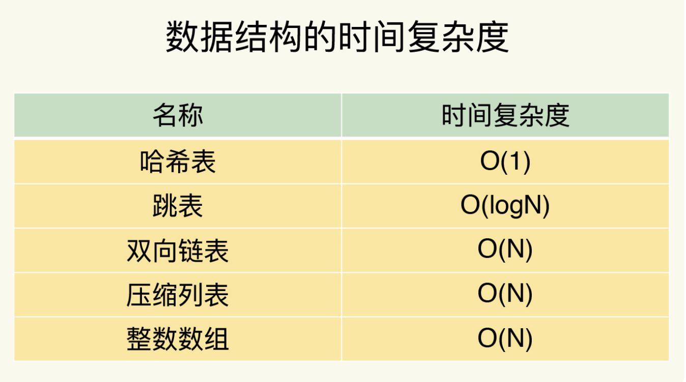

# 数据结构

数据库这么多，为啥 Redis 能有这么突出的表现呢？一方面，这是因为它是内存数据库，所有操作都在内存上完成，内存的访问速度本身就很快。另一方面，这要归功于它的数据结构。这是因为，键值对是按一定的数据结构来组织的，操作键值对最终就是对数据结构进行增删改查操作，所以高效的数据结构是 Redis 快速处理数据的基础。

底层数据结构一共有 6 种，分别是简单动态字符串、双向链表、压缩列表、哈希表、跳表和整数数组。

# 键和值用什么结构组织？

为了实现从键到值的快速访问，Redis 使用了一个哈希表来保存所有键值对。

看到这里，你可能会问了：“如果值是集合类型的话，作为数组元素的哈希桶怎么来保存呢？”，其实，哈希桶中的元素保存的并不是值本身，而是指向具体值的指针。这也就是说，不管值是 String，还是集合类型，哈希桶中的元素都是指向它们的指针。

在下图中，可以看到，哈希桶中的 entry 元素中保存了*key和*value指针，分别指向了实际的键和值，这样一来，即使值是一个集合，也可以通过*value指针被查找到。

因为这个哈希表保存了所有的键值对，所以，我也把它称为全局哈希表。

# 为什么哈希表操作变慢了？

当你往哈希表中写入更多数据时，哈希冲突是不可避免的问题。Redis 解决哈希冲突的方式，就是链式哈希。如果哈希表里写入的数据越来越多，哈希冲突可能也会越来越多，这就会导致某些哈希冲突链过长，进而导致这个链上的元素查找耗时长，效率降低。

所以，Redis 会对哈希表做 rehash 操作。rehash 也就是增加现有的哈希桶数量，让逐渐增多的 entry 元素能在更多的桶之间分散保存，减少单个桶中的元素数量，从而减少单个桶中的冲突。

为了使 rehash 操作更高效，Redis 默认使用了两个全局哈希表：哈希表 1 和哈希表 2。一开始，当你刚插入数据时，默认使用哈希表 1，此时的哈希表 2 并没有被分配空间。随着数据逐步增多，Redis 开始执行 rehash，这个过程分为三步：

1.给哈希表 2 分配更大的空间，例如是当前哈希表 1 大小的两倍；
2.把哈希表 1 中的数据重新映射并拷贝到哈希表 2 中；
3.释放哈希表 1 的空间。

到此，我们就可以从哈希表 1 切换到哈希表 2，用增大的哈希表 2 保存更多数据，而原来的哈希表 1 留作下一次 rehash 扩容备用。

这个过程看似简单，但是第二步涉及大量的数据拷贝，如果一次性把哈希表 1 中的数据都迁移完，会造成 Redis 线程阻塞，无法服务其他请求。此时，Redis 就无法快速访问数据了。

为了避免这个问题，Redis 采用了渐进式 rehash。

简单来说就是在第二步拷贝数据时，Redis 仍然正常处理客户端请求，每处理一个请求时，从哈希表 1 中的第一个索引位置开始，顺带着将这个索引位置上的所有 entries 拷贝到哈希表 2 中；等处理下一个请求时，再顺带拷贝哈希表 1 中的下一个索引位置的 entries。如下图所示：

这样就巧妙地把一次性大量拷贝的开销，分摊到了多次处理请求的过程中，避免了耗时操作，保证了数据的快速访问。

# 底层数据结构

对于 String 类型来说，找到哈希桶就能直接增删改查了，所以，哈希表的 O(1) 操作复杂度也就是它的复杂度了。 和 String 类型不同，一个集合类型的值，第一步是通过全局哈希表找到对应的哈希桶位
置，第二步是在集合中再增删改查。

集合的操作效率和集合的底层数据结构有关。集合类型的底层数据结构主要有 5 种：整数数组、双向链表、哈希表、压缩列表和跳表。

压缩列表实际上类似于一个数组，数组中的每一个元素都对应保存一个数据。和数组不同的是，压缩列表在表头有三个字段 zlbytes、zltail 和 zllen，分别表示列表长度、列表尾的偏移量和列表中的 entry 个数；压缩列表在表尾还有一个 zlend，表示列表结束。

在压缩列表中，如果我们要查找定位第一个元素和最后一个元素，可以通过表头三个字段的长度直接定位，复杂度是 O(1)。而查找其他元素时，就没有这么高效了，只能逐个查找，此时的复杂度就是 O(N) 了。

有序链表只能逐一查找元素，导致操作起来非常缓慢，于是就出现了跳表。具体来说，跳表在链表的基础上，增加了多级索引，通过索引位置的几个跳转，实现数据的快速定位，如下图所示：

跳表的查找复杂度就是 O(logN)。

# 不同操作的复杂度

单元素操作，是指每一种集合类型对单个数据实现的增删改查操作。例如，Hash 类型的 HGET、HSET 和 HDEL，Set 类型的 SADD、SREM、SRANDMEMBER 等。这些操作的复杂度由集合采用的数据结构决定，例如，HGET、HSET 和 HDEL 是对哈希表做操作，所以它们的复杂度都是 O(1)；Set 类型用哈希表作为底层数据结构时，它的 SADD、SREM、SRANDMEMBER 复杂度也是 O(1)。

范围操作，是指集合类型中的遍历操作，可以返回集合中的所有数据，比如 Hash 类型的 HGETALL 和 Set 类型的 SMEMBERS，或者返回一个范围内的部分数据，比如 List 类型的 LRANGE 和 ZSet 类型的 ZRANGE。这类操作的复杂度一般是 O(N)，比较耗时，我们应该尽量避免。

不过，Redis 从 2.8 版本开始提供了 SCAN 系列操作（包括 HSCAN，SSCAN 和 ZSCAN），这类操作实现了渐进式遍历，每次只返回有限数量的数据。这样一来，相比于 HGETALL、SMEMBERS 这类操作来说，就避免了一次性返回所有元素而导致的 Redis 阻塞。

统计操作，是指集合类型对集合中所有元素个数的记录，例如 LLEN 和 SCARD。这类操作复杂度只有 O(1)，这是因为当集合类型采用压缩列表、双向链表、整数数组这些数据结构时，这些结构中专门记录了元素的个数统计，因此可以高效地完成相关操作。

例外情况，是指某些数据结构的特殊记录，例如压缩列表和双向链表都会记录表头和表尾的偏移量。这样一来，对于 List 类型的 LPOP、RPOP、LPUSH、RPUSH 这四个操作来说，它们是在列表的头尾增删元素，这就可以通过偏移量直接定位，所以它们的复杂度也只有 O(1)，可以实现快速操作。

