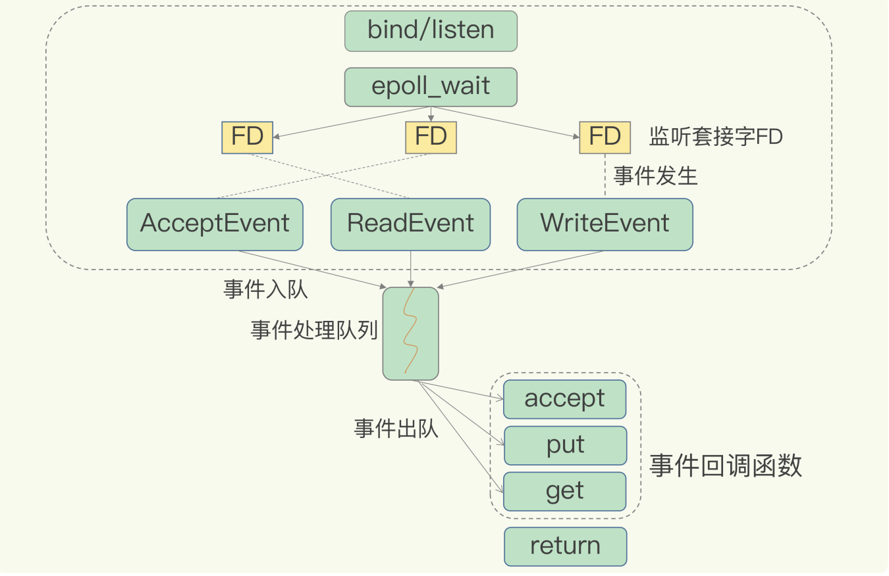

# 为什么单线程Redis那么快？

首先，我要和你厘清一个事实，我们通常说，Redis 是单线程，主要是指 Redis 的网络 IO 和键值对读写是由一个线程来完成的，这也是 Redis 对外提供键值存储服务的主要流程。但 Redis 的其他功能，比如持久化、异步删除、集群数据同步等，其实是由额外的线程执行的。 

# Redis 为什么用单线程？

要更好地理解 Redis 为什么用单线程，我们就要先了解多线程的开销。

日常写程序时，我们经常会听到一种说法：“使用多线程，可以增加系统吞吐率，或是可以增加系统扩展性”，的确，对于一个多线程的系统来说，在有合理的资源分配的情况下，可以增加系统中处理请求操作的资源实体，进而提升系统能够同时处理的请求数，即吞吐率。

但是，在我们采用多线程后，如果没有良好的系统设计，系统吞吐率就增长迟缓了，有时甚至还会出现下降的情况。一个关键的瓶颈在于，系统中通常会存在被多线程同时访问的共享资源，比如一个共享的数据结构。当有多个线程要修改这个共享资源时，为了保证共享资源的正确性，就需要有额外的机制进行保证，而这个额外的机制，就会带来额外的开销。

拿 Redis List 的数据类型来说，假设 Redis 采用多线程设计，现在有两个线程 A 和 B，线程 A 对一个 List 做 LPUSH 操作，并对队列长度加 1。同时，线程 B 对该 List 执行 LPOP 操作，并对队列长度减 1。为了保证队列长度的正确性，Redis 需要让线程 A 和 B 的 LPUSH 和 LPOP 串行执行，这样一来，Redis 可以无误地记录它们对 List 长度的修改。否则，我们可能就会得到错误的长度结果。这就是多线程编程模式面临的共享资源的并发访问控制问题。

如果只是简单地采用一个粗粒度互斥锁，就会出现不理想的结果：即使增加了线程，大部分线程也在等待获取访问共享资源的互斥锁，并行变串行，系统吞吐率并没有随着线程的增加而增加。采用多线程开发一般会引入同步原语来保护共享资源的并发访问，这也会降低系统代码的易调试性和可维护性。为了避免这些问题，Redis 直接采用了单线程模式。

# 单线程 Redis 为什么那么快？

- 一方面，Redis 的大部分操作在内存上完成，再加上它采用了高效的数据结构，例如哈希表和跳表，这是它实现高性能的一个重要原因。 
  
- 另一方面，就是 Redis 采用了多路复用机制，使其在网络 IO 操作中能并发处理大量的客户端请求，实现高吞吐率。

Redis 网络框架采用 epoll 机制，简单来说，在 Redis 只运行单线程的情况下， epoll 机制允许内核中，同时存在多个监听套接字和已连接套接字。内核会一直监听这些套接字上的连接请求或数据请求。一旦有请求到达，就会交给 Redis 线程处理，这就实现了一个 Redis 线程处理多个 IO 流的效果。

为了在请求到达时能通知到 Redis 线程，select/epoll 提供了基于事件的回调机制，即针对不同事件的发生，调用相应的处理函数。