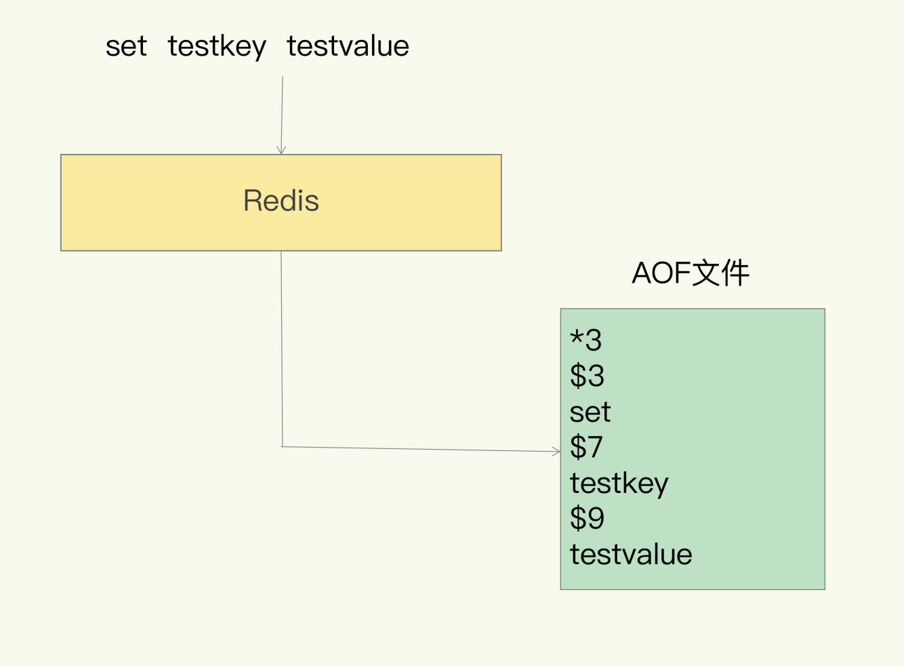
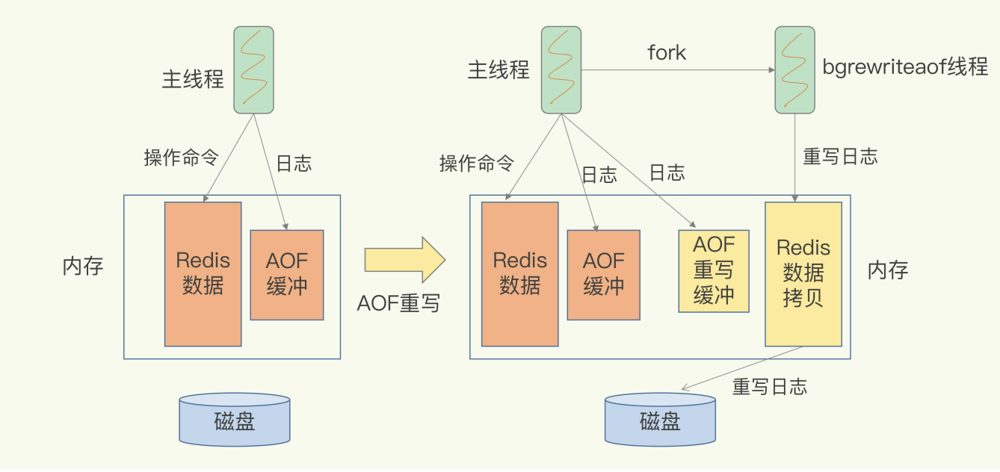

# 避免数据丢失---AOF日志

说到日志，我们比较熟悉的是数据库的写前日志（Write Ahead Log, WAL），也就是说，在实际写数据前，先把修改的数据记到日志文件中，以便故障时进行恢复。不过，AOF 日志正好相反，它是写后日志，“写后”的意思是 Redis 是先执行命令，把数据写入内存，然后才记录日志

那 AOF 为什么要先执行命令再记日志呢？

传统数据库的日志，例如 redo log（重做日志），记录的是修改后的数据，而 AOF 里记录的是 Redis 收到的每一条命令，这些命令是以文本形式保存的。

我们以 Redis 收到“set testkey testvalue”命令后记录的日志为例，看看 AOF 日志的内容。其中，“*3”表示当前命令有三个部分，每部分都是由“$+数字”开头，后面紧跟着具体的命令、键或值。这里，“数字”表示这部分中的命令、键或值一共有多少字节。例如，“$3 set”表示这部分有 3 个字节，也就是“set”命令。

但是，为了避免额外的检查开销，Redis 在向 AOF 里面记录日志的时候，并不会先去对这些命令进行语法检查。所以，如果先记日志再执行命令的话，日志中就有可能记录了错误的命令，Redis 在使用日志恢复数据时，就可能会出错。

而写后日志这种方式，就是先让系统执行命令，只有命令能执行成功，才会被记录到日志中，否则，系统就会直接向客户端报错。所以，Redis 使用写后日志这一方式的一大好处是，可以避免出现记录错误命令的情况。

除此之外，AOF 还有一个好处：**它是在命令执行后才记录日志，所以不会阻塞当前的写操作。**

不过，AOF 也有两个潜在的风险。

首先，如果刚执行完一个命令，还没有来得及记日志就宕机了，那么这个命令和相应的数据就有丢失的风险。

其次，AOF 虽然避免了对当前命令的阻塞，但可能会给下一个操作带来阻塞风险。这是因为，AOF 日志也是在主线程中执行的，如果在把日志文件写入磁盘时，磁盘写压力大，就会导致写盘很慢，进而导致后续的操作也无法执行了。

这两个风险都是和 AOF 写回磁盘的时机相关的。对于这个问题，AOF提供了三种写回策略。

# 三种写回策略

- Always，同步写回：每个写命令执行完，立马同步地将日志写回磁盘；
- Everysec，每秒写回：每个写命令执行完，只是先把日志写到 AOF 文件的内存缓冲区，每隔一秒把缓冲区中的内容写入磁盘；
- No，操作系统控制的写回：每个写命令执行完，只是先把日志写到 AOF 文件的内存缓冲区，由操作系统决定何时将缓冲区内容写回磁盘

# AOF 重写机制

AOF 文件过大也会带来的性能问题，文件太大，之后再往里面追加命令记录的话，效率也会变低；而且如果发生宕机，AOF 中记录的命令要一个个被重新执行，用于故障恢复的时间就会很长。

简单来说，AOF 重写机制就是在重写时，Redis 根据数据库的现状创建一个新的 AOF 文件，也就是说，读取数据库中的所有键值对，然后对每一个键值对用一条命令记录它的写入。比如说，当读取了键值对“testkey”: “testvalue”之后，重写机制会记录 set testkey testvalue 这条命令。

AOF 重写机制可以减少日志文件大小，当一个键值对被多条写命令反复修改时，AOF 文件会记录相应的多条命令。但是重写后之对应一条日志。

为了避免阻塞主线程，导致数据库性能下降，重写过程是由后台线程 bgrewriteaof 来完成。我把重写的过程总结为“一个拷贝，两处日志”。

“一个拷贝”就是指，每次执行重写时，主线程 fork 出后台的 bgrewriteaof 子进程。此时，fork 会把主线程的内存拷贝一份给 bgrewriteaof 子进程，这里面就包含了数据库的最新数据。然后，bgrewriteaof 子进程就可以在不影响主线程的情况下，逐一把拷贝的数据写成操作，记入重写日志。

“两处日志”又是什么呢？

因为主线程未阻塞，仍然可以处理新来的操作。此时，如果有写操作，第一处日志就是指正在使用的 AOF 日志，Redis 会把这个操作写到它的缓冲区。这样一来，即使宕机了，这个 AOF 日志的操作仍然是齐全的，可以用于恢复。而第二处日志，就是指新的 AOF 重写日志。这个操作也会被写到重写日志的缓冲区。这样，重写日志也不会丢失最新的操作。等到拷贝数据的所有操作记录重写完成后，重写日志记录的这些最新操作也会写入新的 AOF 文件，以保证数据库最新状态的记录。此时，我们就可以用新的 AOF 文件替代旧文件了。

