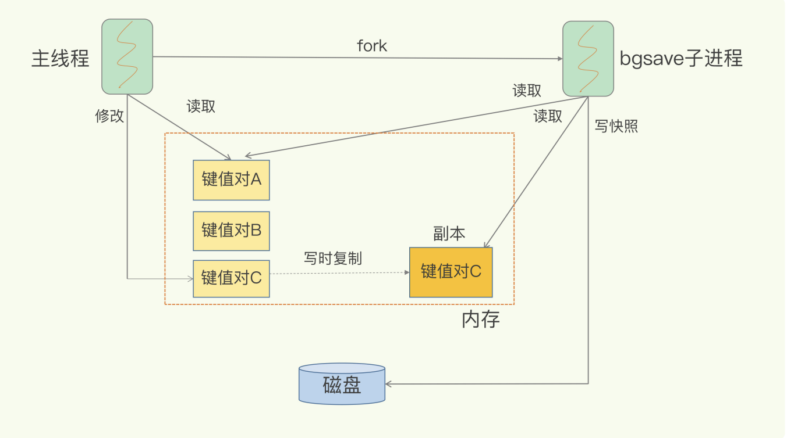
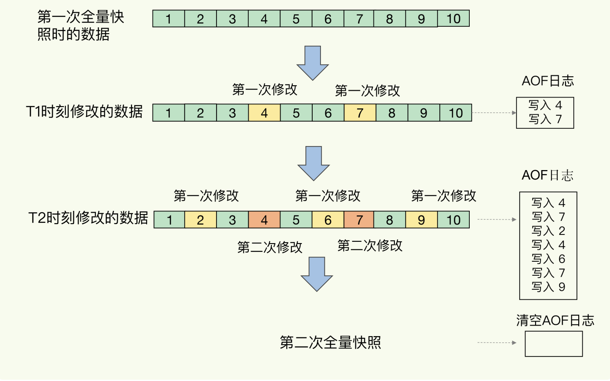

# 宕机后实现快速恢复---RDB快照

对 Redis 来说，它实现类似照片记录效果的方式，就是把某一时刻的状态以文件的形式写到磁盘上，也就是快照。所谓内存快照，就是指内存中的数据在某一个时刻的状态记录。这个快照文件就称为 RDB 文件，其中，RDB 就是 Redis DataBase 的缩写。

和 AOF 相比，RDB 记录的是某一时刻的数据，并不是操作，所以，在做数据恢复时，我们可以直接把 RDB 文件读入内存，很快地完成恢复。

Redis 的数据都在内存中，为了提供所有数据的可靠性保证，它执行的是全量快照，也就是说，把内存中的所有数据都记录到磁盘中。Redis 提供了两个命令来生成 RDB 文件，分别是 save 和 bgsave。
- save：在主线程中执行，会导致阻塞；
- bgsave：创建一个子进程，专门用于写入 RDB 文件，避免了主线程的阻塞，这也是 Redis RDB 文件生成的默认配置。

# 写时复制技术

通常来说快照执行期间数据是不能被修改的，为了保证快照完整性，只能处理读操作，因为不能修改正在执行快照的数据。为了快照而暂停写操作，肯定是不能接受的。所以这个时候，Redis 就会借助操作系统提供的写时复制技术（Copy-On-Write, COW），在执行快照的同时，正常处理写操作。

简单来说，bgsave 子进程是由主线程 fork 生成的，可以共享主线程的所有内存数据。bgsave 子进程运行后，开始读取主线程的内存数据，并把它们写入 RDB 文件。

如果主线程要修改一块数据（例如图中的键值对 C），那么，这块数据就会被复制一份，生成该数据的副本。然后，bgsave 子进程会把这个副本数据写入 RDB 文件，而在这个过程中，主线程仍然可以直接修改原来的数据。

# 增量快照

对于快照来说，所谓“连拍”就是指连续地做快照。这样一来，快照的间隔时间变得很短，即使某一时刻发生宕机了，因为上一时刻快照刚执行，丢失的数据也不会太多。但是，这其中的快照间隔时间就很关键了。

是不是可以每秒做一次快照？毕竟，每次快照都是由 bgsave 子进程在后台执行，也不会阻塞主线程。这种想法其实是错误的。虽然 bgsave 执行时不阻塞主线程，但是，如果频繁地执行全量快照，也会带来两方面的开销。

- 一方面，频繁将全量数据写入磁盘，会给磁盘带来很大压力，多个快照竞争有限的磁盘带宽，前一个快照还没有做完，后一个又开始做了，容易造成恶性循环。
- 另一方面，bgsave 子进程需要通过 fork 操作从主线程创建出来。虽然，子进程在创建后不会再阻塞主线程，但是，fork 这个创建过程本身会阻塞主线程，而且主线程的内存越大，阻塞时间越长。如果频繁 fork 出 bgsave 子进程，这就会频繁阻塞主线程了。

那么，有什么其他好方法吗？

此时，我们可以做增量快照，所谓增量快照，就是指做了一次全量快照后，后续的快照只对修改的数据进行快照记录，这样可以避免每次全量快照的开销。

Redis 4.0 中提出了一个混合使用 AOF 日志和内存快照的方法。简单来说，内存快照以一定的频率执行，在两次快照之间，使用 AOF 日志记录这期间的所有命令操作。

这样一来，快照不用很频繁地执行，这就避免了频繁 fork 对主线程的影响。而且，AOF 日志也只用记录两次快照间的操作，也就是说，不需要记录所有操作了，因此，就不会出现文件过大的情况了，也可以避免重写开销。

如下图所示，T1 和 T2 时刻的修改，用 AOF 日志记录，等到第二次做全量快照时，就可以清空 AOF 日志，因为此时的修改都已经记录到快照中了，恢复时就不再用日志了。

