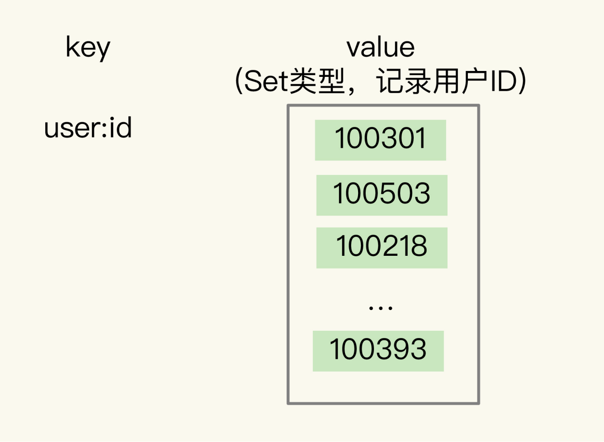
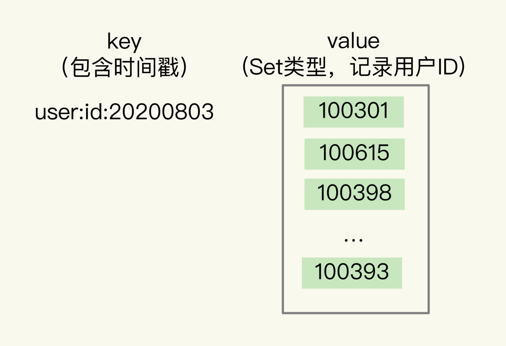

# 统计新增用户数

# 聚合统计

所谓的聚合统计，就是指统计多个集合元素的聚合结果，包括：统计多个集合的共有元素（交集统计），把两个集合相比，统计其中一个集合独有的元素（差集统计），统计多个集合的所有元素（并集统计）。

比如统计手机 App 每天的新增用户数和第二天的留存用户数。我们可以用一个集合记录所有登录过 App 的用户 ID，同时，用另一个集合记录每一天登录过 App 的用户 ID。然后，再对这两个集合做聚合统计。

记录所有登录过 App 的用户 ID 还是比较简单的，我们可以直接使用 Set 类型，把 key 设置为 user:id，表示记录的是用户 ID，value 就是一个 Set 集合，里面是所有登录过 App 的用户 ID，我们可以把这个 Set 叫作累计用户 Set，如下图所示：



累计用户 Set 中没有日期信息，我们是不能直接统计每天的新增用户的。所以，我们还需要把每一天登录的用户 ID，记录到一个新集合中，我们把这个集合叫作每日用户 Set，它有两个特点：

- key 是 user:id 以及当天日期，例如 user: id :20200803。
- value 是 Set 集合，记录当天登录的用户 ID。



在统计每天的新增用户时，我们只用计算每日用户 Set 和累计用户 Set 的差集就行。

假设我们的手机 App 在 2020 年 8 月 3 日上线，那么，8 月 3 日前是没有用户的。此时，累计用户 Set 是空集，当天登录的用户 ID 会被记录到 key 为 user: id :20200803 的 Set 中。所以，user: id :20200803 这个 Set 中的用户就是当天的新增用户。

然后，我们计算累计用户 Set 和 user: id :20200803 Set 的并集结果，结果保存在 user:id 这个累计用户 Set 中，如下所示：

```sh
SUNIONSTORE user:id user:id user: id :20200803
```

此时，user:id 这个累计用户 Set 中就有了 8 月 3 日的用户 ID。等到 8 月 4 日再统计时，我们把 8 月 4 日登录的用户 ID 记录到 user: id :20200804 的 Set 中。接下来，我们执行

SDIFFSTORE 命令计算累计用户 Set 和 user: id :20200804 Set 的差集，结果保存在 key 为 user:new 的 Set 中，如下所示：

```sh
SDIFFSTORE user:new user: id :20200804 user:id
```

可以看到，这个差集中的用户 ID 在 user: id :20200804 的 Set 中存在，但是不在累计用户 Set 中。所以，user:new 这个 Set 中记录的就是 8 月 4 日的新增用户。

当要计算 8 月 4 日的留存用户时，我们只需要再计算 user: id :20200803 和 user: id :20200804 两个 Set 的交集，就可以得到同时在这两个集合中的用户 ID 了，这些就是在 8 月 3 日登录，并且在 8 月 4 日留存的用户。执行的命令如下：

```sh
SINTERSTORE user: id :rem user: id :20200803 user: id :20200804
```

当你需要对多个集合进行聚合计算时，Set 类型会是一个非常不错的选择。不过，这里有一个潜在的风险。Set 的差集、并集和交集的计算复杂度较高，在数据量较大的情况下，如果直接执行这些计算，会导致 Redis 实例阻塞。所以，我给你分享一个小建议：你可以从主从集群中选择一个从库，让它专门负责聚合计算，或者是把数据读取到客户端，在客户端来完成聚合统计，这样就可以规避阻塞主库实例和其他从库实例的风险了。


